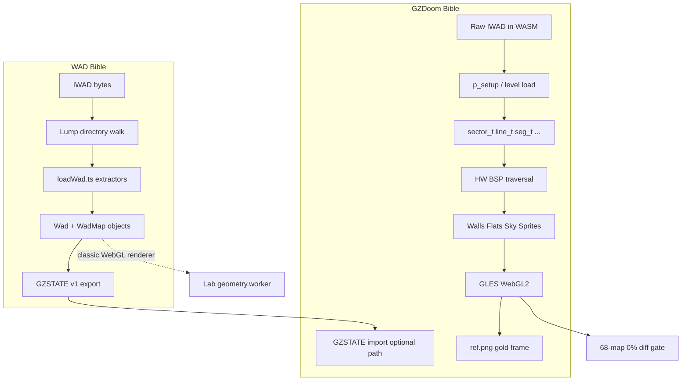

# Doom WAD Lab — Complete Technical Bibles

Two companion references document the **gold standard** for this project: how classic Doom WAD data is parsed, and how **GZDoom** turns that data into pixels. Together they are the authoritative map from raw `DOOM.WAD` / `DOOM2.WAD` bytes through to the **68-map corpus gate** (0% playfield diff vs GLES `ref.png`).

## What “gold standard” means here

| Layer | Authority | Gate |
|-------|-----------|------|
| **WAD parse** | [`doom-wad-core`](../../doom-wad-core) — deterministic TypeScript parser | Unit tests + GZSTATE section diffs |
| **Static map export** | GZSTATE v1 binary (`exportToGzstate.ts`) | Byte-for-byte sections vs C++ dump |
| **Renderer** | [`gzdoom-project`](../../gzdoom-project) GLES / HW renderer in WASM | **68/68** stock maps @ **0%** playfield diff |
| **Lab host** | `doom-wad-lab` — capture, diff, layer toggles | `tools/gzrender-v2/` CI scripts |

Pixels come from **GZDoom C++ inside WASM**, not from the lab’s WebGL2 classic renderer. The lab WebGL path is documented separately in [Rendering](../rendering.md); these bibles focus on **WAD truth** and **GZDoom truth**.

---

## Bible I — WAD Format & Parse Pipeline

**[→ Open the WAD Bible](./wad/README.md)**

How every lump in an IWAD/PWAD is discovered, decoded, and turned into in-memory structures.

| Ch | Title | Topics |
|----|-------|--------|
| [00](./wad/00-introduction.md) | Introduction | Scope, repos, 68-map corpus |
| [01](./wad/01-container-format.md) | Container format | Header, directory, validation |
| [02](./wad/02-loading-phases.md) | Loading phases | `LoadMode` state machine |
| [03](./wad/03-map-lumps.md) | Map lumps | THINGS → BLOCKMAP record layouts |
| [04](./wad/04-graphics-patches-textures.md) | Patches & textures | PNAMES, column posts, composites |
| [05](./wad/05-palette-and-colormap.md) | Palette & colormap | PLAYPAL, COLORMAP, light bands |
| [06](./wad/06-flats-and-sky.md) | Flats & sky | F_* lumps, animation chains |
| [07](./wad/07-sprites-and-animations.md) | Sprites | S_* groups, frame letters |
| [08](./wad/08-switches-textures-linedefs.md) | Switches & flags | SW1↔SW2, linedef bitfield |
| [09](./wad/09-linedef-specials.md) | Line specials | Doors, lifts, teleports |
| [10](./wad/10-sectors-things-bsp.md) | Sectors, things, BSP | Nodes, segs, subsectors |
| [11](./wad/11-audio-and-misc-lumps.md) | Audio & misc | GENMIDI, demos, ENDOOM |
| [12](./wad/12-gzstate-export-bridge.md) | GZSTATE bridge | Parser → canonical export |
| [A](./wad/appendix-map-catalog.md) | **Map catalog** | **Every episode, every level (68 maps)** |
| [Ref](./wad/references.md) | References | Specs, wiki, file index |

---

## Bible IV — Project Chronicle (decisions diary)

**[→ Open the Chronicle](./chronicle/README.md)**

Dated decision log, per-map deep dives (68 maps), source module index, and the [Classic Node/WebGL renderer conversion chronicle](./chronicle/classic-node-webgl-renderer-chronicle.md) — the *why* behind WAD parse, GZDoom gold, and Classic layer choices.

---

## Bible III — Classic Renderer Layers (Node → WebGL2)

**[→ Open the Classic Layer Bible](./classic-layers/README.md)**

How each **Layers panel** toggle maps to Node parse, geometry workers, `drawScene` stages, and GZDoom CVAR parity — with **live toggles**, Puppeteer tests, and E1M1 screenshots.

| Ch | Title | Topics |
|----|-------|--------|
| [00](./classic-layers/00-introduction.md) | Introduction | Live toggles, diagnostics |
| [01](./classic-layers/01-ui-to-draw-plan.md) | UI → draw plan | `RenderLayerToggles` |
| [02](./classic-layers/02-draw-plan-to-stages.md) | Draw plan → stages | `runStage()` gates |
| [03](./classic-layers/03-node-geometry-pipeline.md) | Node geometry | Workers, `mapToWalls`, `mapToFlats` |
| [04](./classic-layers/04-layer-walls.md) | Walls layer | LINEDEFS → quads |
| [05](./classic-layers/05-layer-flats.md) | Flats layer | Floors, ceilings, liquids |
| [06](./classic-layers/06-layer-sky.md) | Sky layer | F_SKY, courtyard |
| [07](./classic-layers/07-layer-sprites.md) | Sprites | THINGS, KVX |
| [08](./classic-layers/08-layer-lighting.md) | Lighting | Sector + dynamic |
| [09](./classic-layers/09-layer-wireframe.md) | Wireframe | BSP / mesh debug |
| [10](./classic-layers/10-gzdoom-parity-matrix.md) | GZDoom parity | CVAR matrix |
| [11](./classic-layers/11-testing-diagnostics.md) | Testing | Puppeteer, DevTools |
| [A](./classic-layers/appendix-layer-catalog.md) | Layer catalog | Full mapping table |
| [📷](./classic-layers/screenshots/README.md) | Screenshots | E1M1 presets |

**Code:** [`classicLayerMapping.ts`](../../src/wad/renderer/modular/classicLayerMapping.ts) · **Tests:** `test-classic-layers.mts`, `test-classic-layers-matrix.mts`

---

## Bible II — GZDoom Renderer Pipeline

**[→ Open the GZDoom Renderer Bible](./gzdoom/README.md)**

How GZDoom walks BSP data and emits walls, flats, sky, lights, sprites — from `vertex_t` to framebuffer.

| Ch | Title | Topics |
|----|-------|--------|
| [00](./gzdoom/00-gold-standard-overview.md) | Gold standard | Corpus gate, WASM path |
| [01](./gzdoom/01-engine-boot-and-wad-load.md) | Boot & WAD load | IWAD, texture manager |
| [02](./gzdoom/02-level-data-structures.md) | Level structs | `sector_t`, `line_t`, `seg_t` |
| [03](./gzdoom/03-view-setup-and-camera.md) | View & camera | Viewpoint, matrices |
| [04](./gzdoom/04-bsp-traversal.md) | BSP traversal | `RenderBSPNode`, clipper |
| [05](./gzdoom/05-wall-rendering.md) | Walls | Upper/middle/lower, pegging |
| [06](./gzdoom/06-flats-and-ceilings.md) | Flats | Planes, VBO, F_SKY |
| [07](./gzdoom/07-sky-and-portals.md) | Sky & portals | Sky dome, sector portals |
| [08](./gzdoom/08-lighting.md) | Lighting | Sector light, dynlights |
| [09](./gzdoom/09-sprites-and-models.md) | Sprites & models | Billboards, psprites |
| [10](./gzdoom/10-draw-order-and-translucency.md) | Draw order | Draw lists, translucency |
| [11](./gzdoom/11-hud-and-2d.md) | HUD & 2D | Status bar |
| [12](./gzdoom/12-gles-webgl2-wasm-path.md) | GLES / WASM | WebGL2 backend, host |
| [13](./gzdoom/13-render-layer-cvars.md) | Render layers | `gl_render_*` CVARs |
| [14](./gzdoom/14-gzstate-dump-parity.md) | GZSTATE parity | C++ dump vs TS export |
| [15](./gzdoom/15-wasm-host-and-corpus-gates.md) | Host & gates | Capture scripts, CI |
| [A](./gzdoom/appendix-code-index.md) | Code index | Every key source file |
| [Ref](./gzdoom/references.md) | References | ZDoom wiki, papers |

---

## End-to-end data flow



---

## Related documentation

| Doc | Role |
|-----|------|
| [docs/README.md](../README.md) | All lab guides (index) |
| [wad-processing.md](../wad-processing.md) | Lab worker pipeline (WebGL classic) |
| [rendering.md](../rendering.md) | Lab WebGL2 vs software Doom |
| [line-specials.md](../line-specials.md) | Runtime specials in lab sim |
| [gzrender-v2/README.md](../gzrender-v2/README.md) | GZRender-V2 project plan |
| [gzstate-v1.md](../gzrender-v2/gzstate-v1.md) | GZSTATE packet spec |

## Repository map

```
doom-wad-lab/          ← you are here (host, docs, classic renderer)
  docs/bible/          ← these bibles
  tools/gzrender-v2/   ← gold capture & diff gates
  src/wad/             ← lab-side WAD/game code

doom-wad-core/         ← canonical WAD parser + GZSTATE export
  src/parser/loadWad.ts
  src/export/

gzdoom-project/        ← gold renderer oracle (C++ / GLES / WASM)
  src/rendering/hwrenderer/
  src/gles/
  src/gzstate_dump.cpp
```

---

*Last expanded: comprehensive bible pass — WAD parse through GZDoom GLES gold corpus.*
