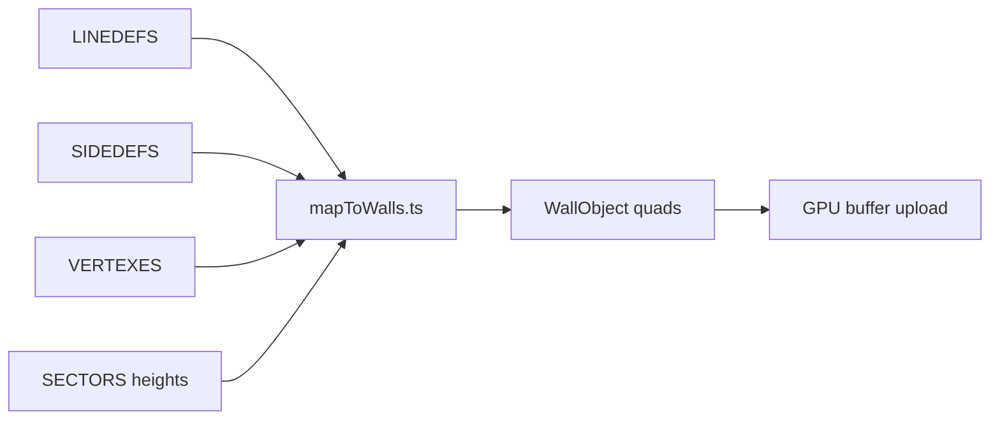
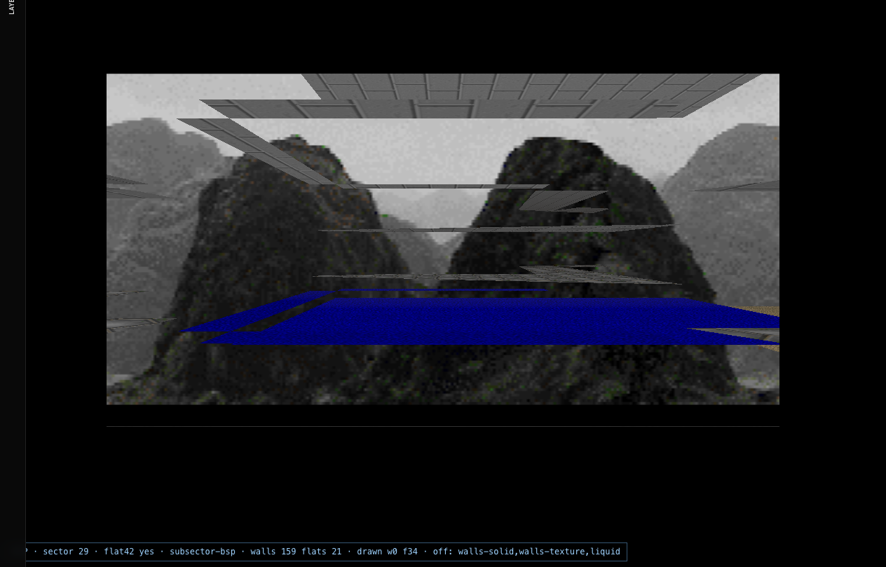

# Chapter 04 — Walls layer

## Table of contents

- [Layer IDs](#layer-ids)
- [WAD → CPU geometry](#wad--cpu-geometry)
- [Draw stages](#draw-stages)
- [Shaders & textures](#shaders--textures)
- [Live toggle behavior](#live-toggle-behavior)
- [Screenshot reference](#screenshot-reference)
- [Failure isolation](#failure-isolation)

---

## Layer IDs

| ID | UI toggles | Draw plan fields |
|----|------------|------------------|
| `walls-solid` | Geometry → **Walls** | `wallsUnlit`, `wallsTextured` |
| `walls-texture` | Textures → **Walls** | `wallsTextured` |

Definition: [`CLASSIC_LAYER_DEFINITIONS`](../../../src/wad/renderer/modular/classicLayerMapping.ts) entries `walls-solid`, `walls-texture`.

---

## WAD → CPU geometry



| WAD field | Wall effect |
|-----------|-------------|
| `SideDef.upper/mid/lower` | Texture names → atlas slice |
| Sector `floorheight` / `ceilingheight` | Vertical span of each surface |
| Linedef flags | Two-sided, unpegged, secret, etc. |
| `LineDef.special` | Moving sectors adjust heights at runtime |

**Key file:** [`mapToWalls.ts`](../../../src/wad/renderer/geometry/mapToWalls.ts) — `createWall()` extrudes a quad between two vertices with Doom pegging rules.

Upper / middle / lower textures become separate draw batches when visible from the camera side.

---

## Draw stages

| Modular stage | When active | What draws |
|---------------|-------------|------------|
| `wallsUnlit` | `layerPlan.wallsUnlit` | Flat-shaded walls (debug / texture-off path) |
| `wallsOpaque` | `layerPlan.wallsTextured` | Opaque masked walls |
| `wallsTransparent` | `layerPlan.wallsTextured` | Translucent midtextures |

Pipeline order: after sky + flats, before sprites — see [Chapter 02](./02-draw-plan-to-stages.md).

BSP culling: only walls in visible subsectors reach the draw loop (`buildGzdoomDrawState`).

---

## Shaders & textures

| Asset | Source lump | Lab module |
|-------|-------------|------------|
| Wall atlas | TEXTURE1/2 + PNAMES + patches | `renderGame/loadWad.ts` |
| PLAYPAL | 768-byte RGB triplets | `doom-wad-core` → RGBA raster |
| COLORMAP | Light bands | Uniform `colormapLut` in `drawScene` |

Programs: `walls.vert` / `walls.frag` (see `CLASSIC_LAYER_DEFINITIONS.shaderPrograms`).

**GZDoom parity CVAR:** `gl_render_walls` — [parity matrix](./10-gzdoom-parity-matrix.md).

---

## Live toggle behavior

Unchecking **Geometry → Walls** sets `solidWalls: false`:

1. `buildRenderLayerDrawPlan` → `wallsTextured = false`, `wallsUnlit = false`
2. `runStage('wallsOpaque')` returns false — **no reload**
3. `__doomDrawStats.walls` drops to 0
4. `__classicLayerDiagnostics.layers` marks `walls-solid` inactive

```bash
npx tsx tools/gzrender-v2/test-classic-layers.mts          # walls-off regression
npx tsx tools/gzrender-v2/test-classic-layers-matrix.mts  # walls-solid isolation
```

Programmatic preset (DevTools / Puppeteer):

```javascript
window.__applyClassicLayerPreset('walls-off');
window.__classicLayerDiagnostics.layers.filter(l => !l.active).map(l => l.id);
// → includes "walls-solid", "walls-texture"
```

---

## Screenshot reference

| Preset | Expected |
|--------|----------|
| `e1m1-all.png` | Textured walls visible |
| `e1m1-walls-solid.png` | **Only** walls (floors/ceilings off) |
| `e1m1-walls-off.png` | Floors + ceilings + sky, **no** vertical surfaces |



Regenerate: `npx tsx tools/gzrender-v2/capture-classic-layer-screenshots.mts`

---

## Failure isolation

| Symptom | Layer to blame | Investigate |
|---------|----------------|-------------|
| Magenta / missing texture | `walls-texture` | PNAMES index, patch missing |
| Gray untextured quads | `walls-texture` off, `walls-solid` on | Textures toggle only |
| No vertical surfaces at all | `walls-solid` | `mapToWalls`, BSP visibility |
| Flickering overlaps | draw order | transparent pass vs opaque |
| Parity vs GZDoom gold | both wall layers | compare with `gl_render_walls 0` in WASM |

---

[← Node pipeline](./03-node-geometry-pipeline.md) · [Next: Flats →](./05-layer-flats.md)
