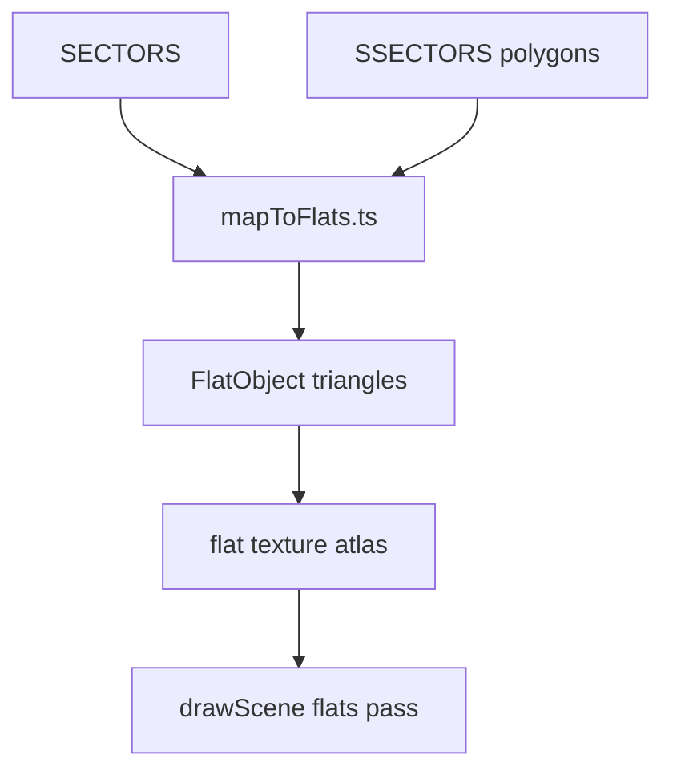
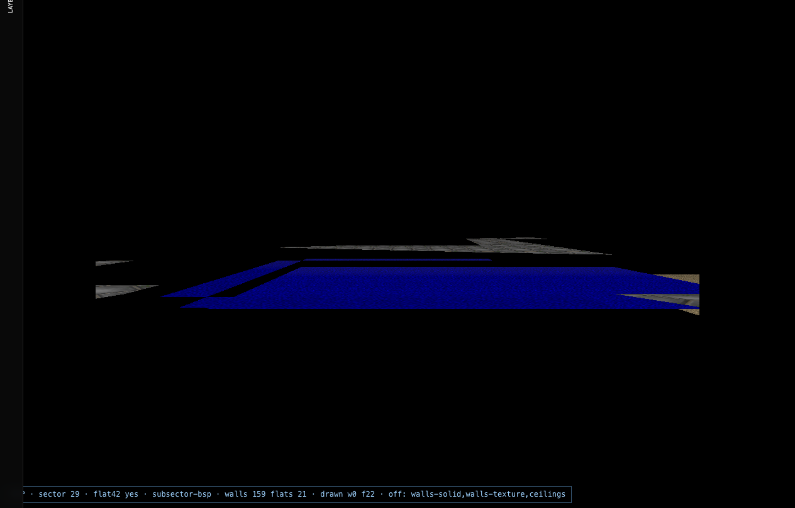

# Chapter 05 — Flats layer (floors & ceilings)

## Table of contents

- [Layer IDs](#layer-ids)
- [WAD data](#wad-data)
- [CPU tessellation](#cpu-tessellation)
- [Draw stages](#draw-stages)
- [Animated liquids](#animated-liquids)
- [Live toggles & tests](#live-toggles--tests)
- [Screenshots](#screenshots)
- [Debugging checklist](#debugging-checklist)

---

## Layer IDs

| ID | UI toggles | Draw plan |
|----|------------|-----------|
| `floors` | Geometry → **Floors** | `drawFloorFlats`, `floorsUnlit`, `floorsTextured` |
| `ceilings` | Geometry → **Ceilings** | `drawCeilingFlats`, `ceilingsUnlit`, `ceilingsTextured` |
| `floor-textures` | Textures → **Floors** | `floorsTextured` |
| `ceiling-textures` | Textures → **Ceilings** | `ceilingsTextured` |
| `liquid` | Textures → **Water & lava** | `liquidAnimated`, `drawFloorFlats` |

---

## WAD data

| Lump / field | Role |
|--------------|------|
| `SECTORS.floorpic` | 8-char flat name (e.g. `FLOOR0_1`) |
| `SECTORS.ceilingpic` | Ceiling flat or `F_SKY` |
| `SECTORS.floorheight` / `ceilingheight` | Y placement |
| `SECTORS.lightlevel` | 0–255 → colormap band |
| F_START…F_END | 4096-byte 64×64 flat lumps |

See [WAD flats chapter](../wad/06-flats-and-sky.md) for lump layout.



---

## CPU tessellation

[`mapToFlats.ts`](../../../src/wad/renderer/geometry/mapToFlats.ts) builds triangle lists per sector surface:

- Floor at `floorheight`
- Ceiling at `ceilingheight` (skipped when `ceilingpic === F_SKY` for that batch — sky pass handles backdrop)
- UVs from Doom 64×64 flat grid

**Important:** Flats and ceilings share the `flats` / `flatsUnlit` modular stages but are gated independently via `drawFloorFlats` vs `drawCeilingFlats`.

---

## Draw stages

| Stage | Condition | Shader |
|-------|-----------|--------|
| `flatsUnlit` | `floorsUnlit` or `ceilingsUnlit` | `flat.frag` (no texture sample) |
| `flats` | `floorsTextured` or `ceilingsTextured` | `flat.frag` + atlas |

Draw order: **after sky**, **before walls** — floors visible through missing walls in `walls-off` preset.

Stats: `__doomDrawStats.flats` increments per drawn batch.

---

## Animated liquids

The `liquid` layer scrolls flat UVs using `animatedFlatMap` from doom-wad-core (`wadInfo.ts`):

- NUKAGE, lava, etc. cycle through flat name chains
- `animateFlatIndex(time)` in `drawScene.ts` picks the frame
- Requires **both** floor geometry and `animatedLiquid` texture toggle

GZDoom CVAR hint: `gl_render_flats` (geometry), not a separate liquid CVAR.

---

## Live toggles & tests

| Preset | Active layers | Inactive |
|--------|---------------|----------|
| `floors` | `floors`, `floor-textures` | walls, ceilings, sky |
| `ceilings` | `ceilings`, `ceiling-textures` | walls, floors, sky |
| `walls-off` | floors + ceilings + sky | walls |

```bash
npx tsx tools/gzrender-v2/test-classic-layers-matrix.mts
```

```javascript
window.__applyClassicLayerPreset('floors');
window.__classicLayerDiagnostics.activeStages; // includes 'flats'
```

---

## Screenshots

| File | Content |
|------|---------|
| `e1m1-floors.png` | Floor flats only |
| `e1m1-ceilings.png` | Ceiling flats only |
| `e1m1-walls-off.png` | Floors + ceilings without walls |



---

## Debugging checklist

| Symptom | Check |
|---------|-------|
| Black floor, walls OK | `floors` layer inactive? `drawFloorFlats` false? |
| Wrong flat image | `floor-textures` — atlas key vs `floorpic` name |
| Ceiling missing | `F_SKY` sector — may be sky pass instead ([Ch. 06](./06-layer-sky.md)) |
| Liquid static | `animatedLiquid` toggle off |
| GZDoom diff on flats | WASM `gl_render_flats`, `gl_texture` |

---

[← Walls](./04-layer-walls.md) · [Next: Sky →](./06-layer-sky.md)
