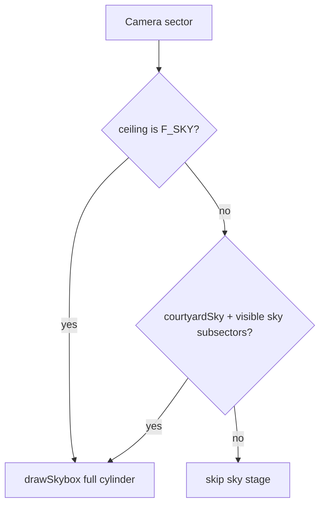
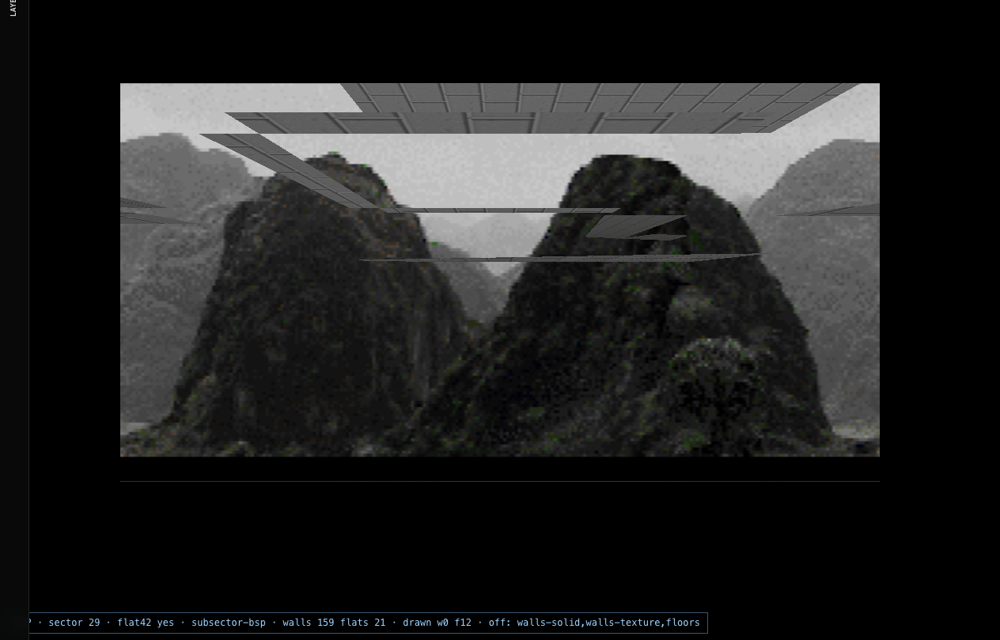

# Chapter 06 — Sky layer

## Table of contents

- [Layer ID](#layer-id)
- [WAD sky data](#wad-sky-data)
- [When sky draws](#when-sky-draws)
- [Courtyard sky toggle](#courtyard-sky-toggle)
- [GPU pass](#gpu-pass)
- [Testing & screenshots](#testing--screenshots)
- [GZDoom parity](#gzdoom-parity)

---

## Layer ID

| ID | UI toggles | Draw plan |
|----|------------|-----------|
| `sky` | Geometry → **Sky**, **Courtyard sky** | `sky`, `courtyardSky` |

Modular stage: **`sky`** — runs early (after wireframe debug, before flats).

---

## WAD sky data

| Source | Meaning |
|--------|---------|
| `SECTORS.ceilingpic === 'F_SKY'` | Sector uses sky instead of ceiling flat |
| `SKY1` / `SKY2` / … lumps | Panoramic sky patch columns |
| `MAPINFO` / game episode | Which sky lump for episode (lab picks from wad metadata) |

Flat sentinel `F_SKY` is documented in [WAD Ch. 06](../wad/06-flats-and-sky.md).

---

## When sky draws

[`shouldRenderFullscreenSkybox`](../../../src/wad/renderer/utils/sectorSkyVisibility.ts) decides if the fullscreen sky cylinder runs:



If `layerPlan.sky === false`, `runStage('sky')` is false — you see clear color or void where ceiling would be.

---

## Courtyard sky toggle

Outdoor maps (e.g. courtyards) may show sky through gaps without the camera standing in an F_SKY sector.

- Toggle: **Geometry → Courtyard sky**
- Draw plan field: `courtyardSky`
- Uses BSP `visibleSectors` + subsector filter from [`gzdoomDrawState.ts`](../../../src/wad/renderer/bsp/gzdoomDrawState.ts)

Disable to debug interior-only views.

---

## GPU pass

| Component | File |
|-----------|------|
| Sky mesh | `drawSkybox.ts` — cylinder / billboard |
| Texture | `textures.sky[currentSky]` from loadWad |
| Shader | `shaders.skybox` |
| Uniforms | yaw + pitch from camera |

Sky draws with depth setup so walls/flats composite correctly afterward.

**Node sources (from mapping):**

- `drawScene drawSkybox` — runtime pass
- `bsp/gzdoomDrawState.ts` — courtyard filter

---

## Testing & screenshots

```bash
window.__applyClassicLayerPreset('sky');
```

Preset enables sky + ceilings (ceilings provide horizon context in E1M1 outdoor areas).

| Screenshot | Preset |
|------------|--------|
| `e1m1-sky.png` | sky + ceilings |
| `e1m1-walls-off.png` | sky visible above flats |



Matrix test case `sky` asserts `walls-solid` and `floors` inactive, `sky` + `ceilings` active.

---

## GZDoom parity

| Classic | GZDoom (s) |
|---------|------------|
| `sky` toggle | `gl_portals`, `gl_noskyboxes` |
| Courtyard heuristic | HW portal / skybox logic |

Full table: [Chapter 10](./10-gzdoom-parity-matrix.md).

When gold corpus diffs show sky band errors, compare WASM with Classic `sky` layer isolated via screenshots.

---

[← Flats](./05-layer-flats.md) · [Next: Sprites →](./07-layer-sprites.md)
