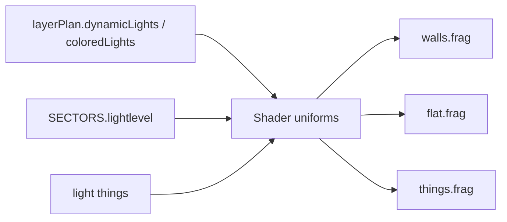

# Chapter 08 — Lighting layers

## Table of contents

- [Layer IDs](#layer-ids)
- [Sector colored light](#sector-colored-light)
- [Dynamic point lights](#dynamic-point-lights)
- [Shader path](#shader-path)
- [WAD sources](#wad-sources)
- [Toggles & diagnostics](#toggles--diagnostics)
- [GZDoom parity](#gzdoom-parity)

---

## Layer IDs

| ID | UI toggle | Draw plan field | Modular stage |
|----|-----------|-----------------|---------------|
| `sector-color` | Lighting → **Colored lighting** | `coloredLights` | *(shader uniform — no separate stage)* |
| `dynamic-light` | Lighting → **Dynamic lighting** | `dynamicLights` | *(shader uniform — no separate stage)* |

Unlike walls/flats, lighting layers **do not** add/remove draw passes. They change how existing passes shade pixels.

---

## Sector colored light

Doom stores per-sector light level 0–255 in `SECTORS.lightlevel`.

Classic renderer:

1. `drawScene` builds `sectorLightCache` from visible sectors
2. `coloredLights` plan flag enables colormap band + tint in wall/flat/sprite shaders
3. Maps to software lighting bands via COLORMAP ([WAD Ch. 05](../wad/05-palette-and-colormap.md))

**Toggle off:** flat ambient — easier parity diff isolation.

---

## Dynamic point lights

| Source | Module |
|--------|--------|
| Light-emitting things | `hydrateLoadedMap.ts` → `pointLights[]` |
| Grid acceleration | `drawScene.ts` `pointLightGrid` |
| Uniforms | Passed to `walls.frag`, `flat.frag`, `things.frag` |

Things like torches and lamps become omni lights with radius / color.

**Toggle off:** sector light only — matches reduced GZDoom dynamic light contribution.

---

## Shader path



No `runStage()` entry — diagnostics show active via draw plan fields on `__classicLayerDiagnostics.plan`.

---

## WAD sources

| Data | Used for |
|------|----------|
| `SECTORS.lightlevel` | Sector color layer |
| `THINGS` type 2028–2046 (lights) | Dynamic lights |
| COLORMAP | Band selection |
| PLAYPAL | Final RGB |

---

## Toggles & diagnostics

```javascript
const d = window.__classicLayerDiagnostics;
d.plan.dynamicLights;   // boolean
d.plan.coloredLights;   // boolean
d.layers.find(l => l.id === 'dynamic-light')?.active;
```

Lighting failures often look like **global brightness** issues — isolate by turning off one layer at a time while keeping geometry toggles on (`__applyClassicLayerPreset('all')` then uncheck in panel).

Unit tests: [`classicLayerMapping.test.ts`](../../../src/wad/renderer/modular/classicLayerMapping.test.ts) — default toggles have both on.

---

## GZDoom parity

| Classic toggle | GZDoom CVAR | Notes |
|----------------|-------------|-------|
| `coloredLighting` | `gl_bandedswlight` | Software light bands |
| `dynamicLighting` | `gl_fogmode` | Dynamic light approximation in WASM layer map |

**Removed from WASM argv:** `gl_lightmode`, `gl_light_sprites` — do not use in layer scripts.

See [GZDoom lighting](../gzdoom/08-lighting.md) for C++ reference.

---

[← Sprites](./07-layer-sprites.md) · [Next: Wireframe →](./09-layer-wireframe.md)
