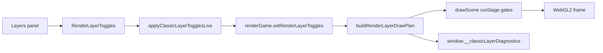
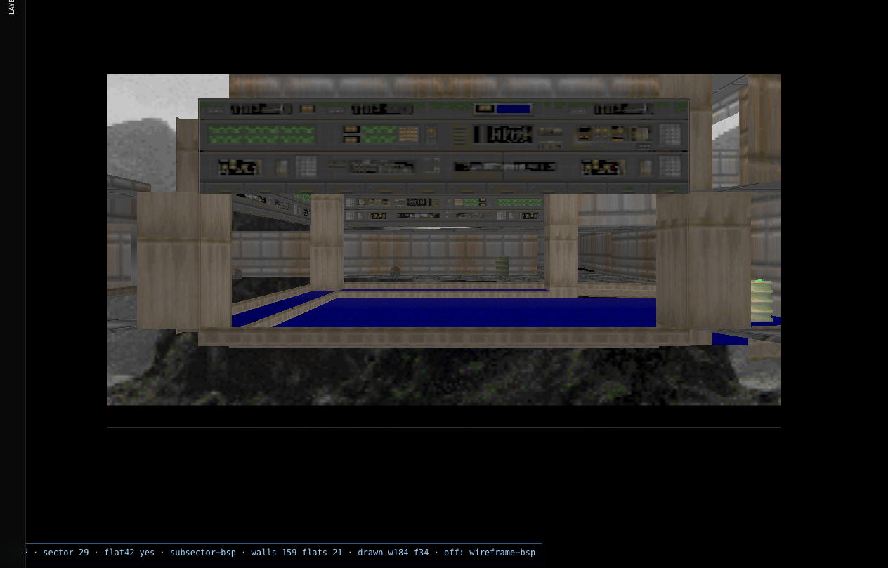
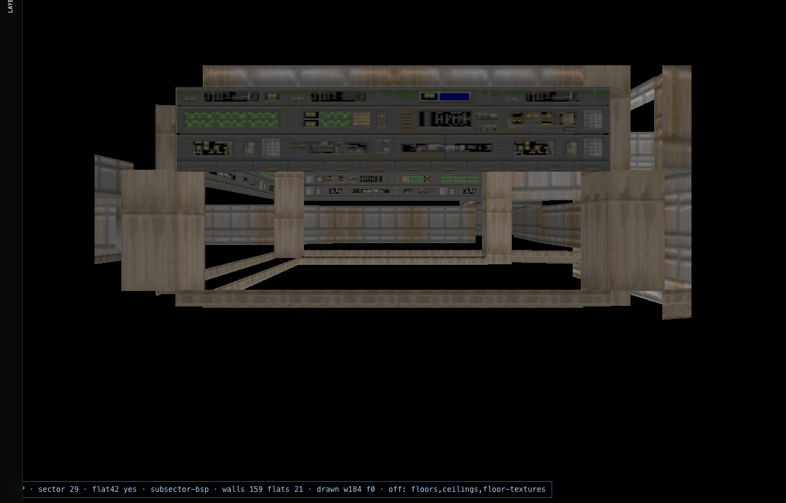
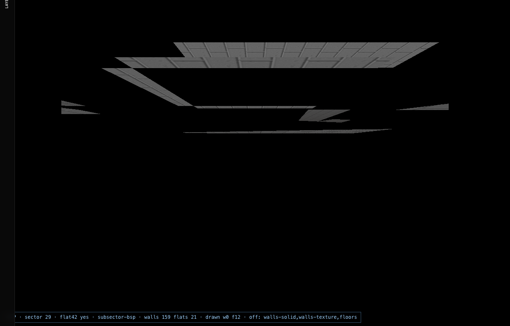

# Classic Renderer Layer Bible

**How every Layers panel toggle maps to Node.js WAD data, CPU geometry, WebGL2 draw passes, and GZDoom WASM CVARs.**

This is the **Classic / TypeScript WebGL2** companion to:

- [GZDoom (s) layer CVARs](../gzdoom/13-render-layer-cvars.md) — live WASM toggles
- [WAD map lumps](../wad/03-map-lumps.md) — raw data source
- [Rendering pipeline](../../rendering.md) — frame overview

---

## Table of contents

| # | Chapter | Topic |
|---|---------|-------|
| 00 | [Introduction](./00-introduction.md) | Goals, live toggles, diagnostics |
| 01 | [UI toggles → draw plan](./01-ui-to-draw-plan.md) | `RenderLayerToggles` → `RenderLayerDrawPlan` |
| 02 | [Draw plan → modular stages](./02-draw-plan-to-stages.md) | `executeHwDrawPipeline` / `runStage()` |
| 03 | [Node geometry pipeline](./03-node-geometry-pipeline.md) | Workers, `mapToWalls`, `mapToFlats` |
| 04 | [Walls layer](./04-layer-walls.md) | LINEDEFS → quads → `walls.frag` |
| 05 | [Flats layer](./05-layer-flats.md) | SECTORS → triangles → `flat.frag` |
| 06 | [Sky layer](./06-layer-sky.md) | F_SKY, courtyard filter |
| 07 | [Sprites & voxels](./07-layer-sprites.md) | THINGS, KVX |
| 08 | [Lighting layers](./08-layer-lighting.md) | Sector + point lights |
| 09 | [Wireframe debug](./09-layer-wireframe.md) | BSP / mesh / sight |
| 10 | [GZDoom parity matrix](./10-gzdoom-parity-matrix.md) | Classic vs (s) CVAR |
| 11 | [Testing & diagnostics](./11-testing-diagnostics.md) | Puppeteer, `__doomDrawStats` |
| A | [Layer catalog](./appendix-layer-catalog.md) | Full `CLASSIC_LAYER_DEFINITIONS` |
| — | [Screenshots](./screenshots/README.md) | Visual presets (E1M1) |

---

## Quick reference — live application

| Backend | Live API | Reload on toggle? |
|---------|----------|-------------------|
| **Classic** | `applyClassicLayerTogglesLive(game, toggles)` | **No** |
| **GZDoom (s)** | `applyGzdoomLayerTogglesLive(module, toggles)` | **No** |
| **GZDoom WASM play** | same as (s) | **No** |

**Code authority:** [`classicLayerMapping.ts`](../../../src/wad/renderer/modular/classicLayerMapping.ts)

---

## Screenshot gallery (E1M1)

| Preset | Image | What you should see |
|--------|-------|---------------------|
| All layers |  | Full scene |
| Walls only |  | Vertical surfaces |
| Floors only |  | Floor flats |
| Ceilings only |  | Ceiling flats |
| Sky |  | Sky cylinder + ceilings |
| Walls off |  | Floors/ceilings/sky without walls |

Regenerate: `npx tsx tools/gzrender-v2/capture-classic-layer-screenshots.mts`

---

[← Bible hub](../README.md)
