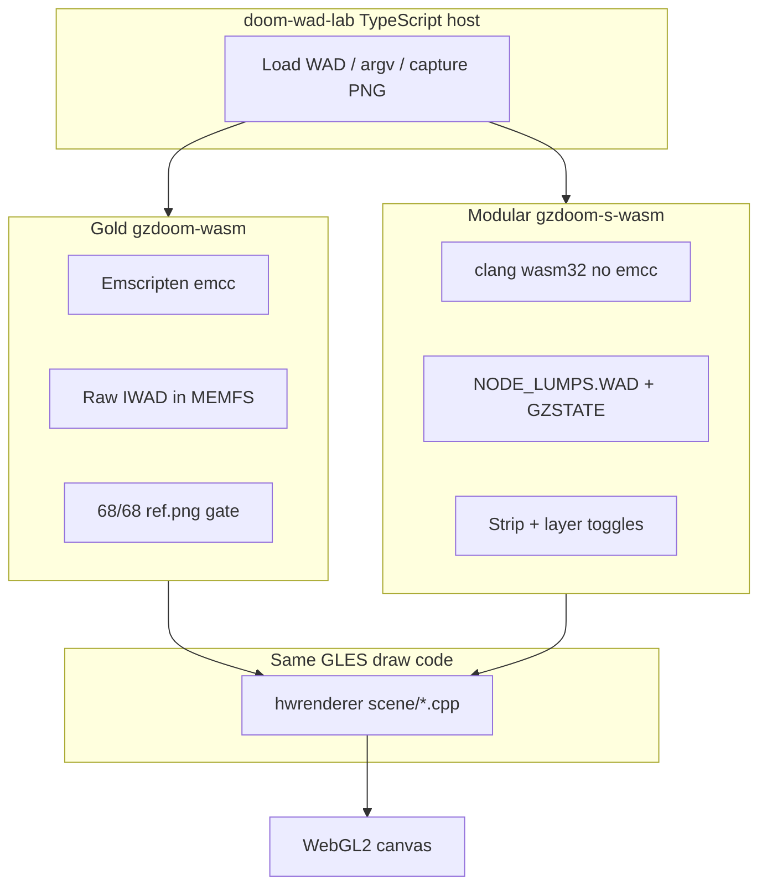
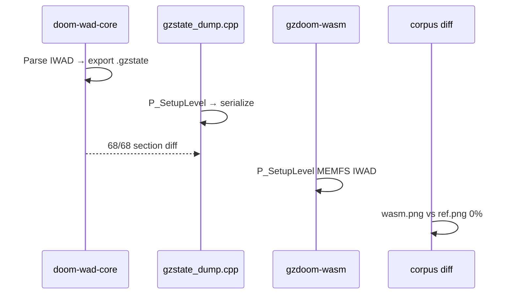
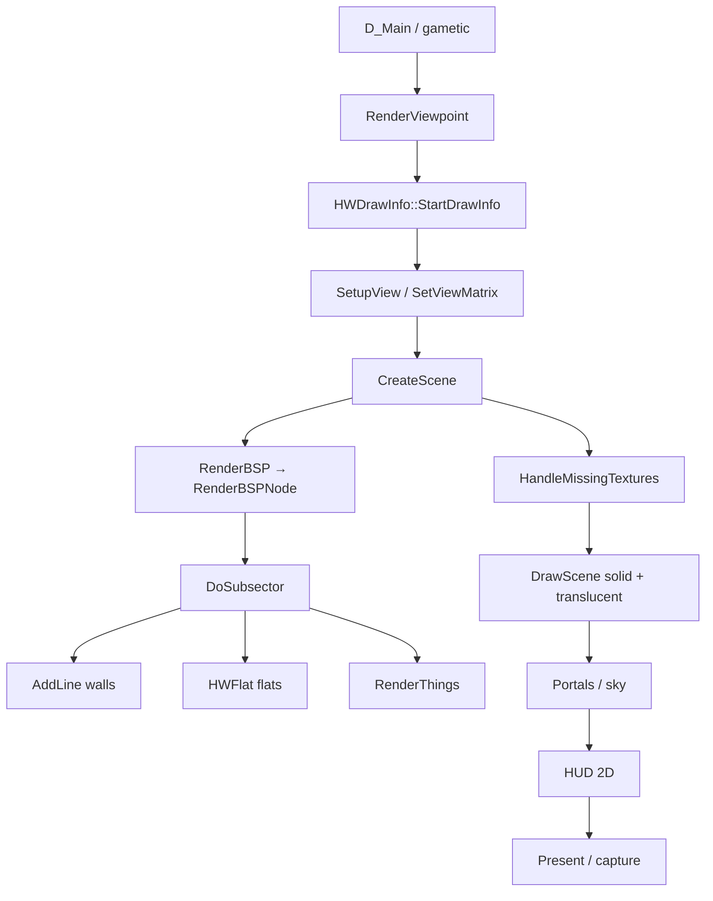

# 00 — Gold Standard Overview

What **gold** means in doom-wad-lab gzrender-v2, how data flows from Node through GZSTATE into WASM, and why the host must never draw pixels.

**Next:** [01-engine-boot-and-wad-load.md](./01-engine-boot-and-wad-load.md) · **Corpus:** [15-wasm-host-and-corpus-gates.md](./15-wasm-host-and-corpus-gates.md)

---

## Definition of gold

**Gold** is the frozen parity oracle: GZDoom's own **GLES hardware renderer**, compiled to WebAssembly via Emscripten, executing inside the browser with **raw IWAD bytes** mounted in MEMFS. The engine parses every lump internally (`W_Init`, `P_SetupLevel`). The TypeScript host loads the module, passes argv, captures PNG — it does **not** implement wall columns, flats, sprites, or sky.

The acceptance gate:

```txt
68 stock maps @ 0% playfield pixel diff
WASM capture (wasm.png) vs native GLES gold (ref.png)
```

| Property | Gold oracle |
|----------|-------------|
| UI backend id | `gzdoom-wasm` |
| Artifact dir | `public/wasm/gzdoom/{gzdoom.js,gzdoom.wasm,*.pk3}` |
| Build | `npm run build:gzdoom-wasm` → `tools/gzrender-v2/build-gzdoom-wasm.sh` |
| WAD input | Raw IWAD in MEMFS — full in-engine parse |
| Play argv | `-gzrender_play -gzrender_browser` + `-iwad /wad/DOOM.WAD` |
| Gate command | `npm run test:gzdraw-corpus` |

Gold is the **reference photograph**. Change it only for documented parity fixes on the frozen path.

Source: [wasm-gold-and-modular.md](../../gzrender-v2/wasm-gold-and-modular.md).

---

## Why a frozen oracle exists

doom-wad-lab's Classic **TypeScript WebGL** renderer (`src/wad/renderer/modular/`) is optimized for editing and federation. It is not GZDoom. The gold path answers:

> Does GZDoom's production HW renderer, relinked for WebGL2, match the same build running natively?

Only C++ GLES inside WASM can answer that. JavaScript draw code cannot.

---

## Gold vs modular `(s)` fork



| | Gold | Modular `(s)` |
|---|------|----------------|
| Linker | Emscripten | clang → wasm32 |
| Map geometry | Engine parses MAP lumps | `-loadgzstate` from Node export |
| Purpose | Prove WASM ≡ native GZDoom | Bisect renderer stages vs Classic WebGL |
| Must not | Be replaced by `(s)` for corpus proof | Fall back to gold Emscripten binary |

Details: [12-gles-webgl2-wasm-path.md](./12-gles-webgl2-wasm-path.md), [14-gzstate-dump-parity.md](./14-gzstate-dump-parity.md).

---

## Success criteria (gzrender-v2 charter)

From [gzrender-v2/README.md](../../gzrender-v2/README.md):

```txt
GZDoom State == Node State
AND GZDoom Frame == Renderer-V2 Frame
AND Renderer-V2 Event Stream == Expected Event Stream
AND Renderer-V2 runs in browser WASM
AND Existing WAD Lab remains untouched
```

Execution order:

```txt
GZDoom dump → import renderer → frame parity → strip renderer
→ Node GZSTATE export → state parity → event parity → corpus parity → WASM
```

---

## Node → GZSTATE → WASM path



1. **Node export** — `npm run test:corpus` validates GZSTATE sections.
2. **GZSTATE import** — modular `-loadgzstate` only; gold uses raw IWAD.
3. **Frame gate** — [15-wasm-host-and-corpus-gates.md](./15-wasm-host-and-corpus-gates.md).

---

## No JavaScript renderer for pixels

From [wasm-renderer-invariants](../../../.cursor/rules/wasm-renderer-invariants.mdc):

1. **No `#ifdef __EMSCRIPTEN__` in renderer draw paths** — use `gles.webgl2`, `gles.glesMode`, `GZRenderOnly`.
2. **No TS/WebGL world drawing** — host loads WASM, captures, diffs.
3. **Step 2 gate** — 68/68 @ 0% playfield diff vs `ref.png`.

---

## Runtime flags

`gzstate_dump.cpp` / `gzstate_dump.h`:

```cpp
bool GZRenderOnly = false;       // hosted capture; skips parts of sim/HUD
bool GZRenderPlay = false;       // full playable — NOT GZRenderOnly
bool GZRenderBrowserHost = false;
bool GZRenderStripped = false;   // modular (s)
```

Parsed in `d_main.cpp` → `InitGZRenderOnlyFromArgs()` before `InitGLES()`.

Gold browser play: `-gzrender_play -gzrender_browser` without forcing `GZRenderOnly`.

---

## End-to-end render pipeline (one frame)



Entry: `hw_entrypoint.cpp`. BSP: [04-bsp-traversal.md](./04-bsp-traversal.md). Draw lists: [10-draw-order-and-translucency.md](./10-draw-order-and-translucency.md).

---

## Federation model

```txt
Classic WebGL (TS)  ←→  GZSTATE  ←→  GZDoom C++ (gold WASM)
         ↑                                      ↑
    renderLayerToggles              applyGzdoomRenderLayers
```

Same semantic layer toggles ([13-render-layer-cvars.md](./13-render-layer-cvars.md)); only gold defines ground-truth pixels.

---

## GZDRAW CPU oracle (development)

`GZDraw_IsCpuOracle()` builds BSP draw lists without GL draws — bisects list construction vs GPU submission. Stricter gate is full GLES → WebGL2 → PNG.

---

## Corpus artifacts

```txt
artifacts/gzrender-v2/gold-standard/{slug}/{map}/ref.png
artifacts/gzrender-v2/gzdoom-wasm-corpus/{slug}/{map}/wasm.png
artifacts/gzrender-v2/gzdoom-wasm-corpus-report.json
public/wasm/gzdoom/
tools/gzrender-v2/
```

View probes: `bspGoldenSnapshots.json`, [view-probe-grid.md](../../gzrender-v2/view-probe-grid.md).

---

## Frozen path change policy

| Allowed | Not allowed |
|---------|-------------|
| GLES parity bugfix + re-gate | JS pixel fallback for gold |
| Host MEMFS/argv fix | `#ifdef __EMSCRIPTEN__` in scene draws |
| Shader fix with 68-map proof | Using `(s)` binary for corpus gate |

---

## Quick commands

```bash
cd doom-wad-lab
npm run build:gzdoom-wasm
npm run verify:gold-wasm
npm run test:gzdraw-corpus    # pixel gate
npm run test:corpus           # GZSTATE gate
```

UI: `?renderer=gzdoom-wasm&map=E1M1`

---

## Glossary

| Term | Meaning |
|------|---------|
| Gold | Frozen `gzdoom-wasm` Emscripten oracle |
| Playfield | 3D view crop excluding status bar |
| GZSTATE | Post-load binary map snapshot v1 |
| ref.png | Native GLES spawn oracle |
| wasm.png | Browser WASM capture |

---

## Chapter map

| Stage | Chapter |
|-------|---------|
| Boot, WAD | [01](./01-engine-boot-and-wad-load.md) |
| Structs | [02](./02-level-data-structures.md) |
| Camera | [03](./03-view-setup-and-camera.md) |
| BSP | [04](./04-bsp-traversal.md) |
| Walls–HUD | [05](./05-wall-rendering.md)–[11](./11-hud-and-2d.md) |
| WASM/GZSTATE | [12](./12-gles-webgl2-wasm-path.md)–[15](./15-wasm-host-and-corpus-gates.md) |

**Index:** [appendix-code-index.md](./appendix-code-index.md) · **External:** [references.md](./references.md)
