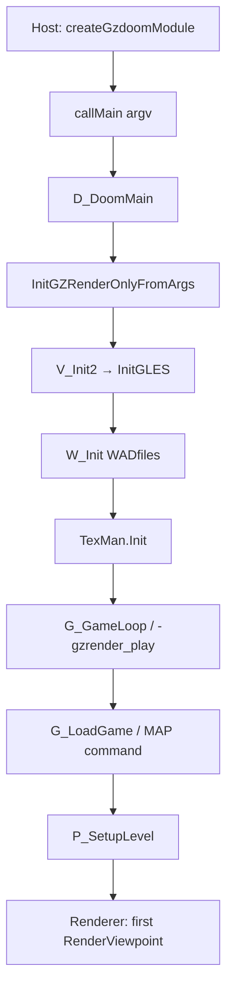
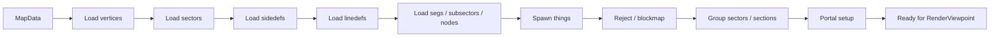

# 01 — Engine Boot and WAD Load

How GZDoom initializes the filesystem, loads IWAD/PWAD archives, builds the texture manager, and enters `P_SetupLevel` — the gateway to all renderer-facing map state.

**Prev:** [00-gold-standard-overview.md](./00-gold-standard-overview.md) · **Next:** [02-level-data-structures.md](./02-level-data-structures.md) · **Textures in render:** [05](./05-wall-rendering.md), [06](./06-flats-and-ceilings.md)

---

## Boot sequence (gold WASM)



Gold argv (typical):

```txt
+vid_renderer gles
+gl_es 1
-gzrender_play
-gzrender_browser
-iwad /wad/DOOM.WAD
+warp E1M1
```

Host mounts IWAD at `/wad/DOOM.WAD` in Emscripten MEMFS before `callMain`. No Node-side lump injection on gold path.

Build/host: [15-wasm-host-and-corpus-gates.md](./15-wasm-host-and-corpus-gates.md).

---

## `W_Init` — WAD filesystem

**File:** `gzdoom-project/src/w_wad.cpp`, invoked from `d_main.cpp`:

```cpp
// d_main.cpp (~3319)
if (!batchrun) Printf ("W_Init: Init WADfiles.\n");
```

`W_Init` registers search paths, opens IWAD (+ optional PWADs, PK3s), and builds the lump directory used by every subsequent loader. Lump names are normalized to 8 characters; map lumps follow the enum in `doomdata.h`:

```cpp
enum {
  ML_LABEL, ML_THINGS, ML_LINEDEFS, ML_SIDEDEFS, ML_VERTEXES,
  ML_SEGS, ML_SSECTORS, ML_NODES, ML_SECTORS, ML_REJECT, ML_BLOCKMAP,
  // ...
  ML_ZNODES = ML_NODES,      // compressed nodes
  ML_GLZNODES = ML_SSECTORS, // GL nodes
};
```

For doom-wad-lab gold, the **same** lump chain Doom uses is read entirely inside WASM. Node's parallel parse (for GZSTATE) must produce identical resolved geometry — validated by corpus tests in [14-gzstate-dump-parity.md](./14-gzstate-dump-parity.md).

---

## PK3 and minimal shader packages

Gold WASM ships PK3s beside `gzdoom.wasm` (`public/wasm/gzdoom/*.pk3`). These provide:

- GLES shader definitions (`gles_shader.cpp` compilation units)
- Default material definitions
- Font/status bar assets for HUD ([11-hud-and-2d.md](./11-hud-and-2d.md))

`build-gzdoom-wasm.sh` runs `build-shader-overlay-pk3.py` and copies artifacts. The gold build intentionally avoids full desktop GZDoom PK3 discovery — see strip order in [wasm-gold-and-modular.md](../../gzrender-v2/wasm-gold-and-modular.md).

---

## Texture manager (`TexMan`)

**Headers:** `texturemanager.h`  
**Implementation:** `texturemanager.cpp` (large; central to all HW draws)

Responsibilities:

1. **Load PATCH / TEXTURE1 / TEXTURE2 / PNAMES** from IWAD.
2. **Resolve `FGameTexture*`** for wall names (`mapsidedef_t::toptexture`, etc.), flats, sprites.
3. **Hardware material binding** — sizes, scaling, NPOT emulation flags, shader layers.
4. **Sky texture lookup** — pairs with `r_sky.h` / [07-sky-and-portals.md](./07-sky-and-portals.md).
5. **Mirror texture** — `TexMan.mirrorTexture` for reflective surfaces (`HWWall::RenderMirrorSurface` in `hw_walls.cpp`).

At level load, sidedefs still store **8-char lump names**. At render time, `AddLine` resolves through TexMan to GPU-ready textures. CVAR `gl_texture` (see [13-render-layer-cvars.md](./13-render-layer-cvars.md)) can disable sampling for debug modes.

GZSTATE export includes texture tables so Node-import path does not re-read IWAD patches:

- `SEC_TEXTURE_DEFS`, `SEC_PNAMES`, `SEC_PATCH_RASTERS`, … in `gzstate_dump.cpp`.

---

## Game state → level load

**File:** `g_level.cpp`

When the player warps to a map or a new game starts:

```cpp
P_SetupLevel(this, position, newGame);
```

`P_SetupLevel` (`p_setup.cpp`) is the **single authoritative level load entry** for both gold IWAD and GZSTATE import paths.

---

## `P_SetupLevel` in detail

**File:** `gzdoom-project/src/p_setup.cpp` — function starts ~line 415.

### Pre-load housekeeping

- Resets per-player counters (unless savegame restore).
- Clears `Players[i]->mo`.
- `S_Start()` / `S_ResetMusic()` — audio stopped before tear-down.
- `P_FreeLevelData()` — releases previous level's nodes, sectors, thinkers, etc.

### Map data source (branch)

```cpp
MapData *map = nullptr;
if (GZState_HasImportPath())
{
  map = P_OpenMapDataFromGzstate(GZState_GetImportPath());
}
else
{
  map = P_OpenMapData(Level->MapName.GetChars(), true);
}
```

| Path | When | Reader |
|------|------|--------|
| `P_OpenMapData` | Gold WASM, native | Reads MAPxx lumps from WAD |
| `P_OpenMapDataFromGzstate` | Modular `-loadgzstate` | Deserializes GZSTATE sections |

Both converge on the same in-memory structures documented in [02-level-data-structures.md](./02-level-data-structures.md).

### Load pipeline (conceptual)



Key sub-functions in `p_setup.cpp` and friends (`p_setup.cpp`, `p_nodes.cpp`, `p_sectors.cpp`):

- **`P_LoadVertexes`** — `mapvertex_t` → `vertex_t` ([02](./02-level-data-structures.md))
- **`P_LoadSectors`** — floor/ceiling heights, light, tags
- **`P_LoadSideDefs` / `P_LoadLineDefs`** — textures, flags, specials
- **`P_LoadNodes` / GL nodes** — BSP; may use prebuilt GLZNODES lump
- **`P_SpawnMapThing`** — actors → `AActor` list linked into sectors

After load, `Level->HeadNode()` points at BSP root consumed by [04-bsp-traversal.md](./04-bsp-traversal.md).

---

## IWAD vs PWAD ordering

GZDoom merges lumps last-wins across the file list. Gold tests use stock `DOOM.WAD` / `DOOM2.WAD` without PWAD overrides so `ref.png` stays reproducible. Custom WAD lab maps use PWAD mount in MEMFS with explicit `-file` argv when testing.

---

## `-gzrender_*` argv and level load timing

From `gzstate_dump.h`:

- **`-gzrender_play`** — Full game loop; `P_SetupLevel` runs normally; HUD + tics active.
- **`-gzrender_hosted` / GZRenderOnly** — May skip user interaction; used for spawn-frame capture with fixed view.
- **`-loadgzstate path`** — Sets import path before warp; `P_SetupLevel` never opens raw MAP lumps for geometry.

Dump hooks after load: `GZState_DumpIfRequested()` serializes post-`P_SetupLevel` state ([14-gzstate-dump-parity.md](./14-gzstate-dump-parity.md)).

---

## `InitGLES` and renderer backend selection

Before any level draw, `V_Init2` selects the GLES backend:

**Files:** `gles_system.cpp`, `hw_entrypoint.cpp`

```cpp
+vid_renderer gles
+gl_es 1
```

Sets `OpenGLESRenderer::gles.webgl2` when running under WebGL2 (browser). This affects shader selection, FBO format, and a few draw-path branches — not separate renderer implementations. See [12-gles-webgl2-wasm-path.md](./12-gles-webgl2-wasm-path.md).

Software and Vulkan backends are excluded from gold WASM link.

---

## First frame after load

1. Player mobj spawned at start spot (`position` argument to `P_SetupLevel`).
2. `R_SetupFrame` builds `FRenderViewpoint` from camera ([03-view-setup-and-camera.md](./03-view-setup-and-camera.md)).
3. `RenderViewpoint` (`hw_entrypoint.cpp`) creates `HWDrawInfo`, calls `CreateScene()`.

For corpus spawn capture, view may be overridden to fixed coordinates via gzrender probe CVARs / dump flags so every map's `ref.png` uses the same camera convention.

---

## doom-wad-lab integration points

| Concern | Lab file |
|---------|----------|
| WASM build | `tools/gzrender-v2/build-gzdoom-wasm.sh` |
| Module host | `src/gzdoom-oracle/gzdoomWasmHost.ts` |
| Play runtime | `src/wad/renderer/gzrender-v2/gzdoom/gzdoomViewerRuntime.ts` |
| IWAD mount | MEMFS in host before `callMain` |
| Node lump re-encode (s only) | `tools/gzrender-v2/export-node-gzstate.mts` |

Gold path never calls `gzstateToWadMap` for geometry — only for parity validation.

---

## Failure modes (operational)

| Symptom | Likely cause |
|---------|----------------|
| `Unable to open map` | IWAD not mounted or wrong `-iwad` path |
| `GZSTATE import failed` | Section mismatch vs engine version ([14](./14-gzstate-dump-parity.md)) |
| Black screen, no crash | `gl_render_*` all off ([13](./13-render-layer-cvars.md)) |
| Missing textures | TexMan init order / PWAD not loaded |
| WASM hang on load | Multithread pool mis-config (gold forces single-thread BSP) |

---

## Key source files

| File | Purpose |
|------|---------|
| `d_main.cpp` | Main loop, `W_Init`, argv parsing |
| `w_wad.cpp` | WAD lump I/O |
| `texturemanager.cpp` | Texture/sprite/flat resolution |
| `p_setup.cpp` | `P_SetupLevel`, map loaders |
| `g_level.cpp` | Invokes level setup from game flow |
| `gzstate_dump.cpp` | Post-load export / import hooks |

Full index: [appendix-code-index.md](./appendix-code-index.md).

---

## Cross-references

- Runtime structs after load: [02-level-data-structures.md](./02-level-data-structures.md)
- When load completes, rendering starts: [04-bsp-traversal.md](./04-bsp-traversal.md)
- GZSTATE binary sections: [14-gzstate-dump-parity.md](./14-gzstate-dump-parity.md)
