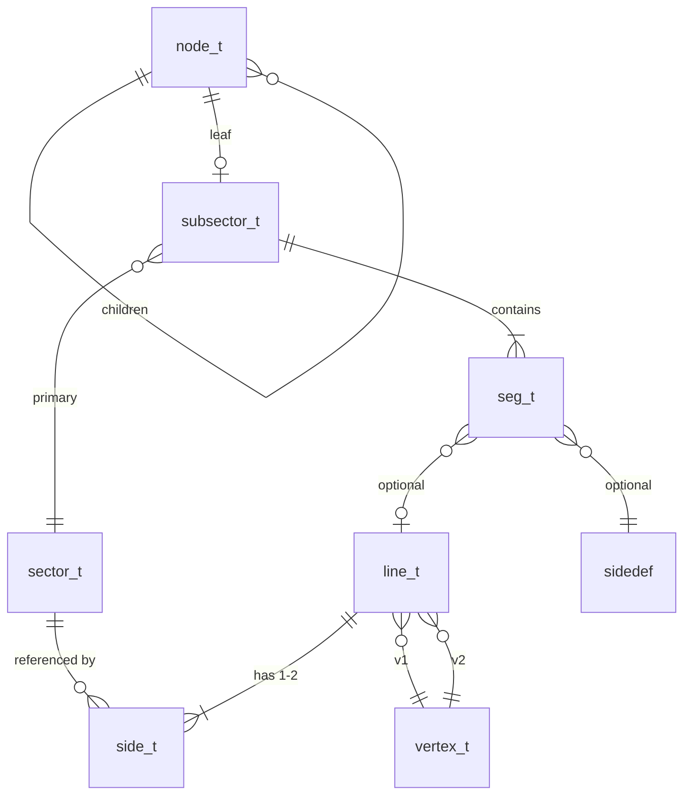

# 02 — Level Data Structures

How WAD map lumps become GZDoom runtime structures — the geometry graph every HW renderer pass traverses.

**Prev:** [01-engine-boot-and-wad-load.md](./01-engine-boot-and-wad-load.md) · **Next:** [03-view-setup-and-camera.md](./03-view-setup-and-camera.md) · **Used by:** [04-bsp-traversal.md](./04-bsp-traversal.md)

---

## Two layers: WAD lumps vs runtime structs

GZDoom maintains a clean split:

| Layer | Header | Role |
|-------|--------|------|
| **Editor / WAD format** | `doomdata.h` | `mapvertex_t`, `maplinedef_t`, `mapsidedef_t`, … — exactly as stored in lumps |
| **Runtime engine** | `gamedata/r_defs.h` | `vertex_t`, `line_t`, `side_t`, `seg_t`, `subsector_t`, `sector_t` — enriched, linked, BSP-ready |

`P_SetupLevel` (`p_setup.cpp`) reads lumps via `MapData` and constructs runtime arrays on `FLevelLocals` (`Level->vertexes`, `Level->lines`, …).

GZSTATE v1 exports **runtime-equivalent** tables so Node and engine agree post-load ([14-gzstate-dump-parity.md](./14-gzstate-dump-parity.md)).

---

## Lump order and MAP contract

From `doomdata.h`:

```cpp
enum {
  ML_LABEL,       // "E1M1" or "MAP01"
  ML_THINGS,
  ML_LINEDEFS,
  ML_SIDEDEFS,
  ML_VERTEXES,
  ML_SEGS,
  ML_SSECTORS,
  ML_NODES,
  ML_SECTORS,
  ML_REJECT,
  ML_BLOCKMAP,
  // Hexen: ML_BEHAVIOR
};
```

Modern maps may supply **GL nodes** in `ML_GLZNODES` (replaces segs/ssectors/nodes/vertexes bundle). GZDoom prefers precomputed GL BSP when present — same runtime structs, different loader in `p_nodes.cpp`.

---

## `vertex_t`

**WAD:** `mapvertex_t { int16_t x, y; }`  
**Runtime:** `vertex_t` in `r_defs.h` (~line 103)

Runtime adds:

- Fixed-point and float cached coordinates (`fx`, `fy` / `fX()`, `fY()`)
- Back-links from segs and lines
- Dirty flags for polyobject moves

Vertices are **2D** map units; Z comes from sector planes when segs are drawn.

---

## `sector_t`

**WAD:** `mapsector_t` — floor/ceiling height, floor/ceiling flat names, light level, tag.  
**Runtime:** `sector_t` (~line 629 in `r_defs.h`) — largest structure.

Critical fields for rendering:

| Field | Render use |
|-------|------------|
| `floorplane` / `ceilingplane` | `secplane_t` — Z at any (x,y); used by [06-flats-and-ceilings.md](./06-flats-and-ceilings.md) |
| `floorpic` / `ceilingpic` | Flat textures via TexMan |
| `lightlevel`, `lightseq`, colors | [08-lighting.md](./08-lighting.md) |
| `heightsec`, `MoreFlags` | Deep water / fake floor — `hw_FakeFlat` ([06](./06-flats-and-ceilings.md)) |
| `touching_renderthings` | Sprite iteration in `DoSubsector` |
| `validcount` | Per-frame "already drawn sector" guard in BSP |
| Portal groups | [07-sky-and-portals.md](./07-sky-and-portals.md) |

Sectors are the **anchor** for flats, light, and thing lists. Walls hang off linedefs between sectors.

---

## `side_t`

**WAD:** `mapsidedef_t` — texture names (8 chars), offsets, sector index.  
**Runtime:** `side_t` (~line 1201)

```cpp
// Conceptual tiers for wall drawing (side_t::top, mid, bottom)
side_t::top, side_t::mid, side_t::bottom
```

Renderer uses sidedef for:

- `GetTexture(side_t::top|mid|bottom)` → `FGameTexture*`
- `textureoffset`, `rowoffset` — pegging ([05-wall-rendering.md](./05-wall-rendering.md))
- `Flags` — `WALLF_POLYOBJ`, `WALLF_DITHERTRANS`, etc.
- Link to `sector_t*` (front sector of wall)

One-sided lines have only front sidedef; back is `NULL` or sentinel.

---

## `line_t`

**WAD:** `maplinedef_t` — v1, v2, flags, special, tag, sidenum[2].  
**Runtime:** `line_t` extends `linebase_t` (~line 1513)

```cpp
struct line_t : public linebase_t {
  // vertices, delta, bbox, flags, special, sidedef[2], frontsector/backsector
};
```

Line flags (`ELineFlags` in `doomdata.h`) affect rendering:

| Flag | Effect |
|------|--------|
| `ML_TWOSIDED` | Back side visible |
| `ML_DONTPEGTOP` / `ML_DONTPEGBOTTOM` | Upper/lower pegging |
| `ML_DONTDRAW` | Skip in automap; may still affect BSP |
| `ML_3DMIDTEX` | Midtexture masked wall |
| `ML_RAILING` | Fence rendering |
| `ML_NOSKYWALLS` | Suppress sky above/below wall gaps |

`AddLine` in BSP ([04](./04-bsp-traversal.md)) receives a `seg_t*`, dereferences `seg->linedef`.

---

## `seg_t`

**WAD:** `mapseg_t` — v1, v2, angle, linedef, side, offset.  
**Runtime:** `seg_t` (~line 1610)

A **seg** is a directed edge of a subsector polygon, always belonging to one `subsector_t`. It carries:

- `v1`, `v2` → `vertex_t*`
- `linedef`, `sidedef` (nullable for minisegs from BSP splits)
- `frontsector`, `backsector` — resolved at load
- `PartnerSeg` — co-linear partner for portal lines

BSP traversal visits **subsectors**; each subsector's `firstline` array is walked to call `AddLine(seg)`.

---

## `subsector_t`

**WAD:** `mapsubsector_t` — numsegs, firstseg index.  
**Runtime:** `subsector_t` (~line 1662)

```cpp
struct subsector_t {
  sector_t *sector;
  seg_t *firstline;
  int numlines;
  // bbox, mapsection, polys (polyobjects), render_sector, section, flags
};
```

`DoSubsector` ([04-bsp-traversal.md](./04-bsp-traversal.md)) is the **hub** that:

1. Culls by clipper / map section
2. Calls `AddLines` for walls
3. Once per sector: flats, things, particles
4. Registers portal coverage

Multiple subsectors may reference one `sector_t` (BSP split the sector into convex pieces).

---

## BSP `node_t`

**WAD:** `mapnode_t` — partition line, children, bbox.  
**Runtime:** `node_t` array on `Level->nodes`.

Child encoding:

- Even pointer → child `node_t*`
- Odd pointer → `(subsector_t*)((uint8_t*)node - 1)`

`RenderBSPNode` walks front-to-back relative to viewpoint ([04](./04-bsp-traversal.md)).

---

## Relationship diagram



---

## `FLevelLocals` containers

After `P_SetupLevel`, the level owns:

```cpp
Level->vertexes    // TArray<vertex_t>
Level->sectors
Level->sides
Level->lines
Level->segs
Level->subsectors
Level->nodes
Level->HeadNode()  // void* BSP root
```

Indexed by `validcount` during render to mark sectors/sides/things processed once per frame.

---

## Things (`AActor`)

**WAD:** `mapthing_t` in THINGS lump.  
**Runtime:** spawned `AActor` instances linked into sectors (`touching_renderthings`).

Not part of `r_defs.h` map structs, but `DoSubsector` → `RenderThings` depends on sector lists ([09-sprites-and-models.md](./09-sprites-and-models.md)).

---

## Fake sectors and `hw_FakeFlat`

When `sector_t::heightsec` is set (deep water, fake ceiling), the **visual** floor/ceiling may come from a paired sector. `hw_FakeFlat(sector, in_area, …)` returns a `sector_t*` view used for plane heights and lighting without mutating the real sector.

**File:** `hw_fakeflat.cpp` — consumed by BSP before `AddLine` and flat processing ([06](./06-flats-and-ceilings.md)).

---

## Sections (UDMF / map sections)

GZDoom groups subsectors into **sections** for flat batching and portal flags. `HWFlat::ProcessSector` uses `sub->section` and `section_renderflags` to avoid duplicate flat work.

---

## GZSTATE section mapping

| GZSTATE section ID | Runtime array |
|--------------------|---------------|
| `SEC_VERTICES` | `vertex_t` |
| `SEC_SECTORS` | `sector_t` core fields |
| `SEC_SIDEDEFS` | `side_t` |
| `SEC_LINEDEFS` | `line_t` |
| `SEC_SEGS` | `seg_t` |
| `SEC_SUBSECTORS` | `subsector_t` |
| `SEC_NODES` | `node_t` |
| `SEC_THINGS` | spawn list |

Exporter: `gzstate_dump.cpp` — enum `GZStateSectionId` lines 78–103.

Importer reconstructs indices without pointers; loader in `p_setup` GZSTATE path wires references.

---

## `p_setup` load order dependency

Load order respects pointer wiring:

1. Vertices (no deps)
2. Sectors
3. Sidedefs (sector indices)
4. Linedefs (vertex + sidedef indices)
5. Segs (line, side, vertex)
6. Subsectors (seg ranges)
7. Nodes (children)
8. Blockmap / reject
9. Group lines into sectors, spawn things, build portal data

Breaking order produces invalid `seg->linedef` or orphan subsectors — GZSTATE parity tests catch this.

---

## Debug CVARs

```cpp
#ifdef _DEBUG
CVAR(Int, gl_breaksec, -1, 0)  // hw_flats.cpp — break on sector num
#endif
```

Useful when bisecting flat vs wall issues with [13-render-layer-cvars.md](./13-render-layer-cvars.md).

---

## Code references

| Symbol | File |
|--------|------|
| WAD structs | `src/doomdata.h` |
| Runtime structs | `src/gamedata/r_defs.h` |
| Loaders | `src/p_setup.cpp`, `src/p_nodes.cpp` |
| GZSTATE export | `src/gzstate_dump.cpp` |

---

## Cross-references

- BSP consumes these structs: [04-bsp-traversal.md](./04-bsp-traversal.md)
- Walls interpret sidedefs: [05-wall-rendering.md](./05-wall-rendering.md)
- Planes from sectors: [06-flats-and-ceilings.md](./06-flats-and-ceilings.md)
