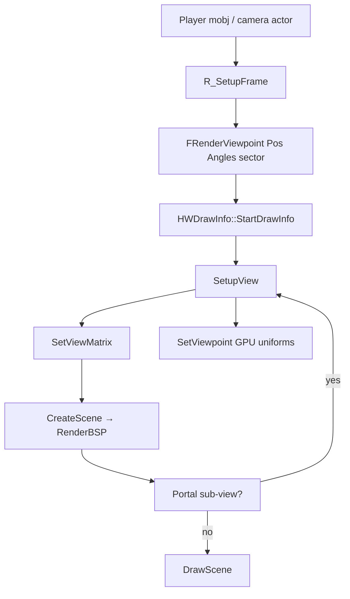

# 03 — View Setup and Camera

`FRenderViewpoint`, projection, the modelview matrix, and mirror/planemirror handling — everything that happens before BSP sees `viewx`/`viewy`.

**Prev:** [02-level-data-structures.md](./02-level-data-structures.md) · **Next:** [04-bsp-traversal.md](./04-bsp-traversal.md) · **Portals:** [07-sky-and-portals.md](./07-sky-and-portals.md)

---

## Types and ownership

| Type | Role |
|------|------|
| `FRenderViewpoint` | Per-view camera: position, angles, FOV, sector, flags |
| `HWDrawInfo` | Scene draw context; holds `Viewpoint`, clipper refs, draw lists |
| `HWViewpointUniforms` / `VPUniforms` | GPU uniform block: view/projection matrices |
| `AActor* camera` | Source of view for player, chase cam, etc. |

View setup spans:

- `R_SetupFrame` — populates `FRenderViewpoint` from player mobj
- `HWDrawInfo::SetupView` — uploads matrices to render state
- Portal re-entry calls `SetupView` with mirror flags ([07](./07-sky-and-portals.md))

---

## Frame setup: `RenderViewpoint`

**File:** `hw_entrypoint.cpp`

```cpp
sector_t* RenderViewpoint(FRenderViewpoint& mainvp, AActor* camera,
    IntRect* bounds, float fov, float ratio, float fovratio,
    bool mainview, bool toscreen)
{
  R_SetupFrame(mainvp, r_viewwindow, camera);
  // ...
  HWDrawInfo *di = HWDrawInfo::StartDrawInfo(...);
  di->SetupView(RenderState, vp.Pos.X, vp.Pos.Y, vp.Pos.Z, false, false);
  di->CreateScene(drawpsprites);
  di->DrawScene(toscreen);
}
```

Gold spawn capture may use fixed view from gzrender probe state instead of live player aim — same code path, different `FRenderViewpoint` inputs.

---

## `FRenderViewpoint` fields (conceptual)

Populated in `r_utility.cpp` / player think:

- **`Pos`** — `(X, Y, Z)` world units (Doom coords: X east, Y north, Z up)
- **`Angles` / `HWAngles`** — yaw/pitch/roll; HW uses `FRotator HWAngles` for GL convention
- **`sector`** — current sector for fog/light defaults
- **`FieldOfView`**
- **`Flags`** — e.g. out-of-bounds (`VPSF_ALLOWOUTOFBOUNDS`) for radar/overhead modes

BSP reads fixed-point copies:

```cpp
// hw_bsp.cpp RenderBSP
viewx = FLOAT2FIXED(Viewpoint.Pos.X);
viewy = FLOAT2FIXED(Viewpoint.Pos.Y);
```

---

## `SetupView` and `SetViewMatrix`

**File:** `hw_drawinfo.cpp` (~lines 396–424)

### `SetViewMatrix`

Builds `VPUniforms.mViewMatrix`:

```cpp
void HWDrawInfo::SetViewMatrix(const FRotator &angles,
    float vx, float vy, float vz, bool mirror, bool planemirror)
{
  float mult = mirror ? -1.f : 1.f;
  float planemult = planemirror ? -Level->info->pixelstretch
                                  : Level->info->pixelstretch;

  VPUniforms.mViewMatrix.loadIdentity();
  VPUniforms.mViewMatrix.rotate(angles.Roll.Degrees(), 0, 0, 1);
  VPUniforms.mViewMatrix.rotate(angles.Pitch.Degrees(), 1, 0, 0);
  VPUniforms.mViewMatrix.rotate(angles.Yaw.Degrees(), 0, mult, 0);
  VPUniforms.mViewMatrix.translate(vx * mult, -vz * planemult, -vy);
  VPUniforms.mViewMatrix.scale(-mult, planemult, 1);
}
```

Coordinate conversion notes:

- Doom **Y** is mapped to GL **-Z** (horizontal plane)
- Doom **Z** (height) maps to GL **Y** (up)
- **Mirror** flips X scale and yaw axis
- **Planemirror** flips vertical axis with `pixelstretch` (Heretic/Hexen compat)

### `SetupView`

```cpp
void HWDrawInfo::SetupView(FRenderState &state,
    float vx, float vy, float vz, bool mirror, bool planemirror)
{
  auto &vp = Viewpoint;
  vp.SetViewAngle(r_viewwindow);
  SetViewMatrix(vp.HWAngles, vx, vy, vz, mirror, planemirror);
  SetCameraPos(vp.Pos);
  VPUniforms.CalcDependencies();
  vpIndex = screen->mViewpoints->SetViewpoint(state, &VPUniforms);
}
```

`SetViewAngle` computes `sin/cos` factors for sprite billboarding and fog. `SetViewpoint` pushes uniforms to GPU buffer for multi-view (VR) — gold uses single view.

---

## Projection and frustum

Projection matrix setup occurs in `HWViewpointUniforms::CalcDependencies()` and `r_viewwindow` configuration (aspect, FOV, letterbox).

`FrustumAngle()` in `hw_drawinfo.cpp` computes horizontal clip angle for BSP clipper seed:

```cpp
void HWDrawInfo::CreateScene(bool drawpsprites)
{
  angle_t a1 = FrustumAngle();
  mClipper->SafeAddClipRangeRealAngles(
      vp.Angles.Yaw.BAMs() + a1, vp.Angles.Yaw.BAMs() - a1);
  // vertical vClipper if VPSF_ALLOWOUTOFBOUNDS
}
```

See [04-bsp-traversal.md](./04-bsp-traversal.md) for clipper interaction.

---

## View flow diagram



---

## Mirror and planemirror

Used by mirrors, reflective flats, and sky portals.

**Call sites:**

- `hw_skyportal.cpp` — `SetupView(state, 0,0,0, mirror, planemirror)`
- `hw_portal.cpp` — multiple portal types re-enter with `state->MirrorFlag`, `state->PlaneMirrorFlag`

When `mirror=true`, the view matrix flips so geometry behind the portal plane renders correctly. `planemirror` handles ceiling/floor portal inversion.

Wall mirrors also use `HWWall::RenderMirrorSurface` ([05-wall-rendering.md](./05-wall-rendering.md)) with sphere mapping effect.

---

## `GZRenderOnly` fast paths

`RenderViewpoint` in `hw_entrypoint.cpp` checks:

```cpp
if (GZRenderOnly && GZDraw_HasPendingDump())
{
  // Skip some GPU setup — CPU oracle / dump path
}
```

Parity capture may skip SSAO, shadow map collection, or HUD ([11-hud-and-2d.md](./11-hud-and-2d.md)) depending on argv. Play mode (`-gzrender_play`) takes the full path.

---

## Camera vs BSP viewpoint

| Use | Coordinates |
|-----|-------------|
| BSP `R_PointOnSide` | `viewx`, `viewy` fixed point |
| Clipper angles | Pseudo-angles from `seg` vertices |
| Sprites | Float `Viewpoint.Pos` vs thing position |
| Radar / OoB | May use tracer actor position for `viewx/y` |

Special case in `RenderBSP`:

```cpp
if (r_radarclipper && Viewpoint.IsAllowedOoB()) {
  // viewx/y from tracer or camera actor
}
```

---

## Interpolation

`R_SetupFrame` respects `cl_capfps` / interpolation flags. Gold corpus uses deterministic tic timing so `ref.png` and `wasm.png` match — typically spawn tics without player movement.

---

## doom-wad-lab view probes

Corpus maps use standardized spawn views. Tools:

- `tools/gzrender-v2/enumerate-view-probes.mts`
- `docs/gzrender-v2/view-probe-grid.md`

Probe coordinates feed argv or CVARs consumed by gzrender dump code (`GZRenderProbeX/Y` in `gzstate_dump.cpp`).

---

## CVARs affecting view

| CVAR | Effect |
|------|--------|
| `r_visibility` | Fog distance table input |
| FOV cvars | Wider FOV → wider frustum clip |
| `r_radarclipper` | Ortho/radar clip behavior in BSP |

Layer toggles do not move camera — see [13-render-layer-cvars.md](./13-render-layer-cvars.md).

---

## Key files

| File | Functions |
|------|-----------|
| `hw_drawinfo.cpp` | `SetupView`, `SetViewMatrix`, `CreateScene`, `FrustumAngle` |
| `hw_entrypoint.cpp` | `RenderViewpoint` |
| `hw_viewpointbuffer.cpp` | GPU viewpoint buffer |
| `r_utility.cpp` | `R_SetupFrame` |
| `hw_skyportal.cpp`, `hw_portal.cpp` | Re-entrant `SetupView` |

---

## Cross-references

- Clipping uses view frustum: [04-bsp-traversal.md](./04-bsp-traversal.md)
- Billboarding uses inverse view: [09-sprites-and-models.md](./09-sprites-and-models.md)
- 2D HUD after 3D: [11-hud-and-2d.md](./11-hud-and-2d.md)
