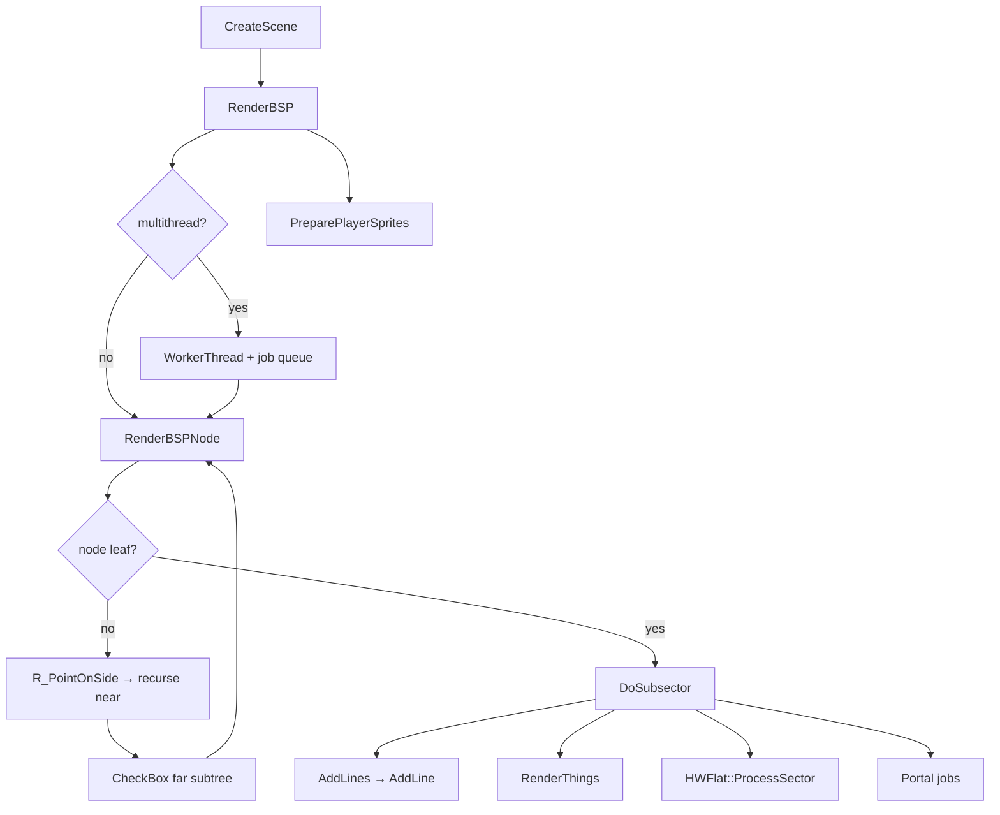

# 04 — BSP Traversal

Front-to-back BSP walk, subsector processing, clipper visibility, and the worker job queue — the core visibility engine of the HW renderer.

**Prev:** [03-view-setup-and-camera.md](./03-view-setup-and-camera.md) · **Next:** [05-wall-rendering.md](./05-wall-rendering.md) · **Structs:** [02-level-data-structures.md](./02-level-data-structures.md)

---

## Overview

After [03-view-setup-and-camera.md](./03-view-setup-and-camera.md) sets the viewpoint, `HWDrawInfo::CreateScene()` calls `RenderBSP(Level->HeadNode(), drawpsprites)`.

BSP traversal:

1. Walks `node_t` tree front-to-back
2. Skips subtrees outside horizontal (and sometimes vertical) clip ranges
3. At leaves, calls `DoSubsector` for each `subsector_t`
4. `DoSubsector` adds walls, flats, sprites, particles, portal coverage

**Primary file:** `gzdoom-project/src/rendering/hwrenderer/scene/hw_bsp.cpp`

---

## Call graph



---

## `RenderBSP` entry

```cpp
void HWDrawInfo::RenderBSP(void *node, bool drawpsprites)
{
  ClearDitherTargets();
  viewx = FLOAT2FIXED(Viewpoint.Pos.X);
  viewy = FLOAT2FIXED(Viewpoint.Pos.Y);
  validcount++;

#ifdef __EMSCRIPTEN__
  multithread = false;  // renderPool(0) — deadlock if true
#else
  multithread = gl_multithread;
#endif
  if (GZDraw_IsCpuOracle())
    multithread = false;

  if (multithread) { /* worker + RenderBSPNode */ }
  else { RenderBSPNode(node); }

  // Dither transparency follow-up, portal sprites, psprites
  if (drawpsprites)
    PreparePlayerSprites(...);
}
```

Gold WASM **always** single-threads BSP (`__EMSCRIPTEN__` guard). Native gold may use `gl_multithread` with `WorkerThread` processing wall/flat/sprite jobs.

---

## `RenderBSPNode`

Classic Doom BSP recursion (~line 954):

```cpp
void HWDrawInfo::RenderBSPNode(void *node)
{
  if (Level->nodes.Size() == 0) {
    DoSubsector(&Level->subsectors[0]);
    return;
  }
  while (!((size_t)node & 1)) {
    node_t *bsp = (node_t *)node;
    int side = R_PointOnSide(viewx, viewy, bsp);
    RenderBSPNode(bsp->children[side]);   // near subtree first
    side ^= 1;
    if (!mClipper->CheckBox(bsp->bbox[side]))
      return;  // far subtree fully clipped
    if (Viewpoint.IsOrtho() && !vClipper->CheckBoxOrthoPitch(...))
      return;
    node = bsp->children[side];
  }
  DoSubsector((subsector_t *)((uint8_t *)node - 1));
}
```

**Front-to-back ordering** ensures the clipper can reject far geometry behind already-processed walls.

`no_renderflags` / `SSRF_SEEN` handles portal edge cases where a subtree must be visited even when bbox clip fails.

---

## Clipper (`hw_clipper.cpp`)

Three clippers in `hw_drawinfo.cpp`:

| Instance | Purpose |
|----------|---------|
| `staticClipper` / `mClipper` | Horizontal angle ranges |
| `staticVClipper` / `vClipper` | Vertical pitch ranges (OoB modes) |
| `staticRClipper` / `rClipper` | Radar / fog-of-war |

Seeded in `CreateScene`:

```cpp
mClipper->SafeAddClipRangeRealAngles(yaw + FrustumAngle(), yaw - FrustumAngle());
```

`AddLine` updates clip ranges when solid walls block view ([05-wall-rendering.md](./05-wall-rendering.md)).

---

## `DoSubsector` — the leaf processor

~line 705 in `hw_bsp.cpp`. Major phases:

### 1. Early outs

- `CurrentMapSections[sub->mapsection]` — federation map sections
- `SSECF_POLYORG` — polyobject origin subsectors skipped
- `SSRF_SEEN` — portal recursion → `UnclipSubsector`
- `mClipper->IsBlocked()` — stacked sector portal state
- Vertical/horizontal subsector bbox vs clippers
- Secret sector radar rules

### 2. Portal clip plane

```cpp
if (mClipPortal) {
  int clipres = mClipPortal->ClipSubsector(sub);
  if (clipres == PClip_InFront)
    return; // may still AddSpecialPortalLines
}
```

### 3. Particles (`gl_render_things`)

```cpp
if (gl_render_things && particles in sub)
  RenderParticles / jobQueue ParticleJob
```

### 4. Walls

```cpp
AddLines(sub, fakesector);
```

`AddLines` walks `sub->firstline` segs, calls `AddLine` ([05](./05-wall-rendering.md)).

### 5. Sector-first things (once per sector per frame)

```cpp
if (sector->validcount != validcount) {
  sector->validcount = validcount;
  if (gl_render_things)
    RenderThings(sub, fakesector);
}
```

### 6. Flats (`gl_render_flats`)

```cpp
if (gl_render_flats && sub->numlines > 2) {
  HWFlat flat;
  flat.ProcessSector(this, fakesector);
  // portal group jobs
}
```

Uses `section_renderflags` to dedupe section flats ([06](./06-flats-and-ceilings.md)).

---

## `AddLines` and polyobjects

```cpp
void HWDrawInfo::AddLines(subsector_t *sub, sector_t *sector)
{
  if (sub->polys != nullptr)
    AddPolyobjs(sub);  // separate mini-BSP
  else
    for each seg: AddLine(seg, mClipPortal != nullptr);
}
```

Polyobjects (`po_man.cpp`) move lines dynamically; subsector may contain `RenderPolyBSPNode` path.

---

## Multithread job queue

```cpp
struct RenderJob {
  enum { FlatJob, WallJob, SpriteJob, ParticleJob, PortalJob, TerminateJob };
  int type;
  subsector_t *sub;
  seg_t *seg;
};
```

Worker (`WorkerThread`) **must not call GL API** — only builds draw lists / vertices. Main thread submits GPU draws in `DrawScene`.

Emscripten: pool size 0 → all jobs run inline on main thread.

---

## CVAR gates in BSP

| CVAR | Where checked |
|------|----------------|
| `gl_render_walls` | Inside `AddLine` (wall dispatcher) |
| `gl_render_flats` | `DoSubsector` flat block |
| `gl_render_things` | Particles, things |

See [13-render-layer-cvars.md](./13-render-layer-cvars.md).

---

## `hw_FakeFlat` at BSP boundary

```cpp
fakesector = hw_FakeFlat(sector, in_area, false);
AddLines(sub, fakesector);
```

Ensures deep-water sectors use correct plane heights for culling and wall upper/lower bounds ([06](./06-flats-and-ceilings.md)).

---

## Ortho / no fog-of-war path

`RenderOrthoNoFog()` iterates all subsectors whose bbox overlaps view frustum — bypasses tree when orthographic radar mode active.

---

## GZDRAW CPU oracle hooks

```cpp
if (outer == nullptr)
  gzdraw_subsector_visit_order.Push(sub->Index());
```

When `GZDraw_IsCpuOracle()`, BSP builds draw lists without GPU upload — used for draw-list parity dumps.

`CreateScene` logs and maps vertex buffers CPU-side only in oracle mode (`hw_drawinfo.cpp`).

---

## Post-BSP hacks (same frame, before draw)

Still in `CreateScene` after `RenderBSP`:

```cpp
HandleMissingTextures(in_area);
HandleHackedSubsectors();
PrepareUnhandledMissingTextures();
DispatchRenderHacks();
```

These fix deep-water holes, missing upper/lower textures, and linedef hacks that BSP alone cannot classify.

**File:** `hw_renderhacks.cpp`

---

## `validcount` discipline

Global per-frame counter incremented at `RenderBSP` start. Used to:

- Draw each sector's things once
- Mark sides processed
- Avoid duplicate flat sections

Must not be disturbed mid-BSP — dither target pass runs **after** BSP completes for this reason (`hw_bsp.cpp` comment ~1070).

---

## Performance counters

`hw_clock.h` clocks: `Bsp`, `ClipWall`, `SetupFlat`, `SetupSprite`, `WTTotal`, `MTWait`.

---

## doom-wad-lab relevance

- **0% diff gate** requires identical BSP visit order and clip behavior native vs WASM — any `gles.webgl2` branch in wall setup must not change visibility.
- **Layer toggles** that disable walls/flats/things are checked here — useful to bisect parity failures ([13](./13-render-layer-cvars.md)).
- **GZSTATE import** must produce identical `node_t`/`subsector_t` graph or BSP diverges ([14](./14-gzstate-dump-parity.md)).

---

## Key symbols

| Symbol | File |
|--------|------|
| `RenderBSP`, `RenderBSPNode`, `DoSubsector` | `hw_bsp.cpp` |
| `AddLine`, `AddLines` | `hw_bsp.cpp` → wall dispatcher |
| `Clipper` | `hw_clipper.cpp` |
| `CreateScene` | `hw_drawinfo.cpp` |
| `HWWallDispatcher` | `hw_walldispatcher.cpp` |

---

## Cross-references

- Wall details after `AddLine`: [05-wall-rendering.md](./05-wall-rendering.md)
- Flat processing from `DoSubsector`: [06-flats-and-ceilings.md](./06-flats-and-ceilings.md)
- Sprites from `RenderThings`: [09-sprites-and-models.md](./09-sprites-and-models.md)
