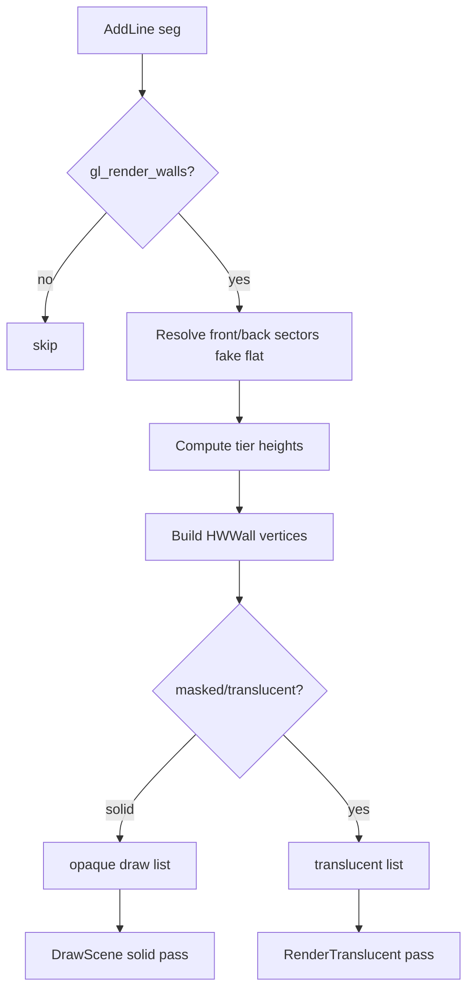

# 05 — Wall Rendering

From `AddLine` through upper/middle/lower segments, texture pegging, masked/translucent walls, and GPU submission.

**Prev:** [04-bsp-traversal.md](./04-bsp-traversal.md) · **Next:** [06-flats-and-ceilings.md](./06-flats-and-ceilings.md) · **Lighting:** [08-lighting.md](./08-lighting.md)

---

## Pipeline position

BSP `DoSubsector` → `AddLines` → **`AddLine(seg)`** → `HWWallDispatcher` → `HWWall` setup → draw lists → `HWWall::RenderTexturedWall` / `RenderWall`.

**Files:**

- `hw_bsp.cpp` — `AddLine` entry (via dispatcher include)
- `hw_walldispatcher.cpp` — tier selection, job dispatch
- `hw_walls.cpp` — wall class, render methods (~2553 lines)
- `hw_walls_vertex.cpp` — vertex generation, UV math

---

## `HWWall` render path

All wall draws funnel through:

```cpp
void HWWall::RenderWall(FRenderState &state, int textured)
{
  state.SetLightIndex(dynlightindex);
  state.Draw(DT_TriangleFan, vertindex, vertcount);
}
```

`RenderTexturedWall` sets material, fog, glow planes, then calls `RenderWall`:

```cpp
void HWWall::RenderTexturedWall(HWWallDispatcher* di, FRenderState &state, int rflags)
{
  state.SetMaterial(texture, UF_Texture, 0, flags & 3, NO_TRANSLATION, -1);
  SetColor(state, di->Level, di->lightmode, lightlevel, rel, ...);
  SetFog(state, ...);
  RenderWall(state, HWWall::RWF_TEXTURED);
}
```

---

## Wall tiers: upper, middle, lower

Classic Doom splits a linedef's visible surface into up to three **tiers** based on floor/ceiling heights on front/back sectors:

| Tier | When visible |
|------|----------------|
| **Upper** | Front ceiling > back ceiling (or one-sided) |
| **Middle** | "Normal" wall between matching openings; also 2S unpegged middle |
| **Lower** | Front floor < back floor |

`renderwalltotier[]` in `hw_walls.cpp` maps render flags to `side_t::top/mid/bottom`.

`AddLine` compares `frontsector` and `backsector` plane heights (after `hw_FakeFlat`) to decide which tiers to emit.

---

## Pegging (`ML_DONTPEGTOP`, `ML_DONTPEGBOTTOM`)

From `doomdata.h` line flags:

- **Pegged top** — upper texture top aligns to front sector ceiling
- **Unpegged top** (`ML_DONTPEGTOP`) — texture anchored to back sector ceiling height
- **Pegged bottom** — lower texture bottom at front floor
- **Unpegged bottom** — anchors to back floor

Pegging affects **v** texture coordinates in `hw_walls_vertex.cpp`, not just aesthetic — parity diffs often trace to wrong pegging on two-sided lines.

---

## One-sided vs two-sided

- **One-sided** (`backsector == NULL`) — single middle tier (unless sky hack)
- **Two-sided** — may draw upper+lower only (window), or middle if heights align
- **`ML_TWOSIDED`** without back sector at runtime = treat as solid

Missing upper/lower textures post-processed in `HandleMissingTextures` ([04](./04-bsp-traversal.md)).

---

## Masked and transparent walls

| Case | Handling |
|------|----------|
| Midtexture with alpha | Translucent draw list pass ([10](./10-draw-order-and-translucency.md)) |
| `ML_ADDTRANS` | Additive blend |
| `ML_3DMIDTEX` | Masked middle, may clip to floor/ceiling |
| `gl_mask_threshold` | Alpha test cutoff for masked textures |

CVARs in `hw_drawinfo.cpp`:

```cpp
CVAR(Float, gl_mask_threshold, 0.5f, ...);
CVAR(Float, gl_mask_sprite_threshold, 0.5f, ...);
```

---

## Sky walls

When upper or lower tier would show "sky", texture may be `F_SKY` — handled cooperatively with [07-sky-and-portals.md](./07-sky-and-portals.md) and flat sky holes.

`ML_NOSKYWALLS` suppresses sky quads above/below wall.

---

## Clipper interaction

Solid one-sided walls call into `Clipper` to narrow angle ranges after draw list insertion — prevents drawing geometry behind opaque walls.

Portal lines may not clip the same way; `AddLine(..., clipportal)` parameter from BSP.

---

## Special wall modes

### Fog boundary

```cpp
void HWWall::RenderFogBoundary(HWWallDispatcher* di, FRenderState &state)
```

Draws soft sector fog transitions when `gl_fogmode` active ([08-lighting.md](./08-lighting.md)).

### Mirror surface

```cpp
void HWWall::RenderMirrorSurface(HWWallDispatcher* di, FRenderState &state)
```

Uses `TexMan.mirrorTexture`, sphere map effect, additive blend, decal pass on mirror.

### Glow walls

`HWF_GLOW` flag → `SetGlowPlanes` with sector ceiling/floor planes for gradient glow shader path.

---

## `HWWallDispatcher`

Centralizes per-seg decision logic:

- Skip if `gl_render_walls` false
- Classify line (portal, sky, fence, rail)
- Queue `WallJob` for worker thread when multithreaded
- Build `HWWall` structs in arena allocator

---

## Vertex buffer and indices

Walls append to global flat vertex buffer via `screen->mVertexData`:

- `vertindex`, `vertcount` index into mapped VBO
- Triangle fan topology for quads
- Dynamic lights: `dynlightindex` into light buffer ([08](./08-lighting.md))

`hw_walls_vertex.cpp` computes world positions from seg endpoints + plane Z intersections.

---

## Texture offsets

`sidedef->textureoffset`, `rowoffset` — added to U/V in vertex setup. Scaling from texture size vs 128-unit standard.

`gl_texture` false → solid color debug ([13-render-layer-cvars.md](./13-render-layer-cvars.md)).

---

## Depth bias (WebGL2)

From `hw_drawinfo.cpp`:

```cpp
const bool applyWallDepthBias = OpenGLESRenderer::gles.webgl2 && !GZRender_IsParityCapture();
```

WebGL2 path may apply depth bias to reduce z-fighting on coplanar surfaces; disabled during parity capture for deterministic diff.

---

## Draw list insertion

Walls go to `HWDrawList::walls` sorted by texture/material for batching ([10-draw-order-and-translucency.md](./10-draw-order-and-translucency.md)).

Translucent/masked walls may land in separate list for back-to-front sort.

---

## Polyobject walls

Segs flagged `WALLF_POLYOBJ` routed through polyobject BSP (`AddPolyobjs`). Vertices update when poly moves — not used in static corpus maps but same code path.

---

## Decals on walls

`seg->sidedef->AttachedDecals` — drawn after base wall or in mirror pass (`DrawDecalsForMirror`). **File:** `hw_decal.cpp`.

---

## Wall rendering flow



---

## Common parity failure modes

| Visual bug | Check |
|------------|-------|
| Missing upper texture | `HandleMissingTextures`, sidedef upper name |
| Texture "floating" | Pegging flags |
| Bleeding lower unpegged | Two-sided height diff |
| Mask seam | `gl_mask_threshold`, NPOT emulation |
| Z-fight on door track | WebGL2 depth bias vs native |

---

## Key CVARs

| CVAR | Effect |
|------|--------|
| `gl_render_walls` | Master wall switch |
| `gl_texture` | Textured vs solid |
| `gl_mask_threshold` | Alpha test |
| `gl_fogmode` | Fog boundary walls |

---

## Code index

| File | Role |
|------|------|
| `hw_walls.cpp` | Render methods, fog, mirror, glow |
| `hw_walls_vertex.cpp` | Geometry + UV |
| `hw_walldispatcher.cpp` | AddLine implementation hub |
| `hw_drawstructs.h` | `HWWall` struct |
| `hw_material.cpp` | Texture binding |

---

## Cross-references

- Sector heights for tiers: [02-level-data-structures.md](./02-level-data-structures.md)
- Lighting on walls: [08-lighting.md](./08-lighting.md)
- Sort order: [10-draw-order-and-translucency.md](./10-draw-order-and-translucency.md)
