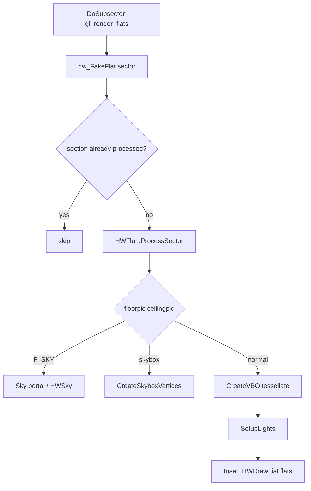

# 06 — Flats and Ceilings

Floor and ceiling polygon rendering, plane equations, `F_SKY`, fake flats, and VBO construction.

**Prev:** [05-wall-rendering.md](./05-wall-rendering.md) · **Next:** [07-sky-and-portals.md](./07-sky-and-portals.md) · **BSP hook:** [04-bsp-traversal.md](./04-bsp-traversal.md)

---

## Role in the pipeline

When BSP visits a subsector and `gl_render_flats` is true, `DoSubsector` invokes:

```cpp
HWFlat flat;
flat.section = sub->section;
flat.ProcessSector(this, fakesector);
```

**Primary files:**

- `hw_flats.cpp` — flat processing, texture matrix, skybox quads
- `hw_fakeflat.cpp` — sector pair heightsec resolution
- `hw_vertexbuilder.cpp` — `CreateVBO`, polygon tessellation from subsector segs
- `flatvertices.h` / `flatvertices.cpp` — vertex format `FFlatVertex`

---

## `HWFlat` responsibilities

For each sector section (floor and/or ceiling):

1. Determine plane Z and texture (`sector_t` / `HWSectorPlane`)
2. Handle `F_SKY` — defer to sky renderer ([07](./07-sky-and-portals.md))
3. Build polygon from subsector edges or skybox bbox
4. Apply plane texture rotation/scale/offset
5. Setup dynamic lights (`SetupLights`)
6. Insert into draw lists (solid vs translucent)

---

## Plane texture matrix

`hw_SetPlaneTextureRotation` in `hw_flats.cpp`:

```cpp
bool hw_SetPlaneTextureRotation(const HWSectorPlane * secplane,
    FGameTexture * gltexture, VSMatrix &dest)
{
  if (offs/scale/angle/non-64 texture) {
    dest.loadIdentity();
    dest.scale(xscale1, yscale1, 1);
    dest.translate(uoffs, voffs, 0);
    dest.scale(64/displayWidth, 64/displayHeight, 1);
    dest.rotate(-secplane->Angle, 0, 0, 1);
    return true;
  }
  return false;
}
```

Standard Doom flats assume 64×64 texels spanning map units; non-64 textures need extra scale.

`SetPlaneTextureRotation` enables `state.EnableTextureMatrix(true)` before draw.

---

## Sky flats vs textured flats

| `ceilingpic` / `floorpic` | Behavior |
|---------------------------|----------|
| Normal flat name | TexMan → sample texture |
| `F_SKY` | No flat polygon; sky portal / skydome draw |
| Skybox sector | `CreateSkyboxVertices` — axis-aligned bbox quad |

### Skybox vertices

```cpp
void HWFlat::CreateSkyboxVertices(FFlatVertex *vert)
{
  // Walk sector lines → min/max X/Y
  // Build clamped quad at plane Z
}
```

Used for enclosed sky sectors (Courtyard-style maps — important in corpus parity).

---

## `hw_FakeFlat`

**File:** `hw_fakeflat.cpp`

```cpp
sector_t * hw_FakeFlat(sector_t * sec, area_t in_area, bool back);
```

When `sector->heightsec` references a control sector:

- **Above/below/in** area selects which floor/ceiling heights apply
- Renderer sees consistent planes for deep water, swimmable floors, fake ceilings
- Called from BSP before walls **and** flats share the same `fakesector`

Without fake flat, E1M8-style liquid and MAP23 courtyards mis-render.

---

## Subsector → polygon

`hw_vertexbuilder.cpp` **`CreateVBO`** tessellates subsector `seg` loop into triangles for GPU:

- Ear-clipping or fan from subsector vertices
- Marks `sub->numlines > 2` requirement (degenerate segs skipped in BSP)
- Hacked subsectors (`sub->hacked`) for deep water fixes — `AddHackedSubsector` in BSP

Vertex data uploaded via `screen->mVertexData->Map()` during `CreateScene` ([04](./04-bsp-traversal.md)).

---

## Section deduplication

`section_renderflags[section] & SSRF_PROCESSED` prevents drawing the same section flat multiple times when BSP hits several subsectors in one section.

`ss_renderflags[sub]` tracks `SSRF_PROCESSED`, `SSRF_RENDERALL`, `SSRF_SEEN` for portal recursion.

---

## Floor vs ceiling pass

`HWFlat::ProcessSector` typically emits:

- **Floor** — downward-facing normal, `floorplane`, `floorpic`
- **Ceiling** — upward-facing, `ceilingplane`, `ceilingpic`

Each may have different light levels (`e`LightType sector specials) — [08-lighting.md](./08-lighting.md).

---

## Translucent flats

Animated liquids, glass floors, and alpha flats go to translucent list with sort keys ([10-draw-order-and-translucency.md](./10-draw-order-and-translucency.md)).

`EFF_DITHERTRANS` similar to walls for stealth dither.

---

## Portal coverage

After flat processing, BSP queues `PortalJob` to register subsector with `FSectorPortalGroup` for ceiling/floor portals ([07](./07-sky-and-portals.md)).

---

## Flat processing diagram



---

## `gl_render_flats` interaction

When false ([13-render-layer-cvars.md](./13-render-layer-cvars.md)):

- No flat jobs from BSP
- Walls and sprites may still draw if enabled
- Parity mode `flats-only` sets walls/things off, flats on

---

## Light and fog on flats

`HWFlat::SetupLights` walks `FLightNode` chain, fills `FDynLightData`, assigns light index.

`SetColor` / `SetFog` from [08-lighting.md](./08-lighting.md) applied at draw time in `HWDrawList::DrawFlats`.

---

## Debug

```cpp
#ifdef _DEBUG
CVAR(Int, gl_breaksec, -1, 0);  // break in flat code for sector num
#endif
```

---

## doom-wad-lab notes

- **Blue liquid / flat anim** — common early parity failures; check flat pic name, blend, colormap ([08](./08-lighting.md)).
- **Courtyard sky** — federation tests in `federatedCourtyardParity.test.ts`; skybox flat path must match gold.
- Tools: `tools/gzrender-v2/dump-e1m1-flats.mts` for flat name dumps.

---

## Key files

| File | Role |
|------|------|
| `hw_flats.cpp` | ProcessSector, skybox, texture matrix |
| `hw_fakeflat.cpp` | heightsec / deep water |
| `hw_vertexbuilder.cpp` | Polygon → VBO |
| `flatvertices.cpp` | Vertex layout |
| `hw_drawlist.cpp` | Flat draw batching |

---

## Cross-references

- Sky handling continuation: [07-sky-and-portals.md](./07-sky-and-portals.md)
- Draw order: [10-draw-order-and-translucency.md](./10-draw-order-and-translucency.md)
- Sector planes defined at load: [02-level-data-structures.md](./02-level-data-structures.md)
