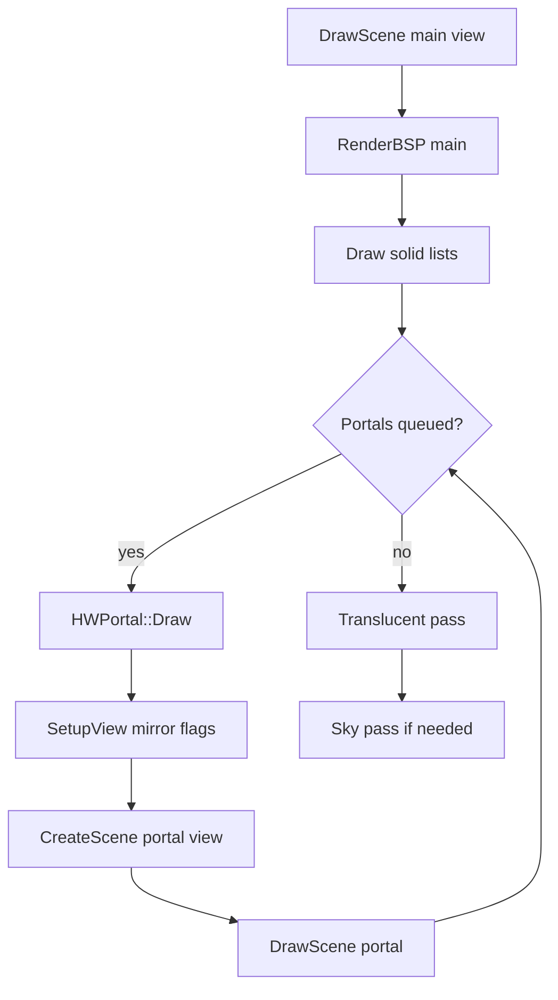

# 07 — Sky and Portals

Sky rendering, horizon portals, sector portals, mirrors, and recursive sub-views.

**Prev:** [06-flats-and-ceilings.md](./06-flats-and-ceilings.md) · **Next:** [08-lighting.md](./08-lighting.md) · **View re-entry:** [03-view-setup-and-camera.md](./03-view-setup-and-camera.md)

---

## Scope

This chapter covers HW renderer files that replace or extend the open sky and connect sectors across portal planes:

| File | Topic |
|------|-------|
| `hw_sky.cpp` | Classic sky texture, sky layers, horizon |
| `hw_skyportal.cpp` | Sky viewpoint portals |
| `hw_portal.cpp` | Sector mirrors, stacked sectors, line portals |
| `hw_skydome.cpp` | Dome geometry (referenced from walls/flats) |

Flats with `F_SKY` delegate here from [06-flats-and-ceilings.md](./06-flats-and-ceilings.md).

---

## Sky basics (`hw_sky.cpp`)

Doom sky is not a physical sector — when ceiling or floor pic is `F_SKY`:

1. Wall upper/lower gaps show sky texture instead of solid flat
2. Horizontal **sky offset** rotates with view yaw (`r_sky.h`, `skyrotate`)
3. **Sky height** and stretch from map MAPINFO / gameinfo

HW renderer draws sky as textured quads or dedicated sky pass with depth handling so floors draw correctly in front.

### CVARs

| CVAR | Effect |
|------|--------|
| `gl_portals` | Master portal/sky portal enable ([13](./13-render-layer-cvars.md)) |
| `gl_noskyboxes` | Disable skybox sectors |
| `gl_no_skyclear` | Skip sky clear pass (`hw_drawinfo.cpp`) |
| `gl_mirrors` | Reflective surfaces |

Parity mode `no-portals` disables portal CVAR group for bisect.

---

## Sky portals (`hw_skyportal.cpp`)

Sky portals render a **secondary viewpoint** looking into a sky box or outdoor layer:

```cpp
di->SetupView(state, 0, 0, 0,
    !!(mState->MirrorFlag & 1),
    !!(mState->PlaneMirrorFlag & 1));
```

Reuses [03-view-setup-and-camera.md](./03-view-setup-and-camera.md) matrix path with mirror flags, then recursively `CreateScene` / `DrawScene` for portal content.

`HWPortal` state tracks recursion depth and stencil mask to prevent infinite loops.

---

## Sector portals (`hw_portal.cpp`)

GZDoom supports multiple portal types:

| Type | Description |
|------|-------------|
| **Plane portals** | Floor/ceiling teleports between sectors |
| **Line portals** | Transparent boundary between areas |
| **Stacked sectors** | Vertical sector stacks (deep water) |
| **Mirror portals** | Reflective line portals |

Common pattern:

```cpp
di->SetupView(rstate, vp.Pos.X, vp.Pos.Y, vp.Pos.Z,
    !!(state->MirrorFlag & 1),
    !!(state->PlaneMirrorFlag & 1));
// render portal scene to texture or direct
```

Portal manager reset each frame in `CreateScene`:

```cpp
portalState.StartFrame();
```

---

## Portal + BSP interaction

From [04-bsp-traversal.md](./04-bsp-traversal.md):

- `mClipPortal` clips subsectors to portal plane
- `SSRF_SEEN` marks subsectors reachable through portal — triggers `UnclipSubsector`
- `AddSubsectorToPortal` registers coverage for recursive draw
- `mCurrentPortal->RenderAttached` after BSP completes

`AddSpecialPortalLines` draws boundary lines when subsector is "outside" portal clip but line lies on portal plane.

---

## Mirrors

Two mechanisms:

1. **Line mirror portals** — full scene re-render (`hw_portal.cpp`)
2. **Mirror surface wall** — `HWWall::RenderMirrorSurface` with `TexMan.mirrorTexture` ([05-wall-rendering.md](./05-wall-rendering.md))

Both require `gl_mirrors` and correct stencil/depth state.

---

## Sky draw order

Typical frame ordering ([10-draw-order-and-translucency.md](./10-draw-order-and-translucency.md)):

1. Optional sky clear (`gl_no_skyclear`)
2. Solid world (walls/flats) — sky gaps write depth/skymask
3. Sky pass — where depth indicates visible sky
4. Translucent geometry
5. Portal overlays / recursive passes

Exact ordering is in `HWDrawInfo::DrawScene` and portal stack.

---

## Portal recursion diagram



---

## Skyboxes vs classic sky

| Mode | Detection | Draw |
|------|-----------|------|
| Classic `F_SKY` | Flat pic name | Panoramic texture scroll |
| Skybox sector | Enclosed sector, sky flat | `CreateSkyboxVertices` clamped quad |
| MAPINFO sky | Outdoor vs indoor | Sky portal link |

Corpus maps E2M7, outdoor scenes exercise both paths.

---

## Stencil and depth

Portals use stencil bits to mark portal frame regions. GLES backend implements stencil in `gles_framebuffer.cpp` — WebGL2 parity sensitive ([12-gles-webgl2-wasm-path.md](./12-gles-webgl2-wasm-path.md)).

`GZRenderOnly` may simplify FBO setup but must preserve portal correctness for gold maps with courtyard sky.

---

## `gl_portals` off behavior

When disabled via layer toggles:

- Sky may flatten to simple backdrop or skip portal recursion
- Used in `no-portals` parity display mode
- Courtyard federation tests expect explicit toggle alignment with Classic WebGL plan

---

## doom-wad-lab integration

`applyGzdoomRenderLayers.ts`:

```typescript
pushBool('gl_portals', toggles.sky);
pushBool('gl_noskyboxes', !toggles.sky);
```

`parityDisplayModes.ts` maps `no-portals` mode to same CVAR bundle.

---

## Key structures

| Struct | Header |
|--------|--------|
| `HWPortal` | `hw_portal.h` |
| `FSectorPortalGroup` | sector portal groups |
| `HWSkyInfo` | sky texture state |

---

## Failure modes

| Symptom | Investigate |
|---------|-------------|
| Hall of mirrors | Portal recursion limit / stencil |
| Sky bleeding indoors | `F_SKY` flat vs ceiling height |
| Courtyard black | Skybox vertices / `gl_noskyboxes` |
| Mirror wrong orientation | `MirrorFlag` / `SetupView` |

Tools: `diagnose-parity-layers.mts`, `federatedCourtyardParity.test.ts`.

---

## Code references

| File | Key APIs |
|------|----------|
| `hw_sky.cpp` | Sky texture draw |
| `hw_skyportal.cpp` | Sky portal viewpoint |
| `hw_portal.cpp` | Portal stack, `RenderPortal` |
| `hw_drawinfo.cpp` | `portalState`, `FindPortal` |

---

## Cross-references

- View matrix on portal entry: [03-view-setup-and-camera.md](./03-view-setup-and-camera.md)
- BSP portal clipping: [04-bsp-traversal.md](./04-bsp-traversal.md)
- Layer CVARs: [13-render-layer-cvars.md](./13-render-layer-cvars.md)
