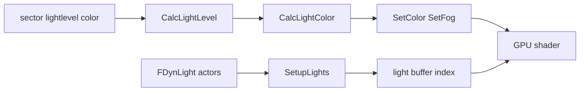

# 08 — Lighting

Sector light levels, hardware colormap, fog, dynamic lights, and color calculation for walls/flats/sprites.

**Prev:** [07-sky-and-portals.md](./07-sky-and-portals.md) · **Next:** [09-sprites-and-models.md](./09-sprites-and-models.md)

---

## File map

| File | Responsibility |
|------|----------------|
| `hw_lighting.cpp` | Light level math, fog tables, `CalcLightLevel` |
| `hw_setcolor.cpp` | `SetColor`, `SetFog` — apply to `FRenderState` |
| `hw_spritelight.cpp` | Thing/sprite lighting, angle to light |
| `hw_dynlightdata.cpp` | Dynamic light gathering per surface |
| `hw_lightbuffer.cpp` | GPU light SSBO upload |
| `a_dynlight.h` / actors | Light objects in world |

Draw paths call `SetColor` / `SetFog` immediately before draw ([05](./05-wall-rendering.md), [06](./06-flats-and-ceilings.md)).

---

## Light modes (`ELightMode`)

GZDoom supports multiple lighting models selected by `gl_lightmode` CVAR:

| Mode | Character |
|------|-----------|
| Software-style | Sector light level + colormap bands |
| Colored sector light | RGB sector colors multiplied |
| Dynamic / modern | Per-pixel dynamic lights from buffer |

Corpus gold uses settings that match native GLES reference captures — typically colored sector light on (`gl_lightmode 1`) when testing `coloredLighting` layer ([13-render-layer-cvars.md](./13-render-layer-cvars.md)).

---

## `CalcLightLevel`

**File:** `hw_lighting.cpp`

```cpp
int CalcLightLevel(ELightMode lightmode, int lightlevel, int rellight,
    bool weapon, int blendfactor)
{
  if (lightlevel <= 0) return 0;
  bool darklightmode = isDarkLightMode(lightmode) || ...;
  if (darklightmode && lightlevel < 192 && !weapon) {
    // software-style darkening curve
  } else {
    light = lightlevel + rellight;
  }
  return clamp(light, 1, 255);
}
```

Inputs:

- **`lightlevel`** — sector base (0–255)
- **`rellight`** — player gun flash, damage flash, item pickup
- **`weapon`** — psprite path uses different curve ([09](./09-sprites-and-models.md))

---

## `CalcLightColor`

Combines sector `PalEntry` color with light level:

```cpp
PalEntry CalcLightColor(ELightMode lightmode, int light, PalEntry pe, int blendfactor)
```

Software lighting returns palette color directly; HW multiplies RGB by light scalar.

---

## Fog

Distance fog controlled by `gl_fogmode`, `gl_distfog`:

```cpp
CUSTOM_CVAR(Int, gl_distfog, 70, ...) {
  // fills distfogtable[2][256]
}
```

`SetFog` in `hw_setcolor.cpp` binds fog color, density, and black/ colored fog paths.

Layer toggle: `gl_fogmode 0` for `no-fog` parity mode.

---

## `SetColor` and `SetFog`

Called from wall flat sprite draw:

```cpp
SetColor(state, di->Level, di->lightmode, lightlevel, rellight,
    di->isFullbrightScene(), Colormap, alpha);
SetFog(state, di->Level, di->lightmode, lightlevel, rellight,
    di->isFullbrightScene(), &Colormap, applyfog);
```

`Colormap` carries palette translation for Boom-style colored sectors.

`isFullbrightScene()` — IDFA, night vision (`gl_enhanced_nightvision`), render hacks.

---

## Dynamic lights

`FDynLight` actors attached to map or moving things. Per-subsector or per-wall:

```cpp
HWFlat::SetupLights(HWDrawInfo *di, FLightNode *node,
    FDynLightData &lightdata, int portalgroup);
```

Results → light buffer index on draw call (`state.SetLightIndex`).

`CollectLights` in `hw_entrypoint.cpp` fills shadow map for shadow-casting lights (may be reduced on `GZRenderOnly` path).

**File:** `hw_dynlightdata.cpp` — spatial queries for lights affecting plane/wall bounds.

---

## Sprite lighting

**File:** `hw_spritelight.cpp`

Sprites pick light from floor/ceiling at thing position, with optional facet light from nearby walls. `gl_light_sprites` toggles dynamic light on sprites ([13](./13-render-layer-cvars.md)).

Weapon sprites use `gl_weaponlight` CVAR default 8.

---

## Banding and software light emulation

```cpp
CVAR(Bool, gl_bandedswlight, false, ...);  // hw_drawinfo.cpp
```

When enabled, simulates software light banding in shader — parity-sensitive vs native.

`GZRenderLastBandedSwLight` exported in `gzstate_dump.cpp` for probe dumps.

---

## Fullbright and invulnerability

Player cheats and powerups set flags on `HWDrawInfo` affecting `rellight` and colormap selection — must match in WASM play mode for HUD parity.

---

## Lighting pipeline diagram



---

## Colormap / palette

Global palette from IWAD `PLAYPAL`; translations for hurt flash, invuln, etc.

`GPalette` initialized at boot ([01-engine-boot-and-wad-load.md](./01-engine-boot-and-wad-load.md)).

Software colormap textures may upload to GPU for legacy fade effects.

---

## CVAR summary

| CVAR | Purpose |
|------|---------|
| `gl_lightmode` | Colored vs classic lighting |
| `gl_light_sprites` | Dynamic lights on sprites |
| `gl_fogmode` | Fog off/on/type |
| `gl_distfog` | Fog density table |
| `gl_weaponlight` | Weapon sprite brightness |
| `gl_enhanced_nightvision` | Light amp |
| `gl_bandedswlight` | Software band emulation |

---

## Parity notes

- **Colormap row boundaries** — WASM corpus allows band-exact tolerance in some gates (`evaluate-gzdoom-wasm-corpus.mts` `boundaryToleranceRadius`) for irreducible GPU `floor()` ULP at fade edges.
- **Identical strict gate** — 0% diff on 68 maps at tolerance 0 for primary gold tier.
- Probe exports: `GZRenderLastLightParms`, `GZRenderLastGlobVis` in `gzstate_dump.cpp`.

---

## Key functions

| Function | File |
|----------|------|
| `CalcLightLevel`, `CalcLightColor` | `hw_lighting.cpp` |
| `SetColor`, `SetFog` | `hw_setcolor.cpp` |
| `SetupLights` | `hw_flats.cpp`, walls |
| `GetSpriteLight` | `hw_spritelight.cpp` |

---

## Cross-references

- Applied during wall draw: [05-wall-rendering.md](./05-wall-rendering.md)
- Flat light setup: [06-flats-and-ceilings.md](./06-flats-and-ceilings.md)
- Sprite lighting: [09-sprites-and-models.md](./09-sprites-and-models.md)
- Fog layer toggle: [13-render-layer-cvars.md](./13-render-layer-cvars.md)
