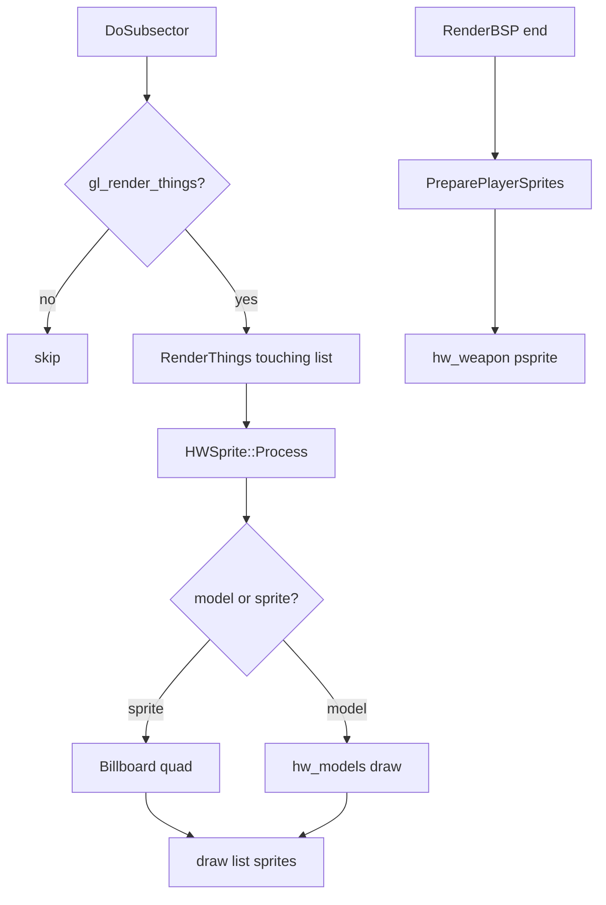

# 09 — Sprites and Models

Map things, voxel/model actors, sprite sorting, shadows, and player weapon psprites.

**Prev:** [08-lighting.md](./08-lighting.md) · **Next:** [10-draw-order-and-translucency.md](./10-draw-order-and-translucency.md) · **BSP:** [04-bsp-traversal.md](./04-bsp-traversal.md)

---

## Entry points

| Path | Trigger |
|------|---------|
| **Sector things** | `DoSubsector` → `RenderThings` when `gl_render_things` |
| **Particles** | `RenderParticles` per subsector |
| **Psprites** | End of `RenderBSP` → `PreparePlayerSprites` |
| **Models** | `HWSprite::Process` with model def |

**Files:**

- `hw_sprites.cpp` — sprite processing, billboarding, draw list
- `hw_models.cpp` — MD3/OBJ model rendering
- `hw_weapon.cpp` — player weapon psprites
- `models.cpp` — model asset management

---

## `RenderThings`

From `hw_bsp.cpp`:

```cpp
void HWDrawInfo::RenderThings(subsector_t * sub, sector_t * sector)
{
  for (auto p = sec->touching_renderthings; p != nullptr; p = p->m_snext) {
    auto thing = p->m_thing;
    if (thing->validcount == validcount) continue;
    thing->validcount = validcount;
    // distance check, map section filter
    HWSprite sprite;
    if (R_ShouldDrawSpriteShadow(thing))
      sprite.Process(this, thing, sector, in_area, false, true);
    sprite.Process(this, thing, sector, in_area, false);
  }
  // sectorportal_thinglist for portal-linked things
}
```

Things linked at level load / sector changes; BSP only **visits** them when subsector in visible sector is processed.

---

## `HWSprite::Process`

Builds a draw item:

1. Resolve sprite frame from `AActor` state (`spritename`, frame index)
2. Lookup `FSpriteModelFrame` — may be vanilla sprite, voxel, or model
3. Compute world position (thing origin + bob + render offset)
4. Billboarding — rotate quad to face camera using `Viewpoint` ([03](./03-view-setup-and-camera.md))
5. Light via [08-lighting.md](./08-lighting.md) sprite path
6. Push to `HWDrawList::sprites` with sort key

---

## Billboarding math

Sprite quads use camera-relative axes:

- X axis from view right vector
- Y axis from view up (or world up for Y billboard modes)

Model actors may use **rotation** instead of full billboard if defined in DECORATE/MODELDEF.

---

## Models (`hw_models.cpp`)

When actor has 3D model:

- Bones from `hw_bonebuffer.cpp`
- Same light buffer as walls
- Depth sorting with sprites in translucent pass

Gold corpus includes maps with actors; static spawn frames show idle poses.

---

## Shadows

Optional sprite shadow quads (`R_ShouldDrawSpriteShadow`) — flattened alpha sprite beneath actor, distance gated by `r_actorspriteshadowdist`.

---

## Particles

`RenderParticles` iterates `Level->ParticlesInSubsec[sub]` — rain, blood, custom effects. Same `gl_render_things` gate.

---

## Psprites / weapon view

**File:** `hw_weapon.cpp`

After BSP:

```cpp
if (drawpsprites)
  PreparePlayerSprites(Viewpoint.sector, in_area);
```

Draws gun, flash, crosshair layers in **view space** attached to camera — not world BSP sorted.

Uses `gl_weaponlight` ([08](./08-lighting.md)). Disabled in some capture modes when `GZRenderOnly` without HUD.

---

## Sorting and translucency

Opaque sprites batch with things in solid pass if no alpha.

Translucent sprites (fire, spirits) → sorted list ([10-draw-order-and-translucency.md](./10-draw-order-and-translucency.md)).

`gl_mask_sprite_threshold` alpha test for masked sprites (similar to walls).

---

## `gl_render_things` CVAR

Master switch from BSP and draw lists ([13-render-layer-cvars.md](./13-render-layer-cvars.md)):

- Off → no things, particles, or psprites in scene build
- Parity `geometry` mode may enable things with walls/flats toggled separately

---

## Sprite pipeline diagram



---

## Thing visibility rules

- `validcount` — once per frame globally
- `CurrentMapSections` — federation filtering
- `distancecheck` actor property — LOD cull
- Secret sector + OoB radar rules skip some things

---

## Voxels

Legacy voxel support through sprite path with voxel data in IWAD — rare in stock Doom II but code path exists in `HWSprite`.

---

## doom-wad-lab

- Spawn corpus frames include monsters/props in default view — thing lighting must match.
- `dump-e1m1-things.mts` — thing enumeration for parity.
- Event stream parity (separate gzrender-v2 doc) tracks thing sounds/actions — not visual bible scope.

---

## Key structures

| Struct | Role |
|--------|------|
| `HWSprite` | Transient draw builder |
| `HWDrawItem` | Generic draw list entry |
| `FSpriteModelFrame` | Frame → geometry |

---

## Code index

| File | Role |
|------|------|
| `hw_sprites.cpp` | Process, sort keys |
| `hw_models.cpp` | 3D model draw |
| `hw_weapon.cpp` | Psprites |
| `hw_bsp.cpp` | `RenderThings`, `RenderParticles` |

---

## Cross-references

- Draw order / alpha: [10-draw-order-and-translucency.md](./10-draw-order-and-translucency.md)
- Lighting: [08-lighting.md](./08-lighting.md)
- Layer toggle: [13-render-layer-cvars.md](./13-render-layer-cvars.md)
