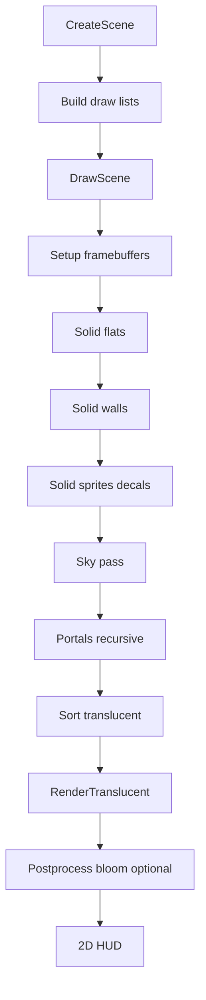

# 10 — Draw Order and Translucency

Draw lists, material sorting, sort nodes, solid vs translucent passes, and portal composition.

**Prev:** [09-sprites-and-models.md](./09-sprites-and-models.md) · **Next:** [11-hud-and-2d.md](./11-hud-and-2d.md)

---

## Purpose

BSP and wall/flat/sprite setup **do not draw immediately** (except oracle/debug paths). They append to `HWDrawList` containers; `HWDrawInfo::DrawScene` executes passes in deterministic order.

**Files:**

- `hw_drawlist.cpp` — list containers, sort, draw execution
- `hw_drawlistadd.cpp` — insertion helpers
- `hw_drawinfo.cpp` — `DrawScene`, pass orchestration
- `hw_drawstructs.h` — `HWWall`, `HWFlat`, `HWSprite`, `HWDrawItem`

---

## Memory arena

```cpp
FMemArena RenderDataAllocator(1024*1024);
```

Draw structs allocated from arena during `CreateScene`; freed when `HWDrawInfo` released (`FDrawInfoList` pooling in `hw_drawinfo.cpp`).

---

## `HWDrawList` structure

```cpp
void HWDrawList::Reset()
{
  walls.Clear();
  flats.Clear();
  sprites.Clear();
  drawitems.Clear();
  // SortNodes chain for translucent ordering
}
```

Separate lists per render pass / texture mode; `HWDrawInfo` may hold multiple lists for portals.

---

## Solid pass (opaque)

Typical order inside `DrawScene`:

1. **Opaque flats** — floors/ceilings without alpha
2. **Opaque walls** — `HWWallDispatcher::DrawWalls`
3. **Opaque sprites** — masked with alpha test, not blend
4. **Decals** — `hw_decal.cpp` on solid surfaces

State sorting: group by texture/material to minimize binds (`gl_sort_textures` optional).

---

## Translucent pass

`RenderTranslucent` / `DrawTranslucent`:

- Back-to-front sort using `SortNode` linked list (`StaticSortNodeArray` in `hw_drawlist.cpp`)
- Includes water flats, glass, fire sprites, masked midtextures
- **`gl_sort_textures`** affects sort stability

Sort keys use distance from viewpoint to primitive centroid (or plane for flats).

---

## Sort nodes

```cpp
class SortNode {
  SortNode *parent, *next;
  // links draw item into sorted chain
};
```

`HWDrawList::Sort()` builds chain before translucent draw. Portal draws may insert additional sort roots.

---

## Draw item types

`HWDrawItem` discriminated union style — wall segment, flat polygon, sprite, sky, model.

`hw_drawlistadd.cpp` provides `AddWall`, `AddFlat`, `AddSprite` used from dispatcher code paths.

---

## Portal draw integration

Main scene draws solid world; portal stack (`hw_portal.cpp`) may:

- Render to FBO texture
- Draw portal overlay quad
- Recurse nested `DrawScene`

Stencil marks portal region before recursive call ([07-sky-and-portals.md](./07-sky-and-portals.md)).

---

## Full frame diagram



Postprocess (`gl_bloom`) often off in parity captures — `no-post` display mode.

---

## `RenderTranslucent` details

- Restores depth write rules per item
- Alpha blend modes from `FRenderStyle` (translucent, add, subtract)
- Fog applied per item like solid path
- Mirror decals may draw here after mirror wall ([05-wall-rendering.md](./05-wall-rendering.md))

---

## Texture mode batches

Walls/flats grouped by:

- `FGameTexture*` pointer
- Shader effect (`EFF_NONE`, `EFF_FOGBOUNDARY`, `EFF_SPHEREMAP`, …)
- Translation / palette slot

Reduces GL state churn — important for WASM performance, not gold parity correctness.

---

## CPU oracle path

When `GZDraw_IsCpuOracle()`:

- Lists still built
- `Draw` calls may no-op or dump to `gzdraw_dump`
- Used to compare draw list contents without GPU

---

## CVAR interactions

| CVAR | Pass effect |
|------|-------------|
| `gl_render_walls/flats/things` | What gets inserted in CreateScene |
| `gl_texture` | Skips texture binds (debug color) |
| `gl_sort_textures` | Sort policy |
| `gl_bloom` | Post pass |

See [13-render-layer-cvars.md](./13-render-layer-cvars.md).

---

## Clocks

`hw_clock.h` tracks `WTDraw`, translucency time — profiling native vs WASM.

---

## doom-wad-lab parity

Frame diff compares **final composited playfield** after all passes. Order bugs show as:

- Sprites through walls (sort)
- Water over floor wrong (flat sort)
- Portal seam (stencil pass order)

`inspect-frame-diff.mts`, `analyze-frame-diff.mts` help classify.

---

## Key functions

| Function | File |
|----------|------|
| `HWDrawInfo::DrawScene` | `hw_drawinfo.cpp` |
| `HWDrawList::DrawWalls/DrawFlats/DrawSprites` | `hw_drawlist.cpp` |
| `RenderTranslucent` | `hw_drawlist.cpp` |
| `ResetRenderDataAllocator` | `hw_drawlist.cpp` |

---

## Cross-references

- Lists populated from: [04](./04-bsp-traversal.md)–[09](./09-sprites-and-models.md)
- HUD after 3D: [11-hud-and-2d.md](./11-hud-and-2d.md)
- GLES state: [12-gles-webgl2-wasm-path.md](./12-gles-webgl2-wasm-path.md)
