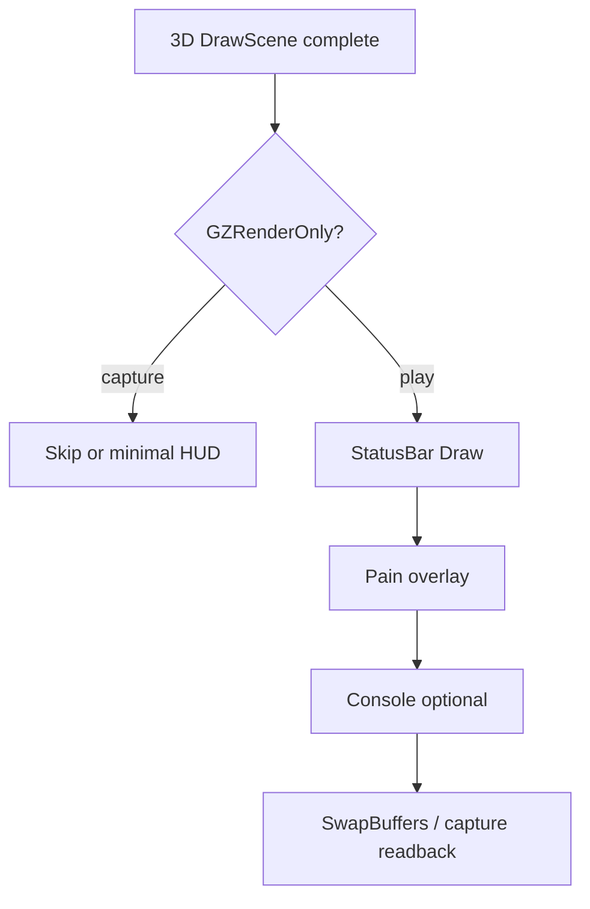

# 11 — HUD and 2D

Status bar, fullscreen overlays, menus, and 2D drawing after the 3D scene — still inside GZDoom GLES, not the TS host.

**Prev:** [10-draw-order-and-translucency.md](./10-draw-order-and-translucency.md) · **Next:** [12-gles-webgl2-wasm-path.md](./12-gles-webgl2-wasm-path.md)

---

## Scope

World geometry chapters ([05](./05-wall-rendering.md)–[10](./10-draw-order-and-translucency.md)) cover the playfield. This chapter covers **2D drawing** on top:

- Status bar (health, ammo, face)
- Crosshair / HUD messages
- Fullscreen patches (pain flash, title)
- Console (if enabled — stripped in gold play often)

**Primary files:**

- `hw_draw2d.cpp` — HW 2D drawer integration
- `v_draw.cpp` / `v_draw.h` — generic 2D draw API
- `sbar.cpp` / `sbar.h` — status bar logic
- `st_stuff.cpp` — status bar widgets (Doom)

---

## When 2D runs

After `HWDrawInfo::DrawScene` completes 3D passes, the frame loop calls status bar draw:

```cpp
// Conceptual flow in hw_entrypoint / player rendering
DrawScene(...);  // 3D world
// if not GZRenderOnly or HUD enabled:
StatusBar->Draw(...);
```

`GZRenderOnly` parity capture often **skips HUD** so playfield diff excludes status bar pixels:

```cpp
// hw_drawinfo.cpp
if (renderHUDModel && !GZRenderOnly) { ... }
if (!GZRenderOnly) { /* full HUD path */ }
```

Spawn corpus `ref.png` crops or masks playfield — see frame diff utilities in doom-wad-lab.

---

## `hw_draw2d.cpp`

Bridges classic Doom 2D drawing (patches, fonts) to GLES:

- Upload patch textures via TexMan
- Draw textured quads in screen space
- Orthographic projection for HUD coordinates (320×200 virtual or high-res scale)

Uses same `FRenderState` as 3D but with 2D shader path / no depth or ortho depth.

---

## Status bar

`sbar.cpp` selects game-specific drawer (`DoomStatusBar`, etc.):

- Reads player inventory (`d_player.h`)
- Animation ticks for face (`STF` sprites)
- Numeric widgets (health, armor, ammo)

All data from game simulation — in `-gzrender_play` WASM, sim runs for real.

---

## HUD debug tracing

`gzstate_dump.cpp`:

```cpp
int GZHudDbgFrames = 0;  // trace status-bar 2D draws when armed
```

`tools/gzrender-v2/diag-gzdoom-hud.mts` — diagnostic script for HUD parity issues.

---

## Fullscreen overlays

Pain tint, invulnerability colormap flash, intermission — `FOverlay` patches. Gold spawn capture typically on first tic before overlays animate.

---

## 2D vs playfield in corpus gate

`diffPlayfieldPngFiles` in doom-wad-lab crops to playfield rectangle excluding:

- Status bar band
- Possible letterbox if configured

Thus HUD implementation can differ slightly without failing gate **if** outside crop — but gold uses same crop for native and WASM.

---

## Fonts

IWAD `STCFN`/`STCBAR` or Unicode font PK3. Loaded at boot via TexMan ([01-engine-boot-and-wad-load.md](./01-engine-boot-and-wad-load.md)).

---

## Draw order



---

## Browser play (`-gzrender_play`)

Full HUD expected in interactive mode:

- Mouse look, movement
- Status bar updates
- `_gzr_exec_cmd` for live CVARs does not disable HUD

Viewer: `gzdoomViewerRuntime.ts`.

---

## Stripped modular fork

Modular `(s)` strip order removes menus/title first but keeps status bar for E1M1 smoke ([wasm-gold-and-modular.md](../../gzrender-v2/wasm-gold-and-modular.md)).

---

## Key files

| File | Role |
|------|------|
| `hw_draw2d.cpp` | GLES 2D backend |
| `v_draw.cpp` | Patch/text draw API |
| `sbar.cpp` | Status bar base |
| `st_stuff.cpp` | Doom ST widgets |
| `hw_drawinfo.cpp` | GZRenderOnly HUD gates |

---

## Cross-references

- 3D composition before HUD: [10-draw-order-and-translucency.md](./10-draw-order-and-translucency.md)
- Capture / crop: [15-wasm-host-and-corpus-gates.md](./15-wasm-host-and-corpus-gates.md)
- Play argv flags: [12-gles-webgl2-wasm-path.md](./12-gles-webgl2-wasm-path.md)

---

## Virtual screen coordinates

GZDoom HUD assumes classic 320×200 virtual pixels scaled to actual canvas:

- `V_DrawPatch` positions in virtual space
- High-DPI scaling via `vid_scale` / UI scale cvars
- GLES backend transforms to normalized device coordinates in `hw_draw2d.cpp`

WASM gold uses same scaling path as native — parity captures must use identical `vid` cvars in argv for spawn frames.

---

## Status bar animation

Face sprites (`STFEVL0` …) advance on player damage/heal events from game sim. First-tic spawn captures typically show neutral face because:

- No damage yet on tic 0
- `gametic` may be frozen for capture

Interactive play (`test-interactive-play.mts`) validates face updates separately from corpus gate.

---

## Automap and overlays

Automap drawing uses separate 2D path (`am_map.cpp`) — not part of playfield parity crop. Fullscreen automap not used in spawn capture argv.

---

## Console and developer overlays

Gold strip profile removes or disables most CCMD console UI for size. `_gzr_exec_cmd` remains for CVAR mutation ([13-render-layer-cvars.md](./13-render-layer-cvars.md)) — distinct from visible console widget.

---

## `v_draw.cpp` patch pipeline

Patches are column-based bitmaps in WAD:

1. `FTexture` created at TexMan load
2. 2D draw requests texture handle
3. `hw_draw2d` emits textured quad with alpha

Same texture cache as wall patches — palette translations apply for pain flash.

---

## Intermission and title

Title screen / intermission (`D_StartTitle`, `F_Intermission`) use 2D draws outside level render. `-gzrender_play` may skip title when warping directly to map for corpus (`+warp MAPxx`).

---

## Capture readback

Browser capture reads canvas after full frame including HUD (if drawn). Playfield diff crop removes bottom bar region programmatically — document crop rectangle in `frameDiff.ts` when investigating "HUD leak" false positives.

---

## WASM-specific HUD notes

- No OS cursor — crosshair drawn as patch
- Mouse capture via SDL Emscripten layer in `gzdoom.js`
- `-nosound` on gold path — SFX from JS event stream separately (gzrender-v2 event parity phase)
