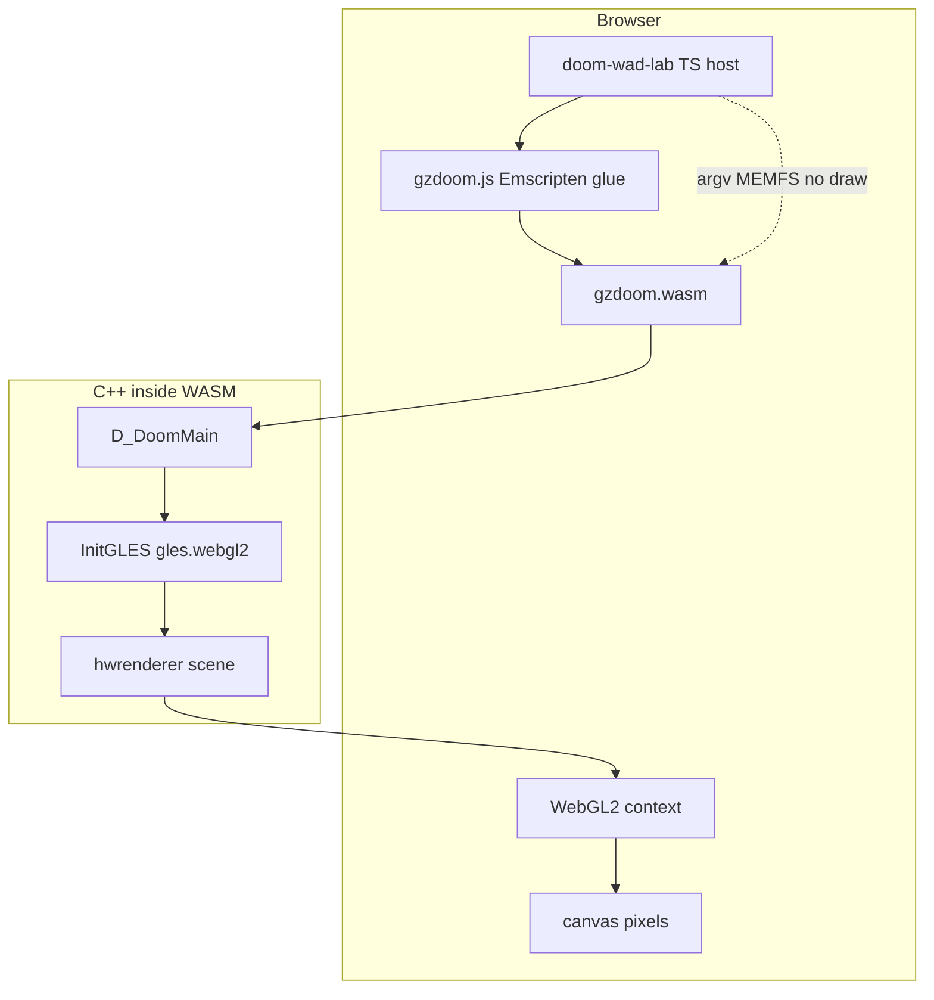

# 12 — GLES, WebGL2, and WASM Path

The GLES backend in `gzdoom-project/src/gles/`, runtime flags `gles.webgl2` and `GZRenderOnly`, and Emscripten host integration — **without** `#ifdef __EMSCRIPTEN__` in renderer draw code.

**Prev:** [11-hud-and-2d.md](./11-hud-and-2d.md) · **Next:** [13-render-layer-cvars.md](./13-render-layer-cvars.md) · **Overview:** [00-gold-standard-overview.md](./00-gold-standard-overview.md)

---

## Architecture rule

From [wasm-renderer-invariants](../../../.cursor/rules/wasm-renderer-invariants.mdc):

1. **No `#ifdef __EMSCRIPTEN__` in renderer draw paths** — branch on `OpenGLESRenderer::gles.webgl2`, `gles.glesMode`, `GZRenderOnly`.
2. **No JavaScript renderer** — TS host only loads WASM, argv, capture.
3. **Same C++ draw code** for native gold and WASM gold.

Acceptable exception: **non-draw** infrastructure (e.g. thread pool size in `hw_bsp.cpp`) where Emscripten cannot run worker threads.

---

## Directory layout

```txt
gzdoom-project/src/common/rendering/gles/
  gles_system.cpp/h      Init, capability probe, gles.webgl2
  gles_shader.cpp        Shader compile/link
  gles_framebuffer.cpp   FBO, stencil, GZRenderOnly shortcuts
  gles_buffers.cpp       VBO/IBO
  gles_renderstate.cpp   Draw calls
  gles_texture.cpp       Texture upload
```

HW scene code stays in `src/rendering/hwrenderer/scene/` — backend-agnostic via `FRenderState` / `HWRenderState`.

---

## `InitGLES` and mode selection

**File:** `gles_system.cpp`

On init, probes GL version:

```cpp
gles.webgl2 = glVersion >= 3.0;  // browser WebGL2
gles.wasmGl = gles.webgl2;
gles.glesMode = (gles.webgl2 || glVersion >= 3.0)
    ? GLES_MODE_OGL3 : GLES_MODE_GLES;
```

Modes:

| `glesMode` | Target |
|------------|--------|
| `GLES_MODE_GLES` | Mobile GLES2 |
| `GLES_MODE_OGL2` | Desktop GL 2.x |
| `GLES_MODE_OGL3` | GL 3.3+ / WebGL2 |

Gold WASM runs **WebGL2** path (`gles.webgl2 == true`) while matching desktop OGL3 shader branches where possible.

Special case:

```cpp
if (GZRenderOnly && !gles.wasmGl)
  gles.webgl2 = true;  // force webgl2 branches for hosted capture
```

---

## Runtime flags (not preprocessor)

| Flag | Set by | Renderer effect |
|------|--------|-----------------|
| `gles.webgl2` | `InitGLES` | Shader selection, depth bias, FBO formats |
| `gles.glesMode` | Capability probe | API feature tier |
| `GZRenderOnly` | `-gzrender_hosted` argv | Skip HUD, reduce GPU setup |
| `GZRenderPlay` | `-gzrender_play` | Full game loop |
| `GZRenderBrowserHost` | `-gzrender_browser` | Browser I/O shims |
| `GZRenderStripped` | `-gzrender_s` | Modular fork |

Parsed in `d_main.cpp` → `InitGZRenderOnlyFromArgs()` **before** `V_Init2`.

---

## Example renderer branches

### Depth bias (WebGL2)

`hw_drawinfo.cpp`:

```cpp
const bool applyWallDepthBias =
    OpenGLESRenderer::gles.webgl2 && !GZRender_IsParityCapture();
```

### FBO setup

`gles_framebuffer.cpp`:

```cpp
if (GZRenderOnly) { /* reduced attachments for capture */ }
```

### Shaders

`gles_shader.cpp`:

```cpp
if (!gles.webgl2) { /* alternate shader variant */ }
```

---

## Gold WASM build

**Script:** `doom-wad-lab/tools/gzrender-v2/build-gzdoom-wasm.sh`

- **Toolchain:** Emscripten `emcc` + `emcmake` + ninja
- **Output:** `public/wasm/gzdoom/gzdoom.js`, `gzdoom.wasm`, PK3s
- **Build dir:** `gzdoom-project/build-wasm` (never mix with pure-wasm-s)
- **Link flags:** SDL2, WebGL2, MEMFS, exported functions for host (`_gzr_exec_cmd`, etc.)

Emscripten is **linker/glue only** — renderer remains C++ compiled to `.wasm` machine code.

---

## Host integration (TypeScript)

| File | Role |
|------|------|
| `src/gzdoom-oracle/gzdoomWasmHost.ts` | `createGzdoomModule`, MEMFS mount |
| `src/wad/renderer/gzrender-v2/gzdoom/gzdoomViewerRuntime.ts` | Play/capture UI |
| `src/gzdoom-oracle/gzdoomPureWasmHost.ts` | Modular `(s)` host (no emscripten js) |

Gold flow:

```typescript
// Mount IWAD
module.FS.writeFile('/wad/DOOM.WAD', bytes);
module.callMain(['+vid_renderer', 'gles', '+gl_es', '1',
  '-gzrender_play', '-gzrender_browser', '-iwad', '/wad/DOOM.WAD', ...]);
```

Host **never** calls WebGL draw for world geometry.

---

## Modular pure WASM `(s)` — contrast

**Script:** `build-gzdoom-s-pure-wasm.sh`

- clang `--target=wasm32` (no emcc)
- Custom WASI/browser shims
- Input: `NODE_LUMPS.WAD` + `-loadgzstate`
- Same GLES sources, different linker + I/O

Documented in [wasm-gold-and-modular.md](../../gzrender-v2/wasm-gold-and-modular.md).

---

## WASM path diagram



---

## argv reference (gold)

```txt
+vid_renderer gles
+gl_es 1
-gzrender_play
-gzrender_browser
-iwad /wad/DOOM.WAD
+warp MAP01
+name capture
```

Capture variants add `-gzdraw_dump` or fixed-tic freeze flags per tool scripts.

---

## PK3 and shaders

Minimal shader PK3 built by `build-shader-overlay-pk3.py`. WASM loads these like desktop GZDoom PK3 search path — required for linked shader names in `gles_shader.cpp`.

---

## Verification

```bash
npm run build:gzdoom-wasm
npm run verify:gold-wasm   # artifact separation gold vs (s)
```

`verify-gold-wasm-artifact.sh` ensures paths not contaminated by modular build.

---

## Debugging WASM renderer

- `GZRenderShaderDebugMode` in `gzstate_dump.cpp`
- Browser WebGL validation layers
- Compare same map native `verify-gzdraw-native.mts` vs `capture-gzdoom-wasm-frame.mts`

---

## Forbidden patterns

```cpp
// BAD in hw_walls.cpp draw path:
#ifdef __EMSCRIPTEN__
  glFooWebGLOnly();
#endif

// GOOD:
if (OpenGLESRenderer::gles.webgl2)
  state.SetDepthBias(...);
```

---

## Cross-references

- Layer CVAR argv: [13-render-layer-cvars.md](./13-render-layer-cvars.md)
- Corpus proof: [15-wasm-host-and-corpus-gates.md](./15-wasm-host-and-corpus-gates.md)
- GZSTATE modular load: [14-gzstate-dump-parity.md](./14-gzstate-dump-parity.md)
