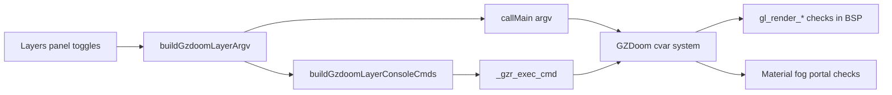

# 13 — Render Layer CVARs

`gl_render_walls`, `gl_render_flats`, `gl_render_things`, and related CVARs — plus doom-wad-lab layer toggle mapping and live updates.

**Prev:** [12-gles-webgl2-wasm-path.md](./12-gles-webgl2-wasm-path.md) · **Next:** [14-gzstate-dump-parity.md](./14-gzstate-dump-parity.md) · **BSP gates:** [04-bsp-traversal.md](./04-bsp-traversal.md)

---

## Design principle

All modular debug visualization is done by **disabling GZDoom HW draw stages via CVARs** — not by drawing overlays in TypeScript.

Two application mechanisms:

1. **Startup argv** — `+gl_render_walls 0` passed to `callMain`
2. **Live console** — `_gzr_exec_cmd("gl_render_walls 0")` without WASM restart

---

## Master render section CVARs

| CVAR | Type | Checked in | Effect |
|------|------|------------|--------|
| `gl_render_walls` | bool | `AddLine`, wall dispatcher | Wall columns, masked walls |
| `gl_render_flats` | bool | `DoSubsector` | Floors, ceilings |
| `gl_render_things` | bool | `DoSubsector`, BSP end | Sprites, particles, psprites |
| `gl_texture` | bool | Material setup | Textured vs solid color |
| `gl_portals` | bool | Portal/sky code | Portals, sky link |
| `gl_noskyboxes` | bool | Skybox sectors | Invert: skyboxes on when false |
| `gl_mirrors` | bool | Mirror portals/walls | Reflective surfaces |
| `gl_fogmode` | int | `SetFog`, fog walls | Distance fog |
| `gl_lightmode` | int | `CalcLightLevel` | Colored sector light |
| `gl_light_sprites` | bool | Sprite light | Dynamic sprite lighting |
| `gl_bloom` | bool | Post pass | Bloom (usually off in parity) |

Declared in `hw_drawinfo.cpp`, `hw_cvars.cpp`, `hw_lighting.cpp`.

---

## Parity display modes

**File:** `doom-wad-lab/src/gzdoom-oracle/parityDisplayModes.ts`

Maps named modes to CVAR argv bundles:

| Mode | Typical CVAR pattern |
|------|---------------------|
| `walls-only` | walls on, flats/things off |
| `flats-only` | flats on, walls/things off |
| `geometry` | walls+flats+things, textures on |
| `notexture` | `gl_texture 0` |
| `no-portals` | portals/skyboxes off |
| `no-fog` | `gl_fogmode 0` |
| `no-post` | bloom off |

Used by batch scripts: `display-mode-corpus.mts`, `regenerate-gold-display-modes.mts`.

---

## Layers panel mapping

**File:** `doom-wad-lab/src/wad/renderer/gzrender-v2/gzdoom/applyGzdoomRenderLayers.ts`

```typescript
export function buildGzdoomLayerArgv(toggles: RenderLayerToggles): string[] {
  pushBool('gl_render_walls', toggles.solidWalls);
  pushBool('gl_render_flats', toggles.solidFloors || toggles.solidCeilings);
  pushBool('gl_render_things', drawThings);
  pushBool('gl_texture', useTextures);
  pushBool('gl_portals', toggles.sky);
  pushBool('gl_noskyboxes', !toggles.sky);
  pushInt('gl_fogmode', toggles.dynamicLighting ? 2 : 0);
  pushInt('gl_lightmode', toggles.coloredLighting ? 1 : 0);
  pushBool('gl_light_sprites', toggles.dynamicLighting);
}
```

Classic WebGL toggles (`renderLayerToggles.ts`) mirror the same semantic layers for federation diff — two backends, one toggle UI.

---

## Live toggles without restart

**File:** `applyGzdoomLayerTogglesLive.ts`

```typescript
export function applyGzdoomLayerTogglesLive(
  module: GzdoomWasmModule,
  toggles: RenderLayerToggles,
): boolean {
  const cmds = buildGzdoomLayerConsoleCmds(toggles);
  for (const cmd of cmds)
    module._gzr_exec_cmd(ptr);  // "gl_render_walls 0"
}
```

Requires WASM export `_gzr_exec_cmd` from gold build. If missing, UI warns to rebuild.

Startup `+cvar` syntax vs console:

- Argv: `+gl_render_walls 0`
- Console: `gl_render_walls 0` (no `+`)

---

## Wireframe modes

When `toggles.wireframeMode !== 'off'`:

- Forces `gl_texture 0`, `gl_render_things 0`
- `bsp` / `sight` — walls on, flats off
- `mesh` — walls and flats on (untextured)

Useful for Classic vs GZDoom mesh federation without texture noise.

---

## CVAR flow diagram



---

## Testing

**File:** `applyGzdoomRenderLayers.test.ts` — unit tests for argv mapping.

**Script:** `tools/gzrender-v2/test-gzdoom-s-layers.mts` — integration for `(s)` fork.

**Script:** `diagnose-parity-layers.mts` — bisect failing map by layer.

---

## Interaction with gold gate

Corpus `ref.png` uses **full** render (all layers on). Layer CVARs are for **debug bisection**, not gold acceptance (except intentional display-mode regression suites).

Running corpus with walls-only mode is a separate test matrix entry ([test-matrix.md](../../gzrender-v2/test-matrix.md)).

---

## Related CVARs (secondary)

| CVAR | Use |
|------|-----|
| `gl_mask_threshold` | Alpha test walls |
| `gl_mask_sprite_threshold` | Alpha test sprites |
| `gl_multithread` | Native only; off on Emscripten |
| `gl_sort_textures` | Translucent sort |
| `gl_no_skyclear` | Sky clear pass |

---

## Modular `(s)` strip order context

CVAR toggles bisect **behavior** without recompiling. The `(s)` fork additionally **strips C++ subsystems** incrementally ([wasm-gold-and-modular.md](../../gzrender-v2/wasm-gold-and-modular.md)) — orthogonal to layer CVARs.

---

## Cross-references

- Where CVARs checked: [04-bsp-traversal.md](./04-bsp-traversal.md), [05](./05-wall-rendering.md)–[07](./07-sky-and-portals.md)
- WASM host: [12-gles-webgl2-wasm-path.md](./12-gles-webgl2-wasm-path.md)
- Display mode corpus: [15-wasm-host-and-corpus-gates.md](./15-wasm-host-and-corpus-gates.md)
