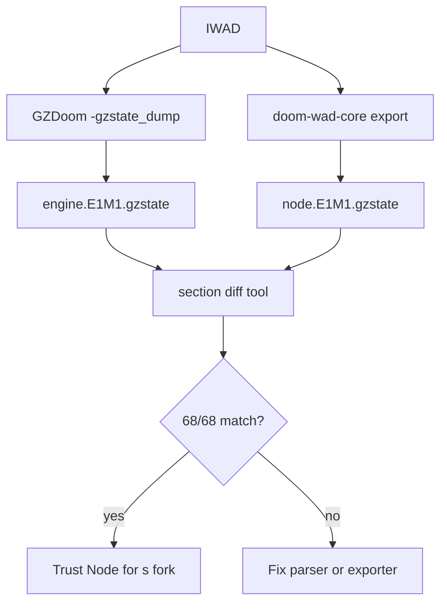

# 14 — GZSTATE Dump and Parity

`gzstate_dump.cpp`, GZSTATE v1 binary sections, Node export from doom-wad-core, and section-by-section parity validation.

**Prev:** [13-render-layer-cvars.md](./13-render-layer-cvars.md) · **Next:** [15-wasm-host-and-corpus-gates.md](./15-wasm-host-and-corpus-gates.md) · **Load path:** [01-engine-boot-and-wad-load.md](./01-engine-boot-and-wad-load.md)

---

## Purpose

GZSTATE is a **post-`P_SetupLevel` snapshot** of renderer-facing map state:

- Deterministic, versioned, little-endian
- Index-based (no pointers)
- Diffable section-by-section
- Consumable by modular `-loadgzstate` path

Proves: **Node parse ≡ GZDoom load** before trusting Node-fed WASM.

Spec: [gzstate-v1.md](../../gzrender-v2/gzstate-v1.md).

---

## Source files

| Location | Role |
|----------|------|
| `gzdoom-project/src/gzstate_dump.cpp` | Engine exporter + import hooks |
| `gzdoom-project/src/gzstate_dump.h` | Flags, public API |
| `doom-wad-lab/tools/gzrender-v2/gzdoom/gzstate_dump.cpp` | Copy/sync for tooling |
| `doom-wad-core` (package) | Node-side export/import |
| `tools/gzrender-v2/export-node-gzstate.mts` | Batch export |

---

## Magic and header

```cpp
static constexpr uint32_t GZSTATE_MAGIC = 0x54535A47; // 'GZST'
static constexpr uint32_t GZSTATE_VERSION = 1;
static constexpr uint32_t GZSTATE_HEADER_SIZE = 64;
```

Header includes map name, engine tag, section count, CRC.

---

## Section IDs

From `gzstate_dump.cpp`:

```cpp
enum GZStateSectionId : uint32_t {
  SEC_STRING_TABLE = 1,
  SEC_VERTICES = 2,
  SEC_SECTORS = 3,
  SEC_SIDEDEFS = 4,
  SEC_LINEDEFS = 5,
  SEC_SEGS = 6,
  SEC_SUBSECTORS = 7,
  SEC_NODES = 8,
  SEC_THINGS = 9,
  SEC_MAP_META = 10,
  SEC_LUMP_CATALOG = 11,
  SEC_TEXTURE_DEFS = 12,
  SEC_FLAT_NAMES = 13,
  SEC_SPRITE_NAMES = 14,
  SEC_MUSIC_NAMES = 15,
  SEC_SOUND_NAMES = 16,
  SEC_PNAMES = 17,
  SEC_PATCH_RASTERS = 18,
  SEC_FLAT_RASTERS = 19,
  SEC_SPRITE_RASTERS = 20,
  SEC_TEXTURE_RASTERS = 21,
  SEC_MAP_REJECT = 22,
  SEC_MAP_BLOCKMAP = 23,
};
```

Each section: `{ id, offset, size, crc }` directory entry (`GZSTATE_SECTION_ENTRY_SIZE = 16`).

---

## Export timing

After successful `P_SetupLevel`:

1. All runtime arrays populated ([02-level-data-structures.md](./02-level-data-structures.md))
2. Textures resolved through TexMan
3. `GZState_DumpIfRequested()` writes file if argv set

Dump path argv examples (tooling):

```txt
-gzstate_dump /tmp/E1M1.gzstate
```

---

## Import timing

**File:** `p_setup.cpp`

```cpp
if (GZState_HasImportPath())
  map = P_OpenMapDataFromGzstate(GZState_GetImportPath());
else
  map = P_OpenMapData(Level->MapName.GetChars(), true);
```

Import reconstructs `MapData` without reading MAP lumps from WAD — used by **modular `(s)`** fork, not gold IWAD path.

---

## Parity workflow



Gate: `npm run test:corpus` (68 maps).

---

## Section-by-section expectations

| Section | Parity notes |
|---------|----------------|
| `SEC_VERTICES` | Fixed-point coords match `vertex_t` |
| `SEC_SECTORS` | Heights, light, flat indices |
| `SEC_SIDEDEFS` | Texture indices into string table |
| `SEC_LINEDEFS` | Flags, sidedef indices, specials |
| `SEC_SEGS` | Line/side/vertex indices |
| `SEC_SUBSECTORS` | Seg ranges |
| `SEC_NODES` | BSP tree; `GZSTATE_NODE_SUBSECTOR_FLAG` on leaves |
| `SEC_THINGS` | Spawn points |
| `SEC_TEXTURE_*` | Raster bytes for software renderer federation |
| `SEC_MAP_REJECT/BLOCKMAP` | Optional; must match if exported |

Index `GZSTATE_NO_SIDE = 0xFFFF` for one-sided back.

---

## String table

All texture/sound names centralized — sidedefs store indices, not 8-char inline in export format. Matches need for deterministic diff across endianness (always LE).

---

## Node export (`doom-wad-core`)

Package `@hypercrab2000/doom-wad-core` implements parallel section writers consumed by:

- `export-node-gzstate.mts`
- `gzstateToWadMap.ts` — rebuild lump archive for `(s)` (`NODE_LUMPS.WAD`)
- Tests: `gzstateToWadMap.test.ts`

---

## Probe / debug exports

`gzstate_dump.cpp` also tracks render probe state for diagnostics:

```cpp
float GZRenderLastGlobVis;
float GZRenderLastLightParms[4];
int GZRenderLastTexMode;
bool GZRenderLastBandedSwLight;
// ...
```

Used when comparing shader uniform parity native vs WASM during investigations — not part of GZSTATE v1 file format.

---

## GZRender flags (same compilation unit)

```cpp
bool GZRenderOnly = false;
bool GZRenderBrowserHost = false;
bool GZRenderPlay = false;
bool GZRenderStripped = false;
```

Documented in [12-gles-webgl2-wasm-path.md](./12-gles-webgl2-wasm-path.md).

---

## Ref frame capture

GZSTATE tooling can arm reference PNG capture after N warmup frames:

```cpp
static FString GZStatePendingRefFramePath;
static int GZStateRefFrameWarmupFrames;
```

Used by `capture-gzstate-import-frame.sh` — validates import path renders same frame as raw load.

---

## Federated draw from GZSTATE (TS)

**Not gold path** — research/federation:

- `src/wad/renderer/gzrender-v2/federated/drawFromGzstate.ts`
- Classic WebGL draws from GZSTATE for comparison

Gold always uses C++ renderer inside WASM.

---

## Versioning rule

Any struct layout change → bump `GZSTATE_VERSION` and update [gzstate-v1.md](../../gzrender-v2/gzstate-v1.md). Mismatch causes import error:

```cpp
I_Error("GZSTATE import failed for map '%s'", ...);
```

---

## Common parity failures

| Section mismatch | Typical cause |
|------------------|---------------|
| NODES | GL vs ZNODES handling |
| SIDEDEFS | Unicode texture name normalization |
| SECTORS | Boom deep water default |
| THINGS | Skill filter not applied consistently |
| TEXTURE_RASTERS | Patch compression |

---

## Tools

| Script | Role |
|--------|------|
| `export-node-gzstate.mts` | Batch Node export |
| `dump-gzdoom-gold-standard.mts` | Engine-side dumps |
| `import-oracle-corpus.mts` | Corpus import |
| `test:corpus` | 68-map gate |

---

## Cross-references

- Struct definitions: [02-level-data-structures.md](./02-level-data-structures.md)
- Modular WASM load: [12-gles-webgl2-wasm-path.md](./12-gles-webgl2-wasm-path.md)
- Frame gate after state trusted: [15-wasm-host-and-corpus-gates.md](./15-wasm-host-and-corpus-gates.md)
