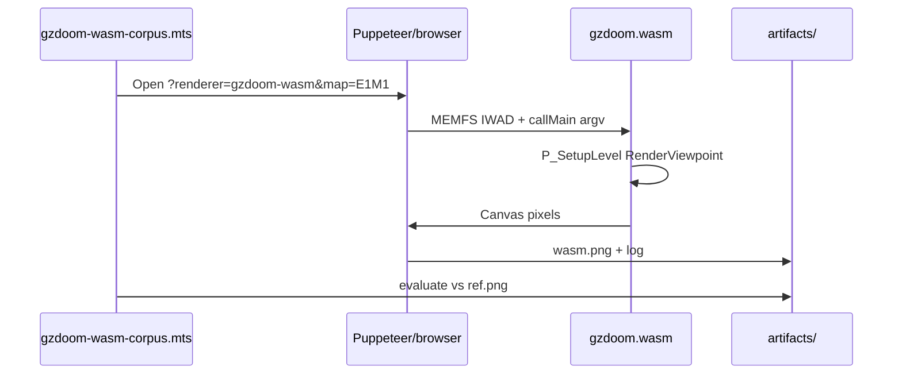

# 15 — WASM Host and Corpus Gates

`doom-wad-lab/tools/gzrender-v2/`, spawn-frame capture, `bspGoldenSnapshots.json`, and the **68-map @ 0% playfield diff** gate.

**Prev:** [14-gzstate-dump-parity.md](./14-gzstate-dump-parity.md) · **Overview:** [00-gold-standard-overview.md](./00-gold-standard-overview.md)

---

## Mission

Prove **GZDoom GLES in WASM** matches **native GLES gold** on every stock map at spawn view — the Step 2 completion gate for gzrender-v2.

---

## Tool directory map

```txt
tools/gzrender-v2/
  build-gzdoom-wasm.sh          Gold Emscripten build
  build-gzdoom-s-pure-wasm.sh   Modular (s) clang build
  verify-gold-wasm-artifact.sh  Gold vs (s) path separation
  gzdoom-wasm-corpus.mts        Capture wasm.png per map
  evaluate-gzdoom-wasm-corpus.mts  Diff vs ref.png
  gzdraw-corpus.mts             Native/wasm batch driver
  run-gzdraw-spawn-corpus.sh    Shell orchestration
  overnight-step2-corpus.sh     Long batch
  materialize-gold-standard.mts Native ref.png generation
  diff-playfield / frameDiff    Pixel diff utilities
  capture-gzdoom-wasm-frame.mts Single-map capture
  export-node-gzstate.mts       GZSTATE batch ([14](./14-gzstate-dump-parity.md))
```

Artifacts:

```txt
artifacts/gzrender-v2/
  gold-standard/{DOOM|DOOM2}/{MAP}/ref.png
  gzdoom-wasm-corpus/{slug}/{map}/wasm.png
  gzdoom-wasm-corpus-report.json
public/wasm/gzdoom/             Shipped module
```

---

## npm scripts (typical)

| Command | Action |
|---------|--------|
| `npm run build:gzdoom-wasm` | Run `build-gzdoom-wasm.sh` |
| `npm run verify:gold-wasm` | Artifact sanity |
| `npm run test:gzdraw-corpus` | Full corpus capture + evaluate |
| `npm run test:corpus` | GZSTATE 68-map parity |

Exact names in `package.json` — see [TESTING.md](../../TESTING.md).

---

## Gold build pipeline

**Script:** `build-gzdoom-wasm.sh`

1. Verify `emcc`, native `ImportExecutables.cmake`
2. `emcmake` configure `build-wasm`
3. ninja GZDoom with GLES-only strip profile
4. Copy `gzdoom.js`, `gzdoom.wasm`, PK3s → `public/wasm/gzdoom/`
5. Log → `artifacts/gzrender-v2/logs/build-gzdoom-wasm.log`

**Never** output to `build-pure-wasm-s` or `public/wasm/gzdoom-s/` from this script.

---

## Capture flow



Single-map: `capture-gzdoom-wasm-frame.mts`.

---

## Evaluation tiers

**File:** `evaluate-gzdoom-wasm-corpus.mts`

Uses `diffPlayfieldPngFiles` from `src/wad/parity/frame/frameDiff.ts`:

| Tier | Criterion |
|------|-----------|
| `strict` | 0 mismatched pixels, tolerance 0 |
| `band` | Colormap boundary band tolerance (`GZDOOM_CORPUS_BAND_RADIUS`) |
| `edge` | Max pixel budget at edges |
| `wasm-gold` | Compare vs `ref-wasm.png` band-aid tier (legacy) |
| `missing` / `fail` | Artifact or reference missing |

**Primary gold standard:** strict 68/68 vs native `ref.png`.

---

## Native gold generation

`materialize-gold-standard.mts` / `regenerate-gold-standard-gles.mts` run native GZDoom with GLES to produce `ref.png` per map — the oracle photographs WASM must match.

`dump-gzdoom-gold-standard.mts` coordinates dump + capture.

---

## `bspGoldenSnapshots.json`

**Path:** `doom-wad-lab/src/wad/renderer/bsp/vanilla/bspGoldenSnapshots.json`

Vanilla BSP regression snapshots for **Node BSP** implementation — related federation infrastructure, not the WASM pixel gate directly. Documents expected subsector/BSP outputs for classic WAD lab renderer.

GZDoom gold gate uses **pixel diff**, not JSON snapshot diff — but BSP correctness in Node underpins GZSTATE parity ([14](./14-gzstate-dump-parity.md)).

---

## Playfield crop

Diff utilities exclude HUD/status bar:

- `read-playfield-pixel.mts`
- `frameDiff.ts` playfield rectangle

Ensures [11-hud-and-2d.md](./11-hud-and-2d.md) differences don't fail world parity.

---

## View probes

Standardized camera for reproducible `ref.png`:

- `enumerate-view-probes.mts`
- `docs/gzrender-v2/view-probe-grid.md`
- Engine: `GZRenderProbeX/Y` in `gzstate_dump.cpp`

All 68 maps use consistent probe policy from corpus config.

---

## Failure triage

| Tool | Use |
|------|-----|
| `summarize-corpus-failures.mts` | Aggregate report |
| `inspect-frame-diff.mts` | Heatmap of mismatches |
| `list-mismatch-pixels.mts` | Coordinate list |
| `diagnose-parity-layers.mts` | Layer CVAR bisect ([13](./13-render-layer-cvars.md)) |
| `analyze-e2m8-mismatch.mts` | Map-specific investigations |
| `repro-blue-liquid.mts` | Flat/light issues |

Report JSON: `artifacts/gzrender-v2/gzdoom-wasm-corpus-report.json`.

---

## Hosted play tests

Interactive regression (not pixel gate):

- `test-hosted-play.mts`
- `test-interactive-play.mts`
- `test-play-input.mts`
- `diag-app-play.mts`

Verify `-gzrender_play` input loop in browser.

---

## Overnight batch

`overnight-step2-corpus.sh` — long-running full corpus for CI/dev machines.

---

## Gate status interpretation

```json
{
  "map": "E1M1",
  "tier": "strict",
  "mismatchedPixels": 0,
  "oracle": "native",
  "detail": "..."
}
```

Target: all maps `tier: "strict"`, `mismatchedPixels: 0`.

---

## Relationship to gzrender-v2 phases

From [four-step-plan.md](../../gzrender-v2/four-step-plan.md):

1. State dump/import parity (GZSTATE) — [14](./14-gzstate-dump-parity.md)
2. **Frame parity WASM vs native** — this chapter
3. Event parity — separate event-system doc
4. Production federation — optional Classic WebGL comparison

---

## UI entry points

```txt
?renderer=gzdoom-wasm       Gold play / capture
?renderer=gzdoom-s-wasm     Modular (requires gzdoom-s artifact)
```

Runtime: `gzdoomViewerRuntime.ts`, `gzdoomSViewerRuntime.ts`.

---

## Cross-references

- Gold definition: [00-gold-standard-overview.md](./00-gold-standard-overview.md)
- WASM build/runtime: [12-gles-webgl2-wasm-path.md](./12-gles-webgl2-wasm-path.md)
- Layer debug during triage: [13-render-layer-cvars.md](./13-render-layer-cvars.md)
