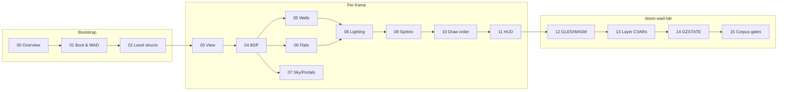

# GZDoom Renderer Bible

Authoritative technical reference for the **gold-standard** hardware (GLES) renderer pipeline used by [doom-wad-lab](../../gzrender-v2/README.md) **gzrender-v2**. Every chapter points at real C++ in `gzdoom-project` and integration code in this repo.

## What this documents

The frozen **gold oracle** path: GZDoom's own GLES HW renderer compiled to WASM, fed raw IWAD bytes, compared against native GLES `ref.png` at **0% playfield pixel diff** on all **68 stock Doom II maps**. The host (TypeScript) never draws pixels.

See [00-gold-standard-overview.md](./00-gold-standard-overview.md) for definitions, gates, and the Node→GZSTATE→WASM federation model.

## Table of contents

| # | Chapter | Topic |
|---|---------|-------|
| — | [00-gold-standard-overview.md](./00-gold-standard-overview.md) | Gold definition, 68-map gate, Node→GZSTATE→WASM, no JS renderer |
| 1 | [01-engine-boot-and-wad-load.md](./01-engine-boot-and-wad-load.md) | IWAD init, texture manager, level load entry points |
| 2 | [02-level-data-structures.md](./02-level-data-structures.md) | WAD lumps → `vertex_t`, `seg_t`, `subsector_t`, … |
| 3 | [03-view-setup-and-camera.md](./03-view-setup-and-camera.md) | `FRenderViewpoint`, view matrix, mirrors |
| 4 | [04-bsp-traversal.md](./04-bsp-traversal.md) | `RenderBSPNode`, `DoSubsector`, clipper |
| 5 | [05-wall-rendering.md](./05-wall-rendering.md) | `AddLine`, upper/middle/lower, pegging, transparency |
| 6 | [06-flats-and-ceilings.md](./06-flats-and-ceilings.md) | Floor/ceiling planes, `F_SKY`, VBO builder |
| 7 | [07-sky-and-portals.md](./07-sky-and-portals.md) | Sky domes, sky portals, sector portals |
| 8 | [08-lighting.md](./08-lighting.md) | Sector light, colormap, dynamic lights |
| 9 | [09-sprites-and-models.md](./09-sprites-and-models.md) | Things, models, psprites / weapon view |
| 10 | [10-draw-order-and-translucency.md](./10-draw-order-and-translucency.md) | Draw lists, sort nodes, translucent pass |
| 11 | [11-hud-and-2d.md](./11-hud-and-2d.md) | Status bar, 2D overlay draws |
| 12 | [12-gles-webgl2-wasm-path.md](./12-gles-webgl2-wasm-path.md) | GLES backend, `gles.webgl2`, `GZRenderOnly`, Emscripten host |
| 13 | [13-render-layer-cvars.md](./13-render-layer-cvars.md) | `gl_render_*` CVARs, layer toggles in doom-wad-lab |
| 14 | [14-gzstate-dump-parity.md](./14-gzstate-dump-parity.md) | `gzstate_dump.cpp`, section-by-section parity |
| 15 | [15-wasm-host-and-corpus-gates.md](./15-wasm-host-and-corpus-gates.md) | `tools/gzrender-v2/`, corpus scripts, 68-map gate |
| A | [appendix-code-index.md](./appendix-code-index.md) | Alphabetical index of key source files |
| R | [references.md](./references.md) | GZDoom wiki, ZDoom wiki, external docs |

## Classic renderer cross-reference

The lab also ships a **TypeScript WebGL2** renderer with per-layer live toggles. For Node→draw-plan→stage mapping (not WASM gold), see the [Classic Layer Bible](../classic-layers/README.md). GZDoom chapters here remain the **pixel oracle**; Classic chapters document debug/isolation of the same conceptual layers in Node.

## Reading order

**Quick paths:**

- **“Why does gold exist?”** → [00](./00-gold-standard-overview.md), [15](./15-wasm-host-and-corpus-gates.md)
- **“How does a map become triangles?”** → [02](./02-level-data-structures.md) → [04](./04-bsp-traversal.md) → [05](./05-wall-rendering.md) / [06](./06-flats-and-ceilings.md)
- **“WASM vs native parity?”** → [12](./12-gles-webgl2-wasm-path.md), [14](./14-gzstate-dump-parity.md), [15](./15-wasm-host-and-corpus-gates.md)
- **“Toggle walls off for debug?”** → [13](./13-render-layer-cvars.md)

## Code locations

| Tree | Role |
|------|------|
| `gzdoom-project/src/rendering/hwrenderer/` | HW renderer entry + scene |
| `gzdoom-project/src/common/rendering/gles/` | GLES / WebGL2 backend |
| `gzdoom-project/src/gzstate_dump.cpp` | GZSTATE v1 exporter |
| `doom-wad-lab/tools/gzrender-v2/` | Build scripts, corpus gates |
| `doom-wad-lab/src/wad/renderer/gzrender-v2/` | TS host integration |

## Related living docs

- [gzrender-v2 README](../../gzrender-v2/README.md) — project charter and status
- [wasm-gold-and-modular.md](../../gzrender-v2/wasm-gold-and-modular.md) — gold vs modular `(s)` fork
- [gzstate-v1.md](../../gzrender-v2/gzstate-v1.md) — GZSTATE binary spec
- [wasm-renderer-invariants](../../../.cursor/rules/wasm-renderer-invariants.mdc) — hard rules for renderer code

## Conventions in this bible

- **Paths** to C++ are relative to `gzdoom-project/` unless prefixed with `doom-wad-lab/`.
- **Gold** always means the Emscripten `gzdoom-wasm` oracle, not Classic WebGL TS renderer.
- **Playfield** means the 3D view rectangle excluding status bar unless noted.
- Cross-links use relative paths within this folder (`./04-bsp-traversal.md`).
