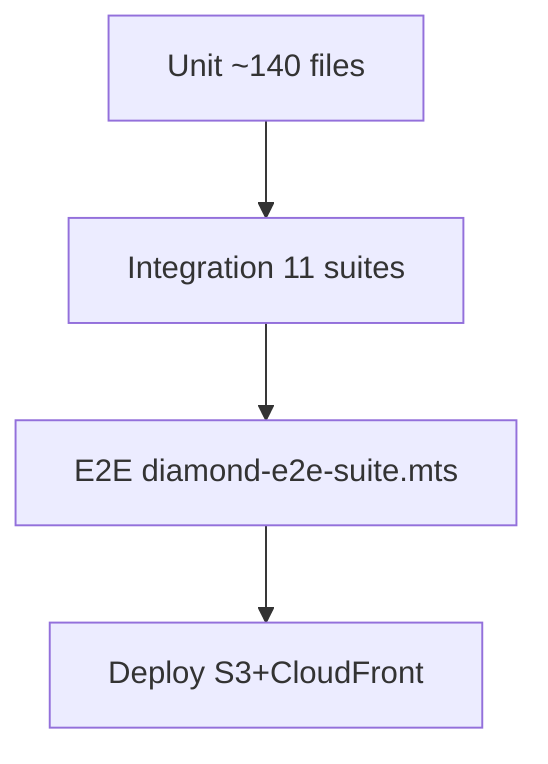

# Testing — Diamond pyramid

## Overview

## Commands

| Layer | Command |
|-------|---------|
| Unit | `npm run test:unit` |
| Coverage | `npm run test:coverage` (≥90%) |
| Integration | `npm run test:integration` |
| E2E | `npm run test:diamond` |
| Full pyramid | `npm run test:pyramid` |

## E2E scenarios

1. **app-shell** — chrome loads, no console errors
2. **wad-map-engine-selects** — IWAD, map, engine dropdowns
3. **gzdoom-gold-load** — gold ref frame for E1M1
4. **classic-play-layers** — WebGL2 + `__applyClassicLayerPreset`
5. **gzdoom-modular-play-layers** — (s) WASM + live wall toggle
6. **audio-sfx-music-toggle** — mute chips without crash
7. **playability-input** — keyboard input, canvas present

## PerfMeter assertion

E2E waits for `[data-testid="perf-meter"]` with numeric fps/ms and non-empty sparkline chart canvas.

## CI

`.github/workflows/ci.yml` and `deploy.yml` run diamond suite against `vite preview` :4173 after build.

---

[← Master hub](../README.md)
