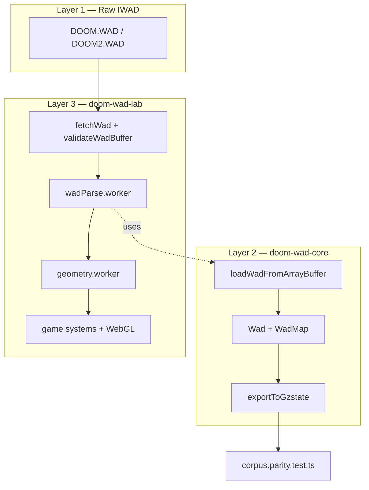

# 00 — Introduction

This chapter defines what the **WAD Bible** covers, what "gold standard" means in the doom-wad-lab project, and how three layers of software relate: the raw IWAD on disk, the TypeScript parser in **doom-wad-core**, and the browser host in **doom-wad-lab**.

← [Table of Contents](./README.md) | Next: [01 — Container Format](./01-container-format.md)

---

## What this bible covers

The WAD Bible is a **byte-accurate, code-linked** reference for classic Doom WAD archives:

| In scope | Out of scope |
|----------|--------------|
| IWAD/PWAD container format | Hexen/Strife/Heretic WAD variants (different record sizes) |
| Map lump record layouts (classic + BEHAVIOR extended) | UDMF text maps (not stored in WAD lumps) |
| Patch, texture, flat, sprite lump formats | Modern PK3/ZScript content |
| PLAYPAL, COLORMAP, lighting indices | OpenGL shader details (see GZDoom Bible) |
| BSP precomputed data (NODES, SEGS, SSECTORS) | Runtime BSP rebuild algorithms |
| GZSTATE v1 export from parsed WAD | GZDoom gameplay simulation |
| 68-map stock corpus catalog | Custom PWAD mod catalogs |

Every chapter ties binary layouts to **concrete source files** in `doom-wad-core` and `doom-wad-lab` so you can verify claims by reading code, not folklore.

---

## The three layers



### Layer 1 — Raw IWAD

Commercial Doom ships as a single **IWAD** (Internal WAD) file:

| File | Maps | Notes |
|------|------|-------|
| `DOOM.WAD` | 36 (`E1M1`–`E4M9`) | Shareware has E1 only; registered adds E2–E3; Ultimate Doom adds E4 |
| `DOOM2.WAD` | 32 (`MAP01`–`MAP32`) | Final Doom episodes use separate IWADs not in the 68-map gate |

The on-disk format is identical for IWAD and PWAD (patch WAD); only the 4-byte magic differs (`IWAD` vs `PWAD`).

### Layer 2 — doom-wad-core

Package path: `/Users/williamfarmer/IdeaProjects/doom/doom-wad-core/`

Canonical responsibilities:

- **Parse** — `src/parser/loadWad.ts` walks the lump directory and builds typed objects.
- **Rasterize** — `src/raster/rasterizePatch.ts`, `rasterizeFlat.ts`, `rasterizeTexture.ts` for headless RGBA output.
- **Export** — `src/export/exportToGzstate.ts` serializes a map into **GZSTATE v1** for parity with GZDoom's C++ dump.

The core package is **renderer-agnostic**. It does not allocate WebGL resources or run game logic.

Key entry point:

```typescript
// doom-wad-core/src/parser/loadWad.ts
export const loadWadFromArrayBuffer = (arrayBuffer: ArrayBuffer): Wad => { ... }
```

### Layer 3 — doom-wad-lab

Package path: `/Users/williamfarmer/IdeaProjects/doom/doom-wad-lab/`

Host responsibilities:

- Fetch IWADs from `public/wads/` (or CDN).
- Validate buffers before parse (`src/wad/loader/validateWadBuffer.ts`).
- Run parsing in a Web Worker (`src/wad/parser/wadParse.worker.ts`).
- Build GPU geometry (`src/wad/renderer/geometry/`).
- Simulate gameplay (doors, lifts, teleports — see [09-linedef-specials.md](./09-linedef-specials.md)).
- Capture and diff GZDoom WASM frames (`tools/gzrender-v2/`).

The lab **imports** doom-wad-core for parsing and GZSTATE export. Local copies under `src/wad/parity/` exist for historical reasons but the canonical parser lives in core.

---

## Gold standard definition

In this project, **gold standard** is a layered set of automated gates, not a single PNG screenshot.

| Tier | Gate | Authority | Status |
|------|------|-----------|--------|
| **WAD data** | Parsed map ≡ GZSTATE sections (20+ sections incl. REJECT/BLOCKMAP raw) | `doom-wad-core` export vs GZDoom dump | Closed — 68/68 maps |
| **BSP draw state** | Subsector/sector order at player spawn | `bspGoldenSnapshots.json` | Closed — 68/68 maps |
| **Frame pixels** | Playfield diff vs native GLES `ref.png` | GZDoom WASM renderer | Target — 68/68 @ **0%** diff |

### The 68-map corpus

The corpus is the union of all stock single-player levels in **DOOM.WAD** and **DOOM2.WAD**:

```
DOOM.WAD:  4 episodes × 9 maps = 36 levels  (E1M1 … E4M9)
DOOM2.WAD: 32 levels                       (MAP01 … MAP32)
Total:     68 maps
```

These maps are enumerated in [appendix-map-catalog.md](./appendix-map-catalog.md) with gold snapshot keys like `DOOM.WAD/E1M1`.

Tests that enforce the corpus:

| Test file | Command |
|-----------|---------|
| `src/wad/parity/corpus.parity.test.ts` | `npm run test:corpus` |
| `src/wad/renderer/bsp/vanilla/bspGoldenSnapshots.test.ts` | part of unit suite |
| `src/wad/parity/gzdoomWasmCorpus.test.ts` | `npm run gzdoom-wasm:corpus:all` |

### What "0% playfield diff" means

For the renderer gate, a headless browser runs GZDoom compiled to WASM, captures a framebuffer PNG at the **player spawn** viewpoint, and compares against a **native GLES gold** reference (`ref.png`). The comparison masks HUD/status bar and counts differing pixels in the 3D playfield only. Zero differing pixels = pass.

This gate uses **GZDoom C++ GLES inside WASM**, not the lab's TypeScript WebGL renderer. See [../gzdoom/00-gold-standard-overview.md](../gzdoom/00-gold-standard-overview.md).

---

## Relationship to GZDoom

GZDoom (`/Users/williamfarmer/IdeaProjects/doom/gzdoom-project/`) is the **renderer oracle**. It loads the same IWAD bytes independently and produces:

- In-memory level structures (`sector_t`, `line_t`, …)
- GZSTATE binary dumps (`src/gzstate_dump.cpp`)
- GLES framebuffer output

The WAD Bible documents how **our parser** interprets bytes. The GZDoom Bible documents how **GZDoom** consumes those bytes to draw pixels. Discrepancies between the two are bugs — the corpus tests exist to find them.

---

## Data model overview

After `loadWadFromArrayBuffer` completes, the in-memory `Wad` object contains:

```typescript
interface Wad {
  indentification: string;       // 'IWAD' or 'PWAD'
  lumpInfo: Lump[];              // ordered directory with raw ArrayBuffer slices
  lumpHash: Record<string, ArrayBuffer>;  // non-map lumps by name

  playpal: [number, number, number][];  // 256 RGB triples
  colormap: ArrayBuffer;
  pnames: string[];
  textures: Record<string, TextureDef>;
  sprites: Record<string, ArrayBuffer>;
  flats: Record<string, ArrayBuffer>;
  maps: Record<string, WadMap>;

  animatedTextures: Record<string, string[]>;  // chain head → [names…]
  animatedFlats: Record<string, string[]>;
}
```

Each `WadMap` holds parsed arrays for map lumps (THINGS, LINEDEFS, …) plus optional raw bytes for REJECT and BLOCKMAP. See [03-map-lumps.md](./03-map-lumps.md).

---

## How to use this bible while debugging

1. **Parse failure** — Start at [01-container-format.md](./01-container-format.md) and [02-loading-phases.md](./02-loading-phases.md). Confirm magic, directory bounds, and LoadMode transitions.
2. **Wrong record count** — Check classic vs extended in [03-map-lumps.md](./03-map-lumps.md). Extended maps have a `BEHAVIOR` lump and different THINGS/LINEDEFS sizes.
3. **Missing texture** — Trace PNAMES → patch lump → TEXTURE1/2 in [04-graphics-patches-textures.md](./04-graphics-patches-textures.md).
4. **GZSTATE diff** — Compare field mapping in [12-gzstate-export-bridge.md](./12-gzstate-export-bridge.md) against `gzstate_dump.cpp`.
5. **Wrong map in corpus** — Look up the map in [appendix-map-catalog.md](./appendix-map-catalog.md) and verify the snapshot key.

---

## Conventions used throughout

| Convention | Meaning |
|------------|---------|
| **int16** / **uint16** | 2-byte little-endian (`ByteReader.littleEndian = true`) |
| **int32** / **uint32** | 4-byte little-endian |
| **mapname8** | 8-byte ASCII name, NUL-padded, trailing spaces stripped, uppercased |
| **uu** | Doom map units (1 grid square = 64 uu) |
| **Classic format** | Original Doom EXE layout (no BEHAVIOR lump) |
| **Extended format** | Hexen-derived layout when BEHAVIOR lump present anywhere in WAD |

Code paths are cited as:

- Relative from doom-wad-lab docs: `../../../../doom-wad-core/src/parser/loadWad.ts`
- Absolute: `/Users/williamfarmer/IdeaProjects/doom/doom-wad-core/src/parser/loadWad.ts`

---

## Chapter map

| Topic | Chapter |
|-------|---------|
| Header and directory | [01](./01-container-format.md) |
| Directory walk / LoadMode | [02](./02-loading-phases.md) |
| Map records | [03](./03-map-lumps.md) |
| Wall graphics | [04](./04-graphics-patches-textures.md) |
| Color | [05](./05-palette-and-colormap.md) |
| Floors/ceilings | [06](./06-flats-and-sky.md) |
| Actors (sprites) | [07](./07-sprites-and-animations.md) |
| Switches and flags | [08](./08-switches-textures-linedefs.md) |
| Line actions | [09](./09-linedef-specials.md) |
| BSP and collision | [10](./10-sectors-things-bsp.md) |
| Audio and extras | [11](./11-audio-and-misc-lumps.md) |
| GZSTATE export | [12](./12-gzstate-export-bridge.md) |
| All 68 maps | [appendix](./appendix-map-catalog.md) |

---

← [Table of Contents](./README.md) | Next: [01 — Container Format](./01-container-format.md)
