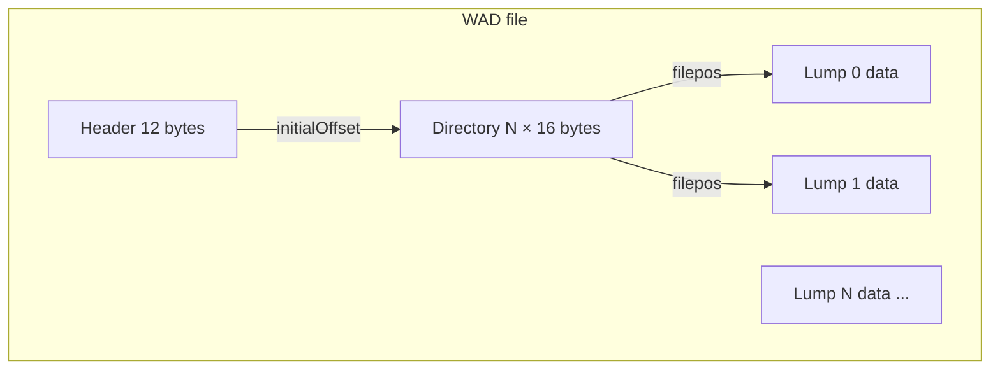

# 01 — Container Format

The Doom WAD format is a simple append-only archive: a fixed header, a lump directory, and concatenated lump payloads. This chapter documents the on-disk layout, endianness, lump naming rules, and the pre-parse validation in doom-wad-lab.

← [00 — Introduction](./00-introduction.md) | [TOC](./README.md) | Next: [02 — Loading Phases](./02-loading-phases.md)

---

## File structure overview



A WAD file is **not** a ZIP archive. Lumps are stored at arbitrary offsets; the directory at the end (or middle, for some PWADs) is the only index.

| Region | Size | Description |
|--------|------|-------------|
| Header | 12 bytes | Magic, lump count, directory offset |
| Lump data | variable | Raw bytes for each lump, often tightly packed |
| Directory | `numLumps × 16` | One entry per lump |

The directory is typically at the **end** of the file for IWADs, but PWADs may place it immediately after the header with lump data following — both layouts are valid as long as offsets stay in range.

---

## Header (12 bytes)

Read by `readHeaderData()` in `/Users/williamfarmer/IdeaProjects/doom/doom-wad-core/src/parser/loadWad.ts`:

| Offset | Size | Type | Field | Description |
|--------|------|------|-------|-------------|
| 0 | 4 | ASCII | `identification` | `IWAD` or `PWAD` |
| 4 | 4 | int32 LE | `numLumps` | Number of directory entries |
| 8 | 4 | int32 LE | `initialOffset` | Byte offset to first directory entry |

### Magic values

| Magic | Meaning |
|-------|---------|
| `IWAD` | Internal WAD — commercial game data (DOOM.WAD, DOOM2.WAD, …) |
| `PWAD` | Patch WAD — user/mod add-on loaded atop an IWAD |

Other magics (`RTAD`, etc.) exist in non-Doom games and are **not** supported by doom-wad-core.

Example hex dump (DOOM2.WAD header):

```
49 57 41 44  dc 5a 06 00  00 90 06 00
I  W  A  D   numLumps=0x65adc   dir@0x69000
```

Code reference:

```456:461:/Users/williamfarmer/IdeaProjects/doom/doom-wad-core/src/parser/loadWad.ts
function readHeaderData(byteReader: ByteReader) {
  const identification = byteReader.readASCII(4);
  const numLumps = byteReader.readInt32();
  const initialOffset = byteReader.readInt32();
  return { identification, numLumps, initialOffset };
}
```

---

## Directory entry (16 bytes each)

Read in `lumpifyWad()` — one entry per lump, in directory order (which is also **load order** for the state machine in [02-loading-phases.md](./02-loading-phases.md)):

| Offset | Size | Type | Field | Description |
|--------|------|------|-------|-------------|
| 0 | 4 | int32 LE | `filepos` | Absolute byte offset to lump data |
| 4 | 4 | int32 LE | `size` | Lump size in bytes |
| 8 | 8 | char[8] | `name` | Lump name (see below) |

Total directory size: **`numLumps × 16`** bytes starting at `initialOffset`.

Code reference:

```413:431:/Users/williamfarmer/IdeaProjects/doom/doom-wad-core/src/parser/loadWad.ts
  for (let j = 0; j < numLumps; j++) {
    filepos = byteReader.readInt32();
    size = byteReader.readInt32();
    lumpName = byteReader.readLumpName8();

    lumpData = arrayBuffer.slice(filepos, filepos + size);
    newLump = {
      name: lumpName as LumpName,
      data: lumpData,
    };

    if (lumpName === LumpName.BEHAVIOR) {
      isExtended = true;
    }

    wadinfo.lumpInfo.push(newLump);
  }
```

### Lump data extraction

Each lump's payload is extracted with `ArrayBuffer.slice(filepos, filepos + size)`. No decompression — lumps are stored verbatim.

**Empty lumps** (`size = 0`) are valid (marker lumps like `S_START` often have zero bytes).

**Overlapping lumps** are legal in the format (two directory entries may point at the same bytes) but rare in stock IWADs.

---

## Lump naming (8 characters)

Doom lump names are exactly **8 bytes**, space- or NUL-padded. doom-wad-core normalizes names via `ByteReader.parseLumpName8()`:

```107:120:/Users/williamfarmer/IdeaProjects/doom/doom-wad-core/src/byte/ByteReader.ts
  readLumpName8(): string {
    const bytes = new Uint8Array(8);
    for (let i = 0; i < 8; i++) bytes[i] = this.readUint8();
    return ByteReader.parseLumpName8(bytes);
  }

  static parseLumpName8(bytes: Uint8Array): string {
    const nullIdx = bytes.indexOf(0);
    const end = nullIdx >= 0 ? nullIdx : bytes.length;
    let name = '';
    for (let i = 0; i < end; i++) name += String.fromCharCode(bytes[i]!);
    return name.replace(/ +$/, '').toUpperCase();
  }
```

Rules (matching GZDoom `TrimLumpName`):

1. Read up to 8 bytes.
2. Truncate at first `0x00` if present.
3. Strip trailing spaces.
4. Convert to **uppercase**.

Examples:

| Raw bytes (8) | Parsed name |
|---------------|-------------|
| `E1M1\0\0\0\0` | `E1M1` |
| `FLOOR4_8` | `FLOOR4_8` |
| `TROO A1\0` (legacy) | `TROO` (NUL truncates; sprites use `TROOA1` in practice) |
| `CWILV01 ` | `CWILV01` |

### Name categories

| Pattern | Examples | Role |
|---------|----------|------|
| Map header | `E1M1`, `MAP01` | Starts map lump group — see [02](./02-loading-phases.md) |
| Map data | `THINGS`, `LINEDEFS`, … | Map component lumps |
| Markers | `S_START`, `F_END`, `P1_START` | Delimit sprite/flat/patch ranges |
| Global | `PLAYPAL`, `TEXTURE1`, `PNAMES` | Game-wide resources |
| Patch | `BROWN1`, `STARTAN3` | Wall graphic (between P_START/P_END) |
| Flat | `FLOOR4_8`, `NUKAGE1` | Floor/ceiling 64×64 graphic |
| Sprite | `TROOA1`, `PISFA0` | Actor rotation frame |
| Sound | `DSPISTOL` | Digitized sound effect |
| Music | `D_E1M1`, `D_RUNNIN` | MUS/MIDI lump |

The full enum of recognized special names is in `/Users/williamfarmer/IdeaProjects/doom/doom-wad-core/src/types/Lump.ts`.

---

## Endianness

All multi-byte integers in WAD headers, directory entries, and map lumps are **little-endian**.

`ByteReader` defaults to LE:

```6:10:/Users/williamfarmer/IdeaProjects/doom/doom-wad-core/src/byte/ByteReader.ts
  constructor(arrayBuffer: ArrayBuffer) {
    this.reader = new DataView(arrayBuffer);
    this.offset = 0;
    this.littleEndian = true;
  }
```

This matches original Doom on x86 and all little-endian ports. doom-wad-core does not byte-swap for big-endian hosts — `DataView` with `littleEndian: true` is always used.

---

## Validation — `validateWadBuffer`

Before parsing, doom-wad-lab validates the buffer in `/Users/williamfarmer/IdeaProjects/doom/doom-wad-lab/src/wad/loader/validateWadBuffer.ts`:

```3:40:/Users/williamfarmer/IdeaProjects/doom/doom-wad-lab/src/wad/loader/validateWadBuffer.ts
export function validateWadBuffer(buffer: ArrayBuffer, path: string): void {
  if (buffer.byteLength < 12) {
    throw new Error(
      `WAD file is too small (${buffer.byteLength} bytes). ...`
    );
  }

  const view = new DataView(buffer);
  const magic = String.fromCharCode(
    view.getUint8(0),
    view.getUint8(1),
    view.getUint8(2),
    view.getUint8(3)
  );

  if (!WAD_MAGIC.includes(magic as (typeof WAD_MAGIC)[number])) {
    ...
  }

  const lumpCount = view.getInt32(4, true);
  const directoryOffset = view.getInt32(8, true);

  if (lumpCount < 0 || lumpCount > 50000) {
    throw new Error(`Invalid WAD lump count (${lumpCount}) at ${path}`);
  }

  const directoryEnd = directoryOffset + lumpCount * 16;
  if (directoryOffset < 12 || directoryEnd > buffer.byteLength) {
    throw new Error(
      `WAD directory extends past file end (offset=${directoryOffset}, lumps=${lumpCount}, size=${buffer.byteLength}) at ${path}`
    );
  }
}
```

### Checks performed

| Check | Rationale |
|-------|-----------|
| `byteLength >= 12` | Minimum valid header |
| Magic is `IWAD` or `PWAD` | Rejects HTML error pages from missing CDN files |
| `0 <= lumpCount <= 50000` | Sanity bound (stock IWADs have ~3000 lumps) |
| `12 <= directoryOffset` | Directory cannot overlap header |
| `directoryOffset + lumpCount×16 <= fileSize` | Directory must fit in file |

### Checks **not** performed (yet)

| Omission | Risk |
|----------|------|
| Individual `filepos + size` bounds | Out-of-range lump could throw on slice |
| Duplicate names | Last writer wins in `lumpHash`; maps use sequential context |
| Lump data overlap detection | Valid in format; ignored |

For corpus IWADs these omissions never trigger failures. Hostile PWADs could craft out-of-range offsets — production hosts should add per-lump bounds checks if accepting arbitrary uploads.

Unit tests: `/Users/williamfarmer/IdeaProjects/doom/doom-wad-lab/src/wad/loader/validateWadBuffer.test.ts`.

---

## IWAD vs PWAD loading order

When GZDoom (and classic Doom) loads a PWAD, lumps in the patch **replace** same-named lumps from the IWAD by append order — later directory entries win. doom-wad-core's `loadWadFromArrayBuffer` parses **one file at a time**; the lab's `fetchWadStack.ts` merges IWAD + PWAD by concatenating parse results according to project rules.

For the 68-map corpus, only bare IWADs are used — no PWAD merge.

---

## Typical DOOM2.WAD lump counts

| Metric | Approximate value |
|--------|-------------------|
| Total lumps | ~2,900 |
| Maps | 32 headers + ~11 lumps each |
| Sprites (S_ range) | ~1,200 |
| Flats (F_ range) | ~700 |
| Patches (P_ range) | ~1,000 |
| File size | ~14–18 MB |

Exact counts vary by IWAD revision (1.9 vs Unity re-release, etc.).

---

## Binary layout diagram

```
Offset 0x00000000
┌──────────────────────────────────────┐
│ "IWAD"  │ numLumps  │ dirOffset     │  12 bytes header
├──────────────────────────────────────┤
│                                      │
│  Lump payloads (variable layout)     │
│  ... PLAYPAL, lumps, maps, etc. ...  │
│                                      │
├──────────────────────────────────────┤
│  Directory entry 0  (16 bytes)       │
│  Directory entry 1  (16 bytes)       │
│  ...                                 │
│  Directory entry N-1                 │
└──────────────────────────────────────┘
Offset fileSize
```

Each directory entry:

```
┌────────────┬────────────┬────────────────────┐
│ filepos    │ size       │ name (8 bytes)     │
│ int32 LE   │ int32 LE   │ ASCII padded       │
└────────────┴────────────┴────────────────────┘
```

---

## External references

| Resource | URL |
|----------|-----|
| Doom Wiki — WAD | https://doomwiki.org/wiki/WAD |
| Unofficial Doom Specs — WAD | https://doomwiki.org/wiki/Unofficial_Doom_Specification#WAD_file_structure |
| id FAQ (historical) | https://www.doomworld.com/classicdoom/info/pwadfaq.php |

---

## Code index

| File | Role |
|------|------|
| `doom-wad-core/src/parser/loadWad.ts` | Header read, directory walk, lump slice |
| `doom-wad-core/src/byte/ByteReader.ts` | LE primitives, lump name parse |
| `doom-wad-core/src/types/Lump.ts` | `LumpName` enum |
| `doom-wad-lab/src/wad/loader/validateWadBuffer.ts` | Pre-parse validation |
| `doom-wad-lab/src/wad/loader/fetchWad.ts` | HTTP fetch + validate call site |

---

← [00 — Introduction](./00-introduction.md) | [TOC](./README.md) | Next: [02 — Loading Phases](./02-loading-phases.md)
