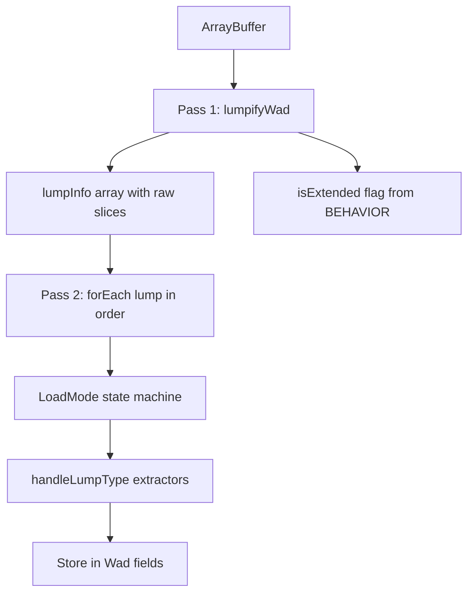
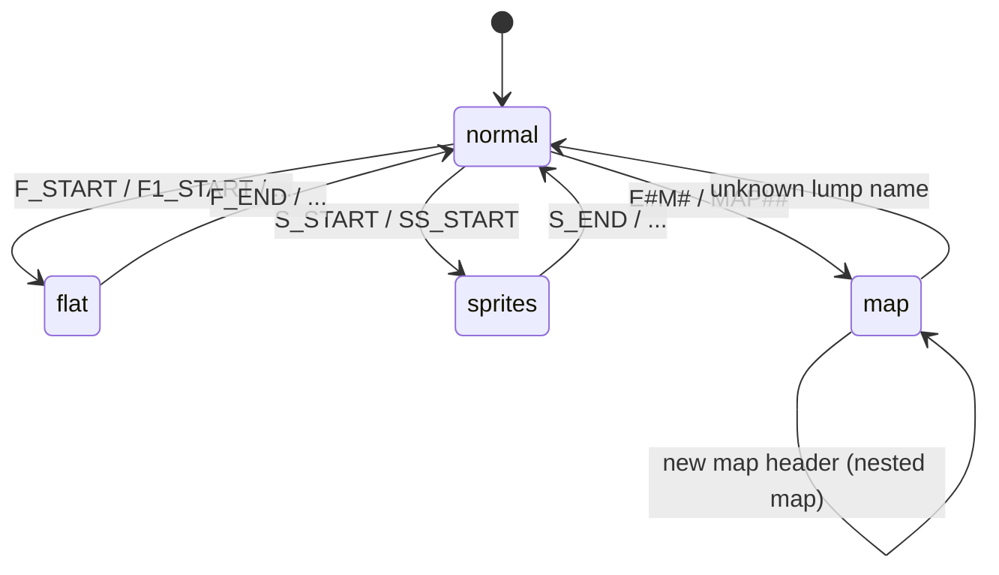

# 02 — Loading Phases

After the lump directory is read, `loadWadFromArrayBuffer` performs a **second pass** over lumps in directory order, interpreting each lump according to a `LoadMode` state machine. This chapter documents that walk, map detection, marker lumps, and the classic vs extended format switch.

← [01 — Container Format](./01-container-format.md) | [TOC](./README.md) | Next: [03 — Map Lumps](./03-map-lumps.md)

---

## Two-pass architecture



**Pass 1** (`lumpifyWad`) reads the directory and slices raw `ArrayBuffer` data for every lump. It also sets `isExtended = true` if **any** lump named `BEHAVIOR` appears anywhere in the WAD (not only inside maps).

**Pass 2** iterates `wadinfo.lumpInfo` in directory order, updating `LoadMode` and dispatching parsers.

Source: `/Users/williamfarmer/IdeaProjects/doom/doom-wad-core/src/parser/loadWad.ts` lines 650–741.

---

## LoadMode enum

```18:23:/Users/williamfarmer/IdeaProjects/doom/doom-wad-core/src/parser/loadWad.ts
enum LoadMode {
  normal,
  sprites,
  flat,
  map,
}
```

| Mode | Active after | Lumps stored in |
|------|--------------|-----------------|
| `normal` | Default; after `_END` markers | `wad.lumpHash[name]` |
| `sprites` | `S_START`, `SS_START` | `wad.sprites[name]` |
| `flat` | `F_START`, `F1_START`, … | `wad.flats[name]` |
| `map` | Map header lump (`E1M1`, `MAP01`) | `wad.maps[mapName][lumpName]` |

---

## Marker lumps — mode transitions

`determineModeBasedOnLumpName()` handles marker lumps **without storing them**:

```611:648:/Users/williamfarmer/IdeaProjects/doom/doom-wad-core/src/parser/loadWad.ts
function determineModeBasedOnLumpName(lumpName: string, mode: LoadMode) {
  let doReturn = false;
  let newModeBasedOnLumpName = mode;
  switch (lumpName) {
    case LumpName.FF_START:
    case LumpName.F_START:
    case LumpName.F1_START:
    case LumpName.F2_START:
    case LumpName.F3_START:
      newModeBasedOnLumpName = LoadMode.flat;
      doReturn = true;
      break;
    case LumpName.SS_START:
    case LumpName.S_START:
      newModeBasedOnLumpName = LoadMode.sprites;
      doReturn = true;
      break;
    case LumpName.FF_END:
    case LumpName.F_END:
    ...
      newModeBasedOnLumpName = LoadMode.normal;
      doReturn = true;
      break;
  }
  return { doReturn, newModeBasedOnLumpName };
}
```

When `doReturn` is true, the lump is consumed for mode change only — no data is stored.

### Marker table

| Marker | Sets mode | Notes |
|--------|-----------|-------|
| `F_START`, `F1_START`, `F2_START`, `F3_START`, `FF_START` | `flat` | Flats namespace begins |
| `F_END`, `F1_END`, …, `FF_END` | `normal` | Flats namespace ends |
| `S_START`, `SS_START` | `sprites` | Sprites namespace begins |
| `S_END`, `SS_END` | `normal` | Sprites namespace ends |
| `P_START`, `P1_START`, `P2_START`, `P3_START` | *(no mode change)* | Patches live in `normal` mode → `lumpHash` |

`P_START`/`P_END` markers are recognized names but do **not** switch LoadMode in doom-wad-core. Patch lumps between markers are stored in `lumpHash` like any other normal lump. See [04-graphics-patches-textures.md](./04-graphics-patches-textures.md).

### Typical IWAD marker sequence

```
...
P_START
  BROWN1, STARTAN3, ... (patches in lumpHash)
P_END
F_START
  FLOOR4_8, CEIL1_1, ... (flats)
F_END
S_START
  TROOA1, TROOB1, ... (sprites)
S_END
...
E1M1          ← map header
  THINGS
  LINEDEFS
  ...
```

---

## Map header detection

Map mode begins when a lump name matches:

```477:479:/Users/williamfarmer/IdeaProjects/doom/doom-wad-core/src/parser/loadWad.ts
function isMapName(lumpName: string) {
  return lumpName.match(/^E[0-9]M[0-9]$/) || lumpName.match(/^MAP[0-9][0-9]$/);
}
```

| Pattern | Examples | Game |
|---------|----------|------|
| `E[1-9]M[1-9]` | `E1M1`, `E4M9` | Doom / Ultimate Doom |
| `MAP[01-32]` | `MAP01`, `MAP32` | Doom II |

**Not matched:** `MAP33` (invalid stock), `E0M1`, `MAP1` (single digit). Hexen uses `MAP01` with different lump sets — out of scope for classic Doom bible.

`extractMap()` creates an empty map shell:

```481:498:/Users/williamfarmer/IdeaProjects/doom/doom-wad-core/src/parser/loadWad.ts
function extractMap(lumpName: string, mapName: string, wadinfo: Wad, mode: LoadMode) {
  ...
  if (isMapName(lumpName)) {
    newMapName = lumpName;
    wadinfo.maps[newMapName] = {
      THINGS: [],
      VERTEXES: [],
      LINEDEFS: [],
      SIDEDEFS: [],
      SECTORS: [],
    };
    newMode = LoadMode.map;
    wasMap = true;
  }
  ...
}
```

The map header lump itself has **no data payload** in stock WADs (size 0). The header is purely a directory sentinel.

---

## Map lump sequence

Once in `LoadMode.map`, only these lumps are assigned to the current map:

```25:37:/Users/williamfarmer/IdeaProjects/doom/doom-wad-core/src/parser/loadWad.ts
const mapLumps = [
  LumpName.THINGS,
  LumpName.LINEDEFS,
  LumpName.SIDEDEFS,
  LumpName.VERTEXES,
  LumpName.SEGS,
  LumpName.SSECTORS,
  LumpName.NODES,
  LumpName.SECTORS,
  LumpName.REJECT,
  LumpName.BLOCKMAP,
  LumpName.BEHAVIOR,
];
```

### Exit map mode

If a lump appears while in map mode whose name is **not** in `mapLumps`, mode resets to `normal`:

```694:696:/Users/williamfarmer/IdeaProjects/doom/doom-wad-core/src/parser/loadWad.ts
    if (mode == LoadMode.map && !mapLumps.includes(lumpName as LumpName)) {
      mode = LoadMode.normal;
    }
```

This handles maps that omit optional lumps (e.g. no REJECT) followed by non-map lumps, or the next map header / marker.

**Order note:** Stock Doom map lumps appear in the order listed above, but the parser accepts any order among recognized map lumps — storage is by name, not sequence.

---

## BEHAVIOR → extended format

If **any** lump in the entire WAD is named `BEHAVIOR`, the global flag `isExtended` is set during pass 1:

```425:427:/Users/williamfarmer/IdeaProjects/doom/doom-wad-core/src/parser/loadWad.ts
    if (lumpName === LumpName.BEHAVIOR) {
      isExtended = true;
    }
```

Effects on parsing:

| Lump | Classic record size | Extended record size |
|------|----------------------|---------------------|
| THINGS | 10 bytes | 20 bytes |
| LINEDEFS | 14 bytes | 16 bytes |

Classic Doom II IWADs do **not** contain BEHAVIOR. The 68-map corpus uses classic sizes throughout.

The BEHAVIOR lump payload (when present) carries Hexen-style map info and ACS scripts — doom-wad-core stores it on the map object but does not execute scripts.

---

## handleLumpType — global lump dispatch

Special lumps parsed regardless of mode (when encountered outside map-only guard):

| Lump | Handler | Stored in |
|------|---------|-----------|
| `PLAYPAL` | `extractPlaypal()` | `wad.playpal` |
| `COLORMAP` | raw copy | `wad.colormap` |
| `ENDDOOM` | raw copy | `wad.enddoom` |
| `PNAMES` | `extractPatchNames()` | `wad.pnames` |
| `TEXTURE1`, `TEXTURE2`, `TEXTURES` | `extractTextures()` | `wad.textures` |
| `GENMIDI`, `DMXGUS` | raw copy | `wad.genmidi`, `wad.dmxgus` |
| `DEMO1`–`DEMO3` | raw copy | `wad.demo1`, etc. |

Map lumps (`VERTEXES`, `LINEDEFS`, …) are parsed when `mode === map` via the same switch — see [03-map-lumps.md](./03-map-lumps.md).

`REJECT` is explicitly no-op in the switch (raw bytes kept only if stored before parse — actually REJECT falls through default and lumpData stays as ArrayBuffer when assigned in map mode).

---

## BLOCKMAP dual storage

When parsing `BLOCKMAP` inside a map:

```700:702:/Users/williamfarmer/IdeaProjects/doom/doom-wad-core/src/parser/loadWad.ts
    if (mode === LoadMode.map && lumpName === LumpName.BLOCKMAP) {
      wadinfo.maps[mapName]!.BLOCKMAP_RAW = lumpData as ArrayBuffer;
    }
```

Then `handleLumpType` replaces `lumpData` with a parsed `BlockMap` object. Both representations exist on the map:

- `BLOCKMAP` — parsed structure (`parseBlockmapFromArrayBuffer`)
- `BLOCKMAP_RAW` — original bytes for GZSTATE parity

---

## Animated texture/flat chain building

During `TEXTURE1`/`TEXTURE2` parsing, `extractTextures()` walks texture names in file order and builds animation chains using `animatedTextureMap` from `wadInfo.ts`.

During flat mode, `extractFlats()` does the same with `animatedFlatMap`.

These run as side effects during pass 2 — see [04](./04-graphics-patches-textures.md) and [06](./06-flats-and-sky.md).

---

## State machine diagram



When a new map header appears while already in map mode, `extractMap` runs first (creating a new map entry) and returns early — the previous map is complete.

---

## doom-wad-lab worker integration

The lab wraps core parsing:

| File | Role |
|------|------|
| `src/wad/parser/loadWadFromArrayBuffer.ts` | Re-export / thin wrapper |
| `src/wad/parser/wadParse.worker.ts` | Worker entry, transfers ArrayBuffer |
| `src/wad/parser/parseWadInWorker.ts` | Promise API with monotonic request IDs |

See [../../wad-processing.md](../../wad-processing.md) for the full fetch → validate → worker pipeline.

---

## Debugging checklist

| Symptom | Likely cause |
|---------|--------------|
| Map missing from `wad.maps` | Header name doesn't match `E#M#` / `MAP##` regex |
| Flats in `lumpHash` instead of `flats` | Missing or mis-ordered `F_START` marker |
| Sprites not in `wad.sprites` | Same for `S_START` |
| Extended record misalignment | BEHAVIOR lump elsewhere in WAD toggled `isExtended` |
| TEXTURES empty | PNAMES or patch lumps loaded after TEXTURE1 |

---

## Code index

| File | Role |
|------|------|
| `doom-wad-core/src/parser/loadWad.ts` | Full two-pass loader |
| `doom-wad-core/src/constants/wadInfo.ts` | Animation chain maps |
| `doom-wad-core/src/types/Lump.ts` | Marker and map lump names |
| `doom-wad-lab/docs/wad-processing.md` | Lab pipeline overview |

---

← [01 — Container Format](./01-container-format.md) | [TOC](./README.md) | Next: [03 — Map Lumps](./03-map-lumps.md)
