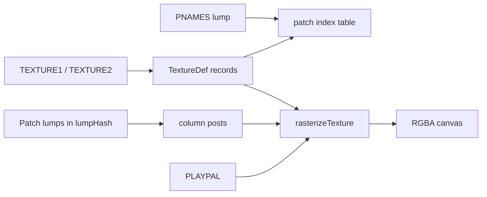

# 04 — Graphics: Patches & Textures

Doom wall graphics use a two-level system: **patches** (column-based bitmaps stored as individual lumps) and **textures** (composite definitions referencing patches by index). This chapter documents PNAMES, patch binary layout, TEXTURE1/2 structure, and animated wall chains.

← [03 — Map Lumps](./03-map-lumps.md) | [TOC](./README.md) | Next: [05 — Palette & Colormap](./05-palette-and-colormap.md)

---

## Pipeline overview



| Stage | Location |
|-------|----------|
| Patch index | `wad.pnames` from PNAMES lump |
| Raw patches | `wad.lumpHash[patchName]` |
| Texture defs | `wad.textures[name]` from TEXTURE1/2 |
| Rasterization | `doom-wad-core/src/raster/rasterizePatch.ts`, `rasterizeTexture.ts` |
| Lab draw | `doom-wad-lab/src/wad/renderer/drawAssets/drawPatch.ts` |

---

## PNAMES — patch name directory

The PNAMES lump is a flat list of 8-char patch names. Patches themselves are separate lumps (between `P_START`/`P_END` markers) stored in `lumpHash`.

### Lump layout

| Offset | Size | Type | Field |
|--------|------|------|-------|
| 0 | 4 | int32 | `numPatches` |
| 4 | 8×N | char[8] each | patch names |

Parser: `extractPatchNames()` in `loadWad.ts`.

```375:384:/Users/williamfarmer/IdeaProjects/doom/doom-wad-core/src/parser/loadWad.ts
function extractPatchNames(lumpDataReader: ByteReader): string[] {
  const numPatches = lumpDataReader.readInt32();
  const pnames = new Array<string>();
  for (let i = 0; i < numPatches; i++) {
    pnames.push(lumpDataReader.readLumpName8());
  }
  return pnames;
}
```

Texture definitions reference patches by **index** into this array, not by name string.

---

## Patch lump format (column posts)

Each patch is a variable-length column-oriented bitmap. Header followed by column offset table, then post commands per column.

### Header — 8 bytes

| Offset | Size | Type | Field |
|--------|------|------|-------|
| 0 | 2 | uint16 | `width` |
| 2 | 2 | uint16 | `height` |
| 4 | 2 | int16 | `leftoffset` — pivot X |
| 6 | 2 | int16 | `topoffset` — pivot Y |

### Column offset table

Immediately after header: `width` × uint32 LE offsets (from start of lump) to each column's post list.

### Post command stream (per column)

Each column is a sequence of **posts** terminated by `yOffset = 255`:

| Field | Size | Description |
|-------|------|-------------|
| `yOffset` | uint8 | Starting Y row (255 = end of column) |
| `numPixels` | uint8 | Run length |
| `skip` | uint8 | Always skipped (unused pad byte) |
| pixels | uint8 × numPixels | Palette indices |

After pixels, one pad byte is skipped before the next post.

Rasterizer (`rasterizePatch.ts`):

```12:44:/Users/williamfarmer/IdeaProjects/doom/doom-wad-core/src/raster/rasterizePatch.ts
export function rasterizePatch(lump: ArrayBuffer, palette: ColourPalette): RasterImage {
  const patchData = new ByteReader(lump);
  const width = patchData.readUint16();
  const height = patchData.readUint16();
  patchData.skip(4);

  const rgba = new Uint8Array(width * height * 4);
  const colOffsets: number[] = [];
  for (let i = 0; i < width; i++) colOffsets.push(patchData.readUint32());

  for (let col = 0; col < colOffsets.length; col++) {
    patchData.setIndex(colOffsets[col]!);
    let yPos = 0;
    while (yPos < height) {
      const yOffset = patchData.readUint8();
      if (yOffset === 255) break;
      const numPixels = patchData.readUint8();
      patchData.skip(1);
      for (let j = 0; j < numPixels; j++) {
        const pixData = patchData.readUint8();
        const rgb = palette[pixData]!;
        const pixIndex = (col + (yOffset + j) * width) * 4;
        rgba[pixIndex] = rgb[0];
        rgba[pixIndex + 1] = rgb[1];
        rgba[pixIndex + 2] = rgb[2];
        rgba[pixIndex + 3] = 255;
      }
      patchData.skip(1);
      yPos = yOffset + numPixels;
    }
  }
  return { width, height, rgba };
}
```

**Transparency:** Palette index **0** is never drawn as opaque in the software renderer — transparent pixels remain alpha 0 in RGBA output.

---

## TEXTURE1 / TEXTURE2 — composite texture definitions

Both lumps share identical format. Doom stores wall textures split across TEXTURE1 (core set) and TEXTURE2 (added in registered Doom / Doom II).

### Top-level layout

| Offset | Size | Type | Field |
|--------|------|------|-------|
| 0 | 4 | int32 | `numTextures` |
| 4 | 4×N | int32 each | `offset[i]` — byte offset to texture i from lump start |

### Per-texture record (at offset[i])

| Offset | Size | Type | Field |
|--------|------|------|-------|
| 0 | 8 | char[8] | `texName` |
| 8 | 4 | int32 | masked (unused, skip) |
| 12 | 2 | int16 | `texWidth` |
| 14 | 2 | int16 | `texHeight` |
| 16 | 4 | int32 | masked (unused, skip) |
| 20 | 2 | int16 | `numPatches` |
| 22 | 10×P | mixed | patch entries |

### Patch entry — 10 bytes each

| Offset | Size | Type | Field |
|--------|------|------|-------|
| 0 | 2 | int16 | `originX` — left placement in texture space |
| 2 | 2 | int16 | `originY` — top placement |
| 4 | 2 | int16 | `patchIndex` — index into PNAMES |
| 6 | 4 | int32 | masked (skip) |

Parser: `extractTextures()` in `loadWad.ts`.

```39:101:/Users/williamfarmer/IdeaProjects/doom/doom-wad-core/src/parser/loadWad.ts
function extractTextures(...) {
  const numTextures = lumpDataReader.readInt32();
  const texOffsets = new Array<number>();
  for (let i = 0; i < numTextures; i++) {
    texOffsets.push(lumpDataReader.readInt32());
  }

  for (let i = 0; i < texOffsets.length; i++) {
    const texOffset = texOffsets[i];
    lumpDataReader.setIndex(texOffset);
    const texName = lumpDataReader.readLumpName8();
    lumpDataReader.skip(4);
    const texWidth = lumpDataReader.readInt16();
    const texHeight = lumpDataReader.readInt16();
    lumpDataReader.skip(4);
    const numPatches = lumpDataReader.readInt16();
    ...
    wadinfo.textures[texName] = {
      texName, texWidth, texHeight, patches,
    };
  }
}
```

### Composite rasterization

`rasterizeTexture()` blits each patch onto a canvas at `(originX, originY)` using patch pivot offsets from the patch header. Later patches overwrite earlier ones (painter's algorithm).

---

## Patch origins and wall UVs

When a wall references texture `STARTAN3`, the sidedef's `xOffset`/`yOffset` scroll the composite. Patch `leftoffset`/`topoffset` define sprite-style pivot for patches used in textures and for standalone sprites.

For wall rendering in doom-wad-lab, `mapToWalls.ts` computes UVs from linedef length and sector heights — see [../../rendering.md](../../rendering.md).

---

## Animated texture chains

Doom cycles certain wall textures (blood, waterfalls, fires) by treating consecutive texture names as animation frames.

### Configuration in wadInfo.ts

```25:39:/Users/williamfarmer/IdeaProjects/doom/doom-wad-core/src/constants/wadInfo.ts
export const animatedTextureMap: Record<string, string> = {
  BLODGR1: 'BLODGR4',
  BLODRIP1: 'BLODRIP4',
  FIREBLU1: 'FIREBLU2',
  FIRLAV3: 'FIRELAVA',
  FIREMAG1: 'FIREMAG3',
  FIREWALA: 'FIREWALL',
  GSTFONT1: 'GSTFONT3',
  ROCKRED1: 'ROCKRED3',
  SLADRIP1: 'SLADRIP3',
  BFALL1: 'BFALL4',
  SFALL1: 'SFALL4',
  WFALL1: 'WFALL4',
  DBRAIN1: 'DBRAIN4',
};
```

| Constant | Value |
|----------|-------|
| `animatedWallFps` | 4 frames/sec |

### Chain building algorithm

During TEXTURE1/2 parse, textures are visited **in lump order** (not alphabetical):

1. When a texture name matches a **start** key in `animatedTextureMap`, begin a new chain.
2. Append each subsequent texture until the **end** name is reached.
3. Every name in the chain maps to the full array via `wad.animatedTextures[texName] = chain`.

```81:93:/Users/williamfarmer/IdeaProjects/doom/doom-wad-core/src/parser/loadWad.ts
    if (animatedTextureKey === undefined) {
      if (animatedTextureStartNames.indexOf(texName) >= 0) {
        animatedTextureKey = texName;
        wadinfo.animatedTextures[animatedTextureKey] = [texName];
      }
    } else {
      wadinfo.animatedTextures[animatedTextureKey].push(texName);
      wadinfo.animatedTextures[texName] = wadinfo.animatedTextures[animatedTextureKey];
      if (animatedTextureEndNames.indexOf(texName) >= 0) {
        animatedTextureKey = undefined;
      }
    }
```

Example chain `BFALL1` → `BFALL2` → `BFALL3` → `BFALL4`: referencing any member resolves the same frame array.

---

## TEXTURES vs TEXTURE1/2

Some PWADs use a lump named `TEXTURES` (Hexen-style). doom-wad-core handles it with the same `extractTextures()` path as TEXTURE1/2.

Stock IWADs use `TEXTURE1` + `TEXTURE2` only.

---

## Switch textures (cross-reference)

Switch wall textures (`SW1`, `SW2`, `DB1`, `DB2` prefixes) are ordinary composite textures. Runtime flip logic is in doom-wad-lab — see [08-switches-textures-linedefs.md](./08-switches-textures-linedefs.md).

---

## GZSTATE export

Texture definitions export via `buildTextureDefs()` in `buildAssetSections.ts`:

- String-interned texture names
- Width, height, patch list with origins and PNAMES indices

Raster digests: `buildTextureRasterDigests()` hashes RGBA output for parity.

---

## Debugging checklist

| Symptom | Check |
|---------|-------|
| Missing wall (magenta/null) | Texture name in SIDEDEFS exists in `wad.textures` |
| Wrong patch alignment | PNAMES index vs patch lump; originX/Y |
| Animation frozen | Name in chain? `animatedTextures[texName]` populated? |
| Patch garbage | Column offset past lump end — corrupt patch lump |

---

## External references

| Resource | URL |
|----------|-----|
| Doom Wiki — Patch | https://doomwiki.org/wiki/Patch |
| Doom Wiki — TEXTURE | https://doomwiki.org/wiki/TEXTURE |
| Animated flat/texture | https://doomwiki.org/wiki/Animated_lump |

---

## Code index

| File | Role |
|------|------|
| `doom-wad-core/src/parser/loadWad.ts` | PNAMES, TEXTURE extract |
| `doom-wad-core/src/raster/rasterizePatch.ts` | Patch → RGBA |
| `doom-wad-core/src/raster/rasterizeTexture.ts` | Composite texture → RGBA |
| `doom-wad-core/src/constants/wadInfo.ts` | Animation maps |
| `doom-wad-lab/src/wad/renderer/drawAssets/drawPatch.ts` | Canvas draw path |

---

← [03 — Map Lumps](./03-map-lumps.md) | [TOC](./README.md) | Next: [05 — Palette & Colormap](./05-palette-and-colormap.md)
