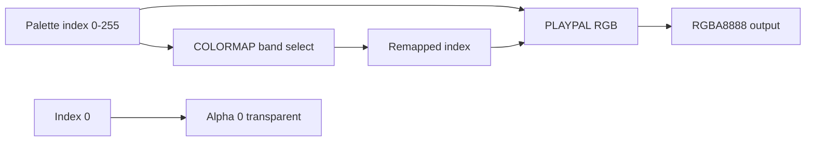

# 05 — Palette & Colormap

Doom graphics are 8-bit indexed color. The PLAYPAL lump defines RGB triples; the COLORMAP lump remaps palette indices for distance lighting and invulnerability. This chapter covers sizes, indexing rules, and how doom-wad-core rasterizes to RGBA.

← [04 — Patches & Textures](./04-graphics-patches-textures.md) | [TOC](./README.md) | Next: [06 — Flats & Sky](./06-flats-and-sky.md)

---

## Color pipeline



| Lump | Size | Parsed to |
|------|------|-----------|
| PLAYPAL | 768 bytes | `wad.playpal` — 256 × [R,G,B] |
| COLORMAP | 8704 bytes | `wad.colormap` — raw ArrayBuffer |

---

## PLAYPAL — 768 bytes

256 colors × 3 bytes (RGB), no alpha in lump.

| Index range | Byte offset | Content |
|-------------|-------------|---------|
| Color 0 | 0–2 | RGB for index 0 (unused — transparent) |
| Color 1 | 3–5 | … |
| … | … | … |
| Color 255 | 765–767 | last color |

Each component is uint8 (0…255). Doom VGA hardware used 6-bit DAC values scaled to 8 bits in the lump.

Parser:

```386:398:/Users/williamfarmer/IdeaProjects/doom/doom-wad-core/src/parser/loadWad.ts
function extractPlaypal(lumpDataReader: ByteReader) {
  const palette = new Array<[number, number, number]>();
  for (let i = 0; i < 256; i++) {
    const r = lumpDataReader.readUint8();
    const g = lumpDataReader.readUint8();
    const b = lumpDataReader.readUint8();
    palette.push([r, g, b]);
  }
  return palette;
}
```

### Index 0 convention

Palette index **0** is the **transparent** color for patches and sprites. Rasterizers skip or zero alpha for index 0:

```37:37:/Users/williamfarmer/IdeaProjects/doom/doom-wad-core/src/raster/rasterizePatch.ts
/** RGBA8888 row-major; index 0 palette entries stay transparent (alpha 0). */
```

Flats use all 256 indices (no transparency within a flat cell).

### PLAYPAL variants in PWADs

Some mods ship alternate PLAYPAL lumps (green-tint episodes, etc.). doom-wad-core stores a single `playpal` — last PLAYPAL lump in directory order wins if multiple exist.

---

## COLORMAP — 8704 bytes (34 × 256)

The colormap is a sequence of **34 palettes**, each 256 bytes mapping source index → lit index.

| Map index | Purpose |
|-----------|---------|
| 0–31 | Light levels (bright → dark) for normal view |
| 32 | Invulnerability tint (gold) |
| 33 | Inverse invulnerability (red, unused in stock) |

Total: **34 × 256 = 8704** bytes.

Layout:

```
offset = lightLevel * 256 + paletteIndex
colormapIndex = colormap[offset]
finalRGB = playpal[colormapIndex]
```

### Light level to colormap band

Sector `lightlevel` (0…255) selects which of maps 0–31 to use. Classic Doom scales:

```
colormapNum = (lightlevel * 32) / 256   // clamped 0–31
```

GZDoom uses more nuanced fixed-point lighting; for WAD parse parity the raw COLORMAP bytes are exported verbatim in GZSTATE.

doom-wad-lab's WebGL path applies simplified ambient heuristics at load time — see `hydrateLoadedMap()` in `loadWad.ts` (lab).

---

## Rasterization to RGB

### Patches and sprites

For unlit preview (editor, asset browser):

```
for each pixel with index i:
  if i == 0: rgba = transparent
  else: rgba = (playpal[i].r, playpal[i].g, playpal[i].b, 255)
```

### Flats

All indices including 0 are opaque:

```13:20:/Users/williamfarmer/IdeaProjects/doom/doom-wad-core/src/raster/rasterizeFlat.ts
  for (let i = 0, pix = 0; i < size; i++) {
    const pixData = flatData.readUint8();
    const rgb = palette[pixData]!;
    rgba[pix++] = rgb[0];
    rgba[pix++] = rgb[1];
    rgba[pix++] = rgb[2];
    rgba[pix++] = 255;
  }
```

### Lit software-style sampling

Full colormap lighting (as in vanilla column renderer):

```
band = selectColormapBand(sector.lightlevel, z, distance)
mappedIndex = colormap[band * 256 + texelIndex]
rgb = playpal[mappedIndex]
```

The lab's software parity frame (`softwareTextureCache.ts`) implements this for GZDoom WASM diffing.

---

## COLORMAP storage in Wad object

```526:528:/Users/williamfarmer/IdeaProjects/doom/doom-wad-core/src/parser/loadWad.ts
    case LumpName.COLORMAP:
      wadinfo.colormap = lumpData;
      break;
```

Raw bytes only — no parsed structure. GZSTATE export includes colormap-derived raster digests indirectly via lit renderer paths, not as a separate section.

---

## PLAYPAL in GZSTATE / parity

PLAYPAL itself is not a separate GZSTATE section. Parity is established through:

- **Patch/flat/texture raster digests** (headless RGBA hashes)
- **Frame corpus** (full lit output from GZDoom)

See [12-gzstate-export-bridge.md](./12-gzstate-export-bridge.md).

---

## Invulnerability colormaps

Map 32 (gold) and 33 (red) remap the framebuffer during power-up invulnerability. Index mapping is fixed in the lump — not computed at runtime.

Classic Doom uses map 32 for the visible gold shimmer effect.

---

## Fullbright and negated lighting

Some source ports support fullbright sprites (skipping colormap). Stock WAD data has no per-sprite fullbright flag in classic THINGS format — fullbright is a renderer feature for specific thing types in GZDoom.

---

## Comparison table: patch vs flat color

| Property | Patch/sprite | Flat |
|----------|--------------|------|
| Index 0 | Transparent | Opaque (uses palette color 0) |
| Colormap in lab preview | Optional | Optional |
| PLAYPAL required | Yes | Yes |
| Typical size | Variable | 4096 bytes |

---

## Debugging checklist

| Symptom | Check |
|---------|-------|
| All pink/missing | PLAYPAL not loaded before raster |
| Too dark everywhere | Wrong colormap band selection |
| Wrong tint | Using invuln map (32) accidentally |
| Index 0 holes in flat | Used patch rasterizer on flat lump |

---

## External references

| Resource | URL |
|----------|-----|
| Doom Wiki — PLAYPAL | https://doomwiki.org/wiki/PLAYPAL |
| Doom Wiki — COLORMAP | https://doomwiki.org/wiki/COLORMAP |
| Unofficial Spec — Pictures | https://doomwiki.org/wiki/Unofficial_Doom_Specification |

---

## Code index

| File | Role |
|------|------|
| `doom-wad-core/src/parser/loadWad.ts` | PLAYPAL/COLORMAP load |
| `doom-wad-core/src/raster/rasterizePatch.ts` | Index → RGBA |
| `doom-wad-core/src/raster/rasterizeFlat.ts` | Flat index → RGBA |
| `doom-wad-lab/src/wad/parity/frame/softwareTextureCache.ts` | Lit colormap path |
| `doom-wad-lab/src/wad/renderer/drawAssets/drawPatch.ts` | Canvas palette draw |

---

← [04 — Patches & Textures](./04-graphics-patches-textures.md) | [TOC](./README.md) | Next: [06 — Flats & Sky](./06-flats-and-sky.md)
