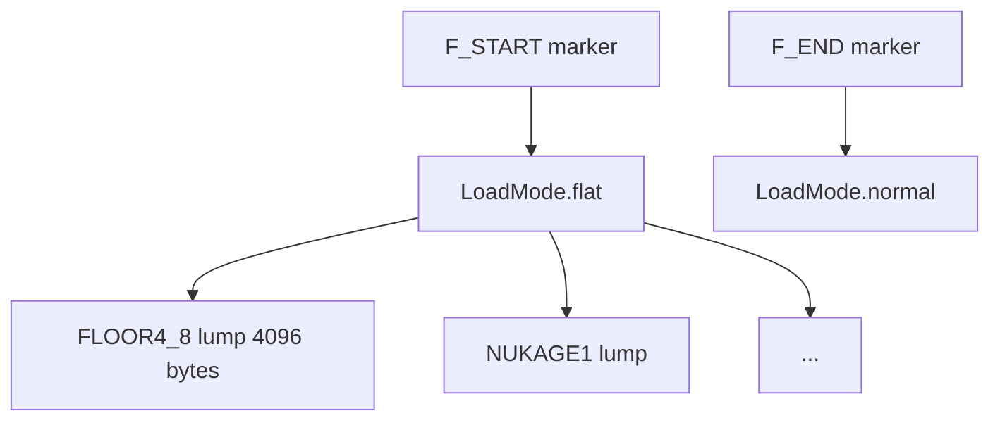

# 06 — Flats & Sky

Floor and ceiling graphics in Doom are **flats**: raw 64×64 arrays of palette indices. They live between `F_START`/`F_END` marker lumps and are collected in `LoadMode.flat`. Sky rendering uses special flat names and separate wall texture names.

← [05 — Palette & Colormap](./05-palette-and-colormap.md) | [TOC](./README.md) | Next: [07 — Sprites & Animations](./07-sprites-and-animations.md)

---

## Flat namespace



| Marker | Effect |
|--------|--------|
| `F_START`, `F1_START`, `F2_START`, `F3_START`, `FF_START` | Enter flat mode |
| `F_END`, `F1_END`, …, `FF_END` | Exit flat mode |

During flat mode, every lump name (except markers) is stored in `wad.flats[name] = ArrayBuffer`.

Source: `loadWad.ts` switch on `LoadMode.flat` + `extractFlats()` for animation chains.

---

## Flat lump format — 4096 bytes

Fixed size: **64 × 64 = 4096** bytes, row-major, one palette index per byte.

| Property | Value |
|----------|-------|
| Width | 64 (`flatSize` in wadInfo.ts) |
| Height | 64 |
| Bytes per pixel | 1 (palette index) |
| Total size | 4096 |

```1:1:/Users/williamfarmer/IdeaProjects/doom/doom-wad-core/src/constants/wadInfo.ts
export const flatSize = 64;
```

No header — unlike patches, the lump **is** the pixel array.

Rasterization: `rasterizeFlat()` in `doom-wad-core/src/raster/rasterizeFlat.ts`.

---

## Sector references

Sectors reference flats by 8-char name in the SECTORS lump:

| Field | Example | Notes |
|-------|---------|-------|
| `floorpic` | `FLOOR4_8` | Must exist in `wad.flats` |
| `ceilingpic` | `CEIL1_1` or `F_SKY` | `F_SKY` triggers sky draw |

If a name is missing from `wad.flats`, renderers substitute a default (often `MISSING` or `-NOFLAT-` in ports).

---

## F_SKY — sky sentinel flat

`F_SKY` is **not** a 4096-byte graphic in the IWAD. It is a magic name telling the renderer to draw the **sky texture** instead of a flat ceiling.

Constants in wadInfo.ts:

```3:5:/Users/williamfarmer/IdeaProjects/doom/doom-wad-core/src/constants/wadInfo.ts
export const skyTextures = ['SKY1', 'SKY2', 'SKY3'];

export const skyFlats = ['F_SKY1', 'F_SKY'];
```

| Game episode | Typical sky wall texture |
|--------------|-------------------------|
| Doom E1 | SKY1 |
| Doom E2 | SKY2 |
| Doom E3 | SKY3 |
| Doom E4 | SKY4 (Ultimate Doom) |
| Doom II | SKY1 (MAP01–11), SKY2 (MAP12–20), SKY3 (MAP21–32) |

Sky **wall** textures (tall composite patches named SKY1, etc.) are ordinary entries in TEXTURE1. The engine maps episode/level to which SKY texture to use — logic lives in GZDoom and doom-wad-lab map loaders, not in the flat lump itself.

doom-wad-lab skips tessellating `F_SKY` ceilings in `mapToFlats()` — sky is drawn as a separate pass.

---

## Animated flat chains

Liquids and slime flats animate by cycling through consecutive lump names, configured in `animatedFlatMap`:

```13:23:/Users/williamfarmer/IdeaProjects/doom/doom-wad-core/src/constants/wadInfo.ts
export const animatedFlatMap: Record<string, string> = {
  NUKAGE1: 'NUKAGE3',
  FWATER1: 'FWATER4',
  SWATER1: 'SWATER4',
  LAVA1: 'LAVA4',
  BLOOD1: 'BLOOD3',
  RROCK05: 'RROCK08',
  SLIME01: 'SLIME04',
  SLIME05: 'SLIME08',
  SLIME09: 'SLIME12',
};
```

| Constant | Value |
|----------|-------|
| `animatedFlatFps` | 4 |

### Chain building

Identical algorithm to wall textures — see [04-graphics-patches-textures.md](./04-graphics-patches-textures.md). During flat mode:

```104:127:/Users/williamfarmer/IdeaProjects/doom/doom-wad-core/src/parser/loadWad.ts
const extractFlats = (...) => {
  if (animatedFlatKey === undefined) {
    if (animatedFlatStartNames.indexOf(lumpName) >= 0) {
      returnedAnimatedFlatKey = lumpName;
      wadinfo.animatedFlats[returnedAnimatedFlatKey] = [lumpName];
    }
  } else {
    wadinfo.animatedFlats[animatedFlatKey].push(lumpName);
    wadinfo.animatedFlats[lumpName] = wadinfo.animatedFlats[animatedFlatKey];
    if (animatedFlatEndNames.indexOf(lumpName) >= 0) {
      returnedAnimatedFlatKey = undefined;
    }
  }
  return returnedAnimatedFlatKey;
};
```

**Important:** Chains depend on **directory order** of flat lumps between F_START and F_END, not numeric suffix order globally.

Example NUKAGE chain: `NUKAGE1`, `NUKAGE2`, `NUKAGE3`.

---

## FF_START / SS_START (Strife legacy markers)

`FF_START`/`FF_END` appear in some IWAD variants. doom-wad-core treats `FF_START` like `F_START` for mode switching.

---

## Flats vs patches

| | Flat | Patch |
|---|------|-------|
| Size | Fixed 4096 | Variable |
| Format | Raw indices | Column posts |
| Namespace | F_START…F_END | P_START…P_END (lumpHash) |
| Transparency | No | Index 0 transparent |
| Use | Floors, ceilings | Walls, sprites, SKY composites |

Never use a patch lump as a flat — sizes won't match and parsing will misalign.

---

## GZSTATE export

Flat names export as a string table section via `buildFlatNames()`:

```30:32:/Users/williamfarmer/IdeaProjects/doom/doom-wad-core/src/export/buildAssetSections.ts
export function buildFlatNames(wad: Wad, strings: string[]): number[] {
  return sortedStringIndices(collectMarkerRangeNames(wad.lumpInfo, 'F'), strings);
}
```

Raster digests: `buildFlatRasterDigests()` — RGBA hash per flat for asset parity.

---

## Runtime flat refresh

When sector floor/ceiling heights change (doors, lifts), doom-wad-lab rebuilds affected flat meshes via `refreshMapGeometry.ts` without reloading flats from disk.

---

## Debugging checklist

| Symptom | Check |
|---------|-------|
| Flat is garbage | Lump size ≠ 4096 |
| Animation stuck | Lump order in WAD; start/end names in animatedFlatMap |
| Sky shows flat color | ceilingpic is F_SKY but sky pass disabled |
| Missing flat | Name typo in SECTORS; lump outside F_START/F_END |

---

## External references

| Resource | URL |
|----------|-----|
| Doom Wiki — Flat | https://doomwiki.org/wiki/Flat |
| Doom Wiki — Sky | https://doomwiki.org/wiki/Sky |
| Animated flat | https://doomwiki.org/wiki/Animated_lump |

---

## Code index

| File | Role |
|------|------|
| `doom-wad-core/src/constants/wadInfo.ts` | flatSize, sky names, animation map |
| `doom-wad-core/src/parser/loadWad.ts` | Flat mode + animation chains |
| `doom-wad-core/src/raster/rasterizeFlat.ts` | Flat → RGBA |
| `doom-wad-lab/src/wad/renderer/geometry/mapToFlats.ts` | Floor/ceiling meshes |
| `doom-wad-lab/src/wad/renderer/geometry/refreshMapGeometry.ts` | Runtime height updates |

---

← [05 — Palette & Colormap](./05-palette-and-colormap.md) | [TOC](./README.md) | Next: [07 — Sprites & Animations](./07-sprites-and-animations.md)
