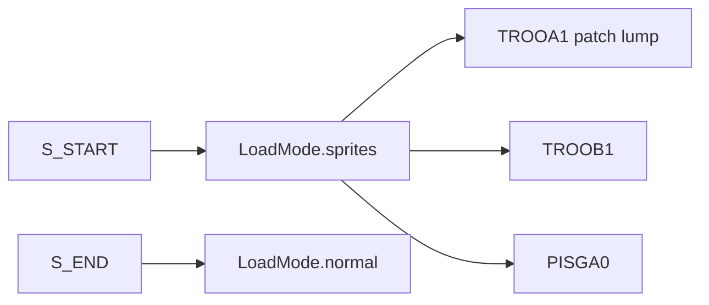

# 07 — Sprites & Animations

Sprites are patch-format graphics for actors (monsters, items, projectiles, player weapons). They are stored as individual lumps between `S_START`/`S_END` markers and indexed by a structured 8-character naming convention.

← [06 — Flats & Sky](./06-flats-and-sky.md) | [TOC](./README.md) | Next: [08 — Switches & Linedefs](./08-switches-textures-linedefs.md)

---

## Sprite namespace



In `LoadMode.sprites`, lumps are stored as raw ArrayBuffers:

```719:722:/Users/williamfarmer/IdeaProjects/doom/doom-wad-core/src/parser/loadWad.ts
      case LoadMode.sprites: {
        wadinfo.sprites[lumpName] = lumpData;
        break;
      }
```

Each sprite lump uses the **same patch column format** as wall patches — see [04-graphics-patches-textures.md](./04-graphics-patches-textures.md).

---

## 8-character sprite name format

Doom sprite lump names encode sprite set, frame, and rotation in 8 bytes:

```
T R O O A 1 [pad]
│ └─┬─┘ │ │
│   │   │ └── rotation 1–8 (or 0 = single view)
│   │   └──── frame letter A–H (animation frame)
│   └──────── sprite prefix (4 chars, often mnemonic)
└──────────── lump name char 0
```

### Examples

| Lump name | Prefix | Frame | Rotation | Meaning |
|-----------|--------|-------|----------|---------|
| `TROOA1` | TROO | A | 1 | Imp, frame A, angle slot 1 |
| `TROOB1` | TROO | B | 1 | Imp, frame B |
| `PISGA0` | PISG | A | 0 | Pistol, frame A, single angle |
| `SHT2H0` | SHT2 | H | 0 | Shotgun frame H |

### Rotation mapping (classic Doom)

Rotations 1–8 map to 45° increments around the actor (8-way billboarding). Rotation **0** means one lump used for all angles.

Some lumps encode **two rotations** in one name when length > 6 chars — see `createSpriteIndex` below.

---

## Frame letters and animation

Within one sprite prefix (`TROO`, `PINK`, etc.), consecutive letters A, B, C… are animation frames (walking cycle, attack, death).

Animation timing is **not** stored in the WAD — defined in engine code (tics per frame). doom-wad-lab uses `animatedSpriteFps = 8` from wadInfo.ts for preview cycling.

Death sequences often use letters through X or multi-sprite chains (e.g. `TROO` death + `BLOD` blood pool).

---

## Building sprite objects — createSpriteIndex

doom-wad-lab builds a nested lookup from flat lump names:

`/Users/williamfarmer/IdeaProjects/doom/doom-wad-lab/src/parser/wad/createSpriteFrame.ts`

```typescript
// Structure: spriteFrames[prefix][frameNum][direction] = lumpName
export const createSpriteIndex = (spriteNames: Array<string>): Record<string, Sprite> => {
  const spriteFrames: Record<string, Sprite> = {};
  for (const spriteName of spriteNames) {
    const realSpriteName = spriteName.slice(0, 4);
    const dir = spriteName[4];
    const frameNum = parseInt(spriteName[5], 10);  // letter → digit via char code in practice

    spriteFrames[realSpriteName][frameNum][dir] = spriteName;

    // Optional second rotation packed in chars 6–7
    if (spriteName.length > 6) {
      const dir2 = spriteName[6];
      const frameNum2 = parseInt(spriteName[7], 10);
      spriteFrames[realSpriteName][frameNum2][dir2] = spriteName;
    }
  }
  return spriteFrames;
};
```

Type definitions:

```1:5:/Users/williamfarmer/IdeaProjects/doom/doom-wad-lab/src/wad/interfaces/Sprite.ts
export type SpriteFrameDirection = string;
export type SpriteFrame = Record<SpriteFrameDirection, string>;
export type Sprite = Record<number, SpriteFrame>;
```

### Inventory builder

`buildSpriteInventory()` in `wadAssetCatalog.ts` summarizes each 4-char prefix:

- Frame count
- All lump names belonging to the sprite

Used by the level viewer asset browser.

---

## SS_START marker

Some IWADs (and many PWADs) use `SS_START`/`SS_END` instead of `S_START`/`S_END`. doom-wad-core treats both identically for mode entry/exit.

---

## Thing type → sprite mapping

THINGS lump `type` field (ednum) maps to engine state (`mobjtype_t`), which maps to sprite prefix (`S_PRST`, etc.). This mapping is **not** in the WAD — it's compiled into the executable.

doom-wad-lab maintains thing type metadata in `thingTypeIndex.ts` for labels and spawn filtering.

Common types:

| Type | Entity | Sprite prefix |
|------|--------|---------------|
| 1–4 | Player starts | PLAY |
| 3001 | Imp | TROO |
| 3002 | Former Human | POSS |
| 2001 | Shotgun | SHTG |
| 2015 | Health bonus | BON1 |

Full catalog: DeHackEd / engine tables / doom-wad-lab thing index.

---

## Sprite rendering in doom-wad-lab

| File | Role |
|------|------|
| `src/wad/renderer/drawAssets/drawSprite.ts` | Canvas patch draw with pivot |
| `src/wad/renderer/rtgl/buildSpriteTriangles.ts` | GPU billboard quads |
| `src/wad/parity/raster/rasterizePatch.ts` | Headless RGBA for parity |

Sprites use patch `leftoffset`/`topoffset` for positioning relative to thing `(x,y)`.

---

## Weapon sprites (PSprite)

First-person weapon graphics use the same patch format but are **not** in S_START ranges — they're drawn as HUD overlays (`PISG`, `SHT1`, etc.). GZDoom separates psprites from world sprites; see GZDoom Bible chapter 09.

---

## GZSTATE export

```34:36:/Users/williamfarmer/IdeaProjects/doom/doom-wad-core/src/export/buildAssetSections.ts
export function buildSpriteNames(wad: Wad, strings: string[]): number[] {
  return sortedStringIndices(collectMarkerRangeNames(wad.lumpInfo, 'S'), strings);
}
```

Sprite raster digests hash each lump's RGBA via `buildSpriteRasterDigests()`.

---

## S_SPRITE and states (engine concept)

Classic Doom defines **states** in executable code linking sprite frame + duration + next state. The WAD only provides lump graphics; state machines are outside WAD parse scope.

DeHackEd patches can replace sprite lumps without renaming — PWAD sprite lumps override IWAD by directory order.

---

## Debugging checklist

| Symptom | Check |
|---------|-------|
| Actor invisible | Sprite prefix for thing type; lump in S_ range |
| Wrong rotation | Missing rotation lumps 1–8; fallback to 0 |
| Animation wrong frame order | Letter sequence in lump names |
| Pink sprite | Patch lump corrupt; PLAYPAL missing |

---

## External references

| Resource | URL |
|----------|-----|
| Doom Wiki — Sprite | https://doomwiki.org/wiki/Sprite |
| Thing types | https://doomwiki.org/wiki/Thing_type |
| Sprite naming | https://doomwiki.org/wiki_Sprite#Naming_conventions |

---

## Code index

| File | Role |
|------|------|
| `doom-wad-core/src/parser/loadWad.ts` | Sprite lump collection |
| `doom-wad-lab/src/parser/wad/createSpriteFrame.ts` | Sprite index graph |
| `doom-wad-lab/src/wad/catalog/wadAssetCatalog.ts` | Sprite inventory |
| `doom-wad-core/src/constants/wadInfo.ts` | animatedSpriteFps |
| `doom-wad-core/src/raster/rasterizePatch.ts` | Lump → RGBA |

---

← [06 — Flats & Sky](./06-flats-and-sky.md) | [TOC](./README.md) | Next: [08 — Switches & Linedefs](./08-switches-textures-linedefs.md)
