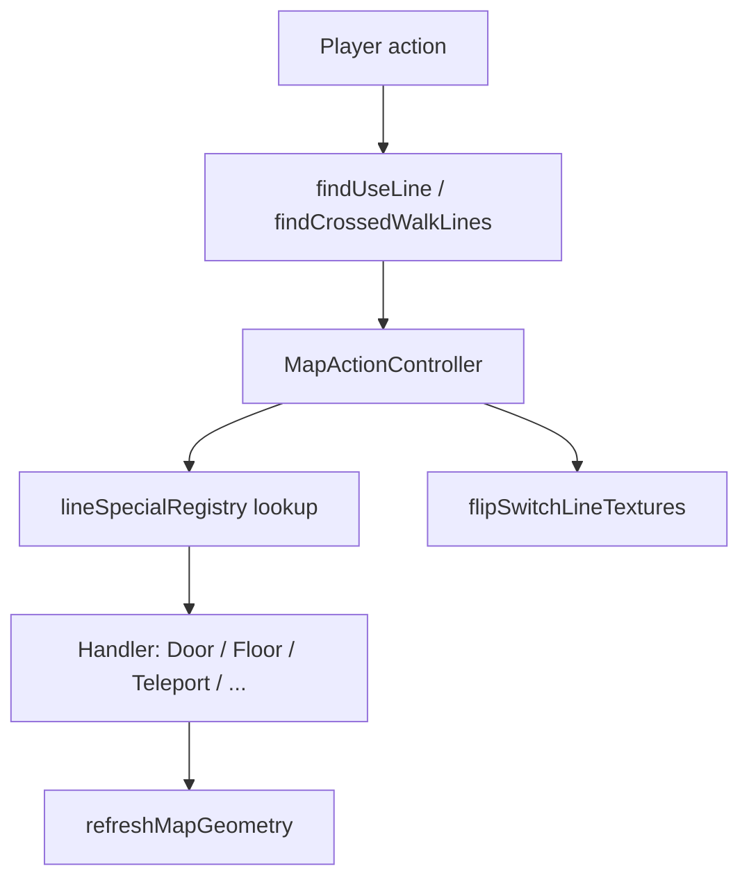

# 09 — Linedef Specials

Line specials are numeric action codes on LINEDEFS that drive doors, lifts, crushers, teleports, exits, and more. This chapter catalogs stock Doom/Doom II specials, activation mnemonics, and how doom-wad-lab maps them to runtime handlers.

← [08 — Switches & Linedefs](./08-switches-textures-linedefs.md) | [TOC](./README.md) | Next: [10 — Sectors, Things, BSP](./10-sectors-things-bsp.md)

---

## Activation model



| Input | Range / rule | Source |
|-------|--------------|--------|
| Use (E / click) | 64 uu, front side, ~90° cone | `findUseLine` |
| Walk cross | Segment intersection | `findCrossedWalkLines` |

Full runtime doc: [../../line-specials.md](../../line-specials.md)

Authoritative catalog: `/Users/williamfarmer/IdeaProjects/doom/doom-wad-lab/src/wad/game/lineSpecialRegistry.ts` (`LINE_SPECIAL_CATALOG`).

Vanilla comment reference: `/Users/williamfarmer/IdeaProjects/doom/doom-wad-lab/src/wad/constants/LineDefSpecials.ts`

---

## Activation mnemonics

Boom-style suffixes on activation types:

| Code | Meaning |
|------|---------|
| W1 | Walk once |
| WR | Walk repeatable |
| S1 | Switch once |
| SR | Switch repeatable |
| G1 | Gun once (player shoots line) |
| D1 | Impact once (projectile) |
| & | Monster activatable (combined with above) |

Extended format stores activation in linedef **flags** bits; classic format encodes activation implicitly in the special number (each special value implies one activation mode).

---

## Handler dispatch

`resolveHandler()` in `lineSpecialRegistry.ts` maps special number → handler:

| Handler | Systems | Example specials |
|---------|---------|------------------|
| `door` | `DoorSystem` | 1, 2, 29, 103, 117 |
| `floor` | `FloorMoverSystem` | 5, 10, 38, 40 |
| `teleport` | `TeleportSystem` | 39, 97, 125, 126 |
| `crusher` | `CrusherSystem` | 6, 25, 73, 141 |
| `exit` | `ExitSystem` | 11, 51, 52, 124 |
| `stair` | `StairSystem` | 7, 8, 100, 127 |
| `donut` | `DonutSystem` | 9 |
| `light` | `LightSystem` | 12, 13, 35 |
| `scroll` | `ScrollSystem` | 48 |
| `movingFloor` | `MovingFloorSystem` | 53, 54, 87, 89 |

---

## Category summary (implemented vs missing)

From [../../line-specials.md](../../line-specials.md):

| Category | Count (approx) | Status in lab |
|----------|----------------|---------------|
| Doors | 37 | Implemented |
| Floors / lifts / ceilings | 20+ | Mostly implemented |
| Teleports | 4 | Implemented |
| Crushers | 7 | Implemented |
| Exits | 4 | Implemented |
| Stairs | 4 | Not yet |
| Donut | 1 | Not yet |
| Lights (line) | 10 | Not yet |
| Scroll | 1 | Not yet |
| Moving floors | 4 | Not yet |
| Keyed doors | 12 | Partial (keys not enforced) |

---

## Door specials (representative)

| Special | Name | Activation |
|---------|------|------------|
| 1 | Manual door open/close | SR |
| 2 | Remote door open | W1 |
| 3 | Remote door close | W1 |
| 4 | Remote door O/C | W1 |
| 29 | Remote door O/C | S1 |
| 31 | Manual door open | S1 |
| 103 | Remote door open | S1 |
| 117 | Manual blaze door O/C | SR (Doom II) |

Doors move **ceiling** of door sector to match front or tagged sector ceiling.

---

## Floor / lift specials (representative)

| Special | Name | Activation |
|---------|------|------------|
| 10 | Lift down-wait-up | W1 |
| 21 | Lift down-wait-up | S1 |
| 5 | Floor raise to LIC | W1 |
| 38 | Floor lower to LEF | W1 |
| 40 | Ceiling raise to HEC | W1 |
| 41 | Ceiling lower to floor | S1 |

Abbreviations: LIC = lowest adjacent ceiling, LEF = lowest adjacent floor, HEC = highest adjacent ceiling, HEF = highest adjacent floor.

---

## Crusher specials

| Special | Activation | Speed |
|---------|------------|-------|
| 6 | W1 | Fast hurt |
| 25 | W1 | Slow hurt |
| 73 | WR | Slow |
| 77 | WR | Fast |
| 141 | W1 | Silent (Doom II) |
| 57, 74 | W1 / WR | Stop crusher |

Gap closes to 8 units, waits, reopens.

---

## Teleport specials

| Special | Who | Landing |
|---------|-----|---------|
| 39 | Player | W1 |
| 97 | Player | WR |
| 125 | Monsters | W1 (Doom II) |
| 126 | Monsters | WR (Doom II) |

Destination: thing type **14** (teleport landing) in sector matching line **tag**.

---

## Exit specials

| Special | Activation | Effect |
|---------|------------|--------|
| 11 | S1 | Exit level |
| 51 | S1 | Exit to secret |
| 52 | W1 | Exit level |
| 124 | W1 | Exit to secret (Doom II) |

Sets `requestExit` on `MapActionController`.

---

## Scroll special

| Special | Name | Notes |
|---------|------|-------|
| 48 | Scrolling wall | Continuous; no trigger — `LineDefSpecials.ts` category `scroll` |

---

## Line special 0

Special **0** means no action. Tag may still be used by sector specials or ACS in other formats.

---

## Tag vs args

| Format | Parameter storage |
|--------|-------------------|
| Classic | `tag` int16 — sector(s) with matching tag |
| Extended | `special` uint8 + `arg1`…`arg5` |

GZSTATE export packs classic tag into `args[0]`:

```65:65:/Users/williamfarmer/IdeaProjects/doom/doom-wad-core/src/export/buildMapSections.ts
    args: [line.tag ?? 0, line.arg1 ?? 0, line.arg2 ?? 0, line.arg3 ?? 0, line.arg4 ?? 0],
```

---

## Using LINE_SPECIAL_CATALOG programmatically

```typescript
import { LINE_SPECIAL_CATALOG } from '@/wad/game/lineSpecialRegistry';

const entry = LINE_SPECIAL_CATALOG.find((e) => e.special === 29);
// { special: 29, category: 'remoteDoor', name: '...', activation: 'S1', status: 'implemented', handler: 'door' }
```

Each row includes `doom2Only` flag for specials absent in Ultimate Doom.

---

## Sector specials (not line specials)

Sector `type` field handles damage, light strobes, secret percentage — drawn/simulated separately:

| Type | Effect |
|------|--------|
| 4, 12, 13, 17 | Light flicker / strobe |
| 7 | Secret sector |
| 16 | 10% damage |
| 11 | Exit super secret |

See [10-sectors-things-bsp.md](./10-sectors-things-bsp.md).

---

## Testing

| Suite | Command |
|-------|---------|
| Unit (61+ parameterized) | `npm run test:unit -- src/wad/game` |
| Synthetic integration | `npm run test:integration` |
| IWAD audit | `line-specials.integration.test.ts` with DOOM2.WAD |

Synthetic maps: `test/helpers/syntheticMaps.ts`

---

## External references

| Resource | URL |
|----------|-----|
| Line types | https://doomwiki.org/wiki_Line_type |
| Door types | https://doomwiki.org/wiki/Door |
| Lift | https://doomwiki.org/wiki/Lift |

---

## Code index

| File | Role |
|------|------|
| `doom-wad-lab/src/wad/game/lineSpecialRegistry.ts` | Full catalog |
| `doom-wad-lab/src/wad/constants/LineDefSpecials.ts` | Vanilla comments |
| `doom-wad-lab/docs/line-specials.md` | Runtime behavior |
| `doom-wad-lab/src/wad/game/mapActionController.ts` | Dispatch |
| `doom-wad-lab/src/wad/game/doorSystem.ts` | Door motion |

---

← [08 — Switches & Linedefs](./08-switches-textures-linedefs.md) | [TOC](./README.md) | Next: [10 — Sectors, Things, BSP](./10-sectors-things-bsp.md)
