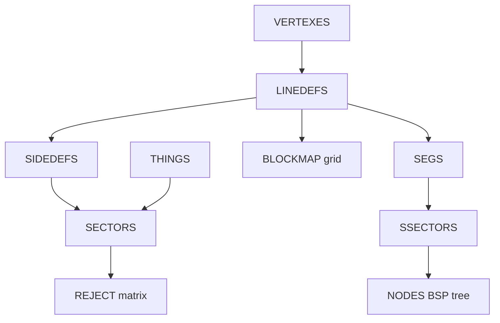

# 10 — Sectors, Things & BSP

Sectors define vertical volumes (floor/ceiling/lighting). Things place actors. BSP lumps (NODES, SEGS, SSECTORS) prepartition space for rendering and sector lookup. REJECT and BLOCKMAP accelerate AI visibility and collision.

← [09 — Linedef Specials](./09-linedef-specials.md) | [TOC](./README.md) | Next: [11 — Audio & Misc](./11-audio-and-misc-lumps.md)

---

## Architectural relationships



Record layouts: [03-map-lumps.md](./03-map-lumps.md)

---

## Sectors

### Record (26 bytes)

| Field | Type | Role |
|-------|------|------|
| floorheight | int16 | Floor Z |
| ceilingheight | int16 | Ceiling Z |
| floorpic | name8 | Flat lump name |
| ceilingpic | name8 | Flat or F_SKY |
| lightlevel | int16 | 0–255 |
| type | int16 | Sector special |
| tag | int16 | Tag for line actions |

Parser adds `lightIntensity = lightlevel / 255` for renderer heuristics.

### Common sector types (stock)

| Type | Behavior |
|------|----------|
| 0 | Normal |
| 1 | Light blink random |
| 2 | Light blink 0.5s |
| 3 | Light blink 1s |
| 4 | Light blink 0.5s synced |
| 7 | Secret (automap) |
| 9 | Secret (official) |
| 10 | Door close in 30s |
| 11 | End level (super secret) |
| 16 | 10% damage per sec |
| 17 | 20% damage per sec |

Sector type 4/12/13/17 strobes handled at draw time in `sectorDynamicLight.ts` (lab).

### Runtime mutation

Doors/crushers change `floorheight`/`ceilingheight` at runtime. doom-wad-lab clones map state per visit (`structuredClone`) so cached WAD geometry stays immutable.

---

## Things

### Classic record (10 bytes)

| Field | Type | Role |
|-------|------|------|
| x, y | int16 | Position |
| angle | int16 | Degrees 0–359 |
| type | int16 | Thing type (ednum) |
| flags | uint16 | Spawn flags |

### Spawn flags (classic)

Parsed in `thingFlags.ts`:

| Bit | Meaning |
|-----|---------|
| 0 | Appears on easy |
| 1 | Appears on medium |
| 2 | Appears on hard |
| 3 | Deaf (no sound reaction) |
| 4 | Hide in single-player |
| 5 | Hide in deathmatch |
| 6 | Hide in coop |
| 7 | Friendly (MBF) |

Ultra-Violence filter in lab: `hasValidFlags()` requires hard bit + not SP-hidden.

### Notable thing types

| Type | Entity |
|------|--------|
| 1–4 | Player 1–4 start |
| 11 | Deathmatch start |
| 14 | Teleport landing |
| 2001–2048 | Weapons |
| 2011–2014 | Keys |
| 3001+ | Monsters |
| 2028 | Tall lamp / light |

Full index: `doom-wad-lab/src/wad/catalog/thingTypeIndex.ts`

---

## BSP — NODES

The BSP tree recursively splits 2D space with partition lines. Each **node** has two children (subtree or subsector).

28 bytes per node — see [03-map-lumps.md](./03-map-lumps.md).

### Traversal (conceptual)

```
RenderBSPNode(nodeIndex):
  if nodeIndex has 0x8000 flag → draw subsector (nodeIndex & 0x7FFF)
  else:
    if viewer in front of partition → render back child first
    draw subsectors on this side
    render front child
```

Classic Doom uses front-to-back for occlusion; GZDoom HW renderer uses its own ordering with Z-buffer — see GZDoom Bible chapter 04.

### Child encoding

| Raw uint16 | Interpretation |
|------------|----------------|
| 0–32767 | Node index |
| 32768–65535 | Subsector index = value & 0x7FFF |

Export: `nodeChildToGzstate()` promotes high bit to `0x80000000`.

---

## BSP — SEGS

Segs are directed edges along linedefs (or mini-segs from partition splits):

| Field | Role |
|-------|------|
| v1, v2 | Segment endpoints (vertex indices) |
| angle | BAM angle |
| linedef | Source linedef (−1 for miniseg) |
| side | 0 front / 1 back |
| offset | Distance along linedef |

Subsectors reference contiguous seg ranges.

---

## BSP — SSECTORS

| Field | Role |
|-------|------|
| numsegs | Count of segs in this leaf |
| firstseg | Starting index in SEGS array |

Each subsector belongs to exactly one **sector** (via its segs' sidedefs). doom-wad-lab's vanilla BSP parity tests compare subsector draw order against `bspGoldenSnapshots.json`.

---

## REJECT matrix

Purpose: **AI sight checks** — if bit (i,j) is set, monsters in sector i cannot see into sector j without line-of-sight tests.

Size: `ceil(numSectors² / 8)` bytes.

- Not used by doom-wad-lab gameplay (simplified LOS).
- Exported raw in GZSTATE `MAP_REJECT` section for parity.
- Symmetric in stock maps but not required to be.

---

## BLOCKMAP

Purpose: spatial hash for **collision**, bullet hits, item pickup.

### Header

| Field | Meaning |
|-------|---------|
| x, y | Grid origin (min coords aligned to 128 uu) |
| columns, rows | Grid dimensions |

### Block size

128×128 map units per cell (engine constant).

### Block list

For each cell, uint16 linedef indices until `0xFFFF` terminator.

Parser: `parseBlockmapFromArrayBuffer()` — also stores `BLOCKMAP_RAW` on map for byte-identical export.

doom-wad-lab movement uses simplified line tests; BLOCKMAP is not queried in the WebGL path today.

---

## Point-in-sector

Given `(x,y)`, classic engine:

1. Walk BSP to find subsector — O(log n)
2. Get sector from subsector's segs → sidedef → sector index

Lab: `findSectorAt()` utilities in geometry/BSP modules; golden tests validate spawn sector index.

---

## BSP golden snapshots

File: `/Users/williamfarmer/IdeaProjects/doom/doom-wad-lab/src/wad/renderer/bsp/vanilla/bspGoldenSnapshots.json`

Keys: `DOOM.WAD/E1M1`, `DOOM2.WAD/MAP01`, etc.

Each entry stores at player spawn:

- `cameraSubsector`
- `cameraSectorIndex`
- `flatSubsectorOrder` — draw order hash
- `flatSectorOrder`

Used by `bspGoldenSnapshots.test.ts` and modular stage parity.

---

## GZSTATE map sections

From `buildMapSections.ts`:

| Section | Source lump |
|---------|-------------|
| VERTICES | VERTEXES |
| SECTORS | SECTORS |
| SIDEDEFS | SIDEDEFS |
| LINEDEFS | LINEDEFS |
| SEGS | SEGS |
| SUBSECTORS | SSECTORS |
| NODES | NODES |
| THINGS | THINGS |
| MAP_REJECT | REJECT raw |
| MAP_BLOCKMAP | BLOCKMAP_RAW |

---

## External references

| Resource | URL |
|----------|-----|
| BSP | https://doomwiki.org/wiki/Binary_space_partitioning |
| REJECT | https://doomwiki.org/wiki/REJECT |
| BLOCKMAP | https://doomwiki.org/wiki/BLOCKMAP |
| Thing | https://doomwiki.org/wiki/Thing |

---

## Code index

| File | Role |
|------|------|
| `doom-wad-core/src/parser/loadWad.ts` | Sector/thing/BSP extract |
| `doom-wad-core/src/parser/parseBlockmap.ts` | BLOCKMAP |
| `doom-wad-core/src/export/buildMapSections.ts` | GZSTATE export |
| `doom-wad-lab/src/wad/renderer/bsp/vanilla/` | BSP parity |
| `doom-wad-lab/src/wad/renderer/geometry/sectorLinesToTriangles.ts` | Sector polygons |

---

← [09 — Linedef Specials](./09-linedef-specials.md) | [TOC](./README.md) | Next: [11 — Audio & Misc](./11-audio-and-misc-lumps.md)
