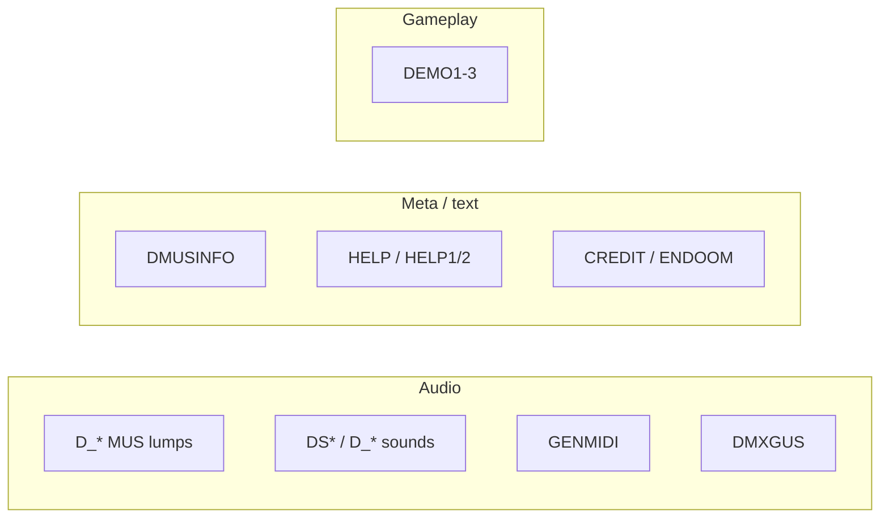

# 11 — Audio & Misc Lumps

Beyond map and graphics lumps, IWADs carry music, sound effects, demos, text screens, MIDI instrument mappings, and the ENDOOM terminal lump. This chapter surveys formats and how doom-wad-core / doom-wad-lab handle them.

← [10 — Sectors, Things, BSP](./10-sectors-things-bsp.md) | [TOC](./README.md) | Next: [12 — GZSTATE Bridge](./12-gzstate-export-bridge.md)

---

## Lump categories overview



Categorization helper: `doom-wad-lab/src/wad/catalog/categorizeLump.ts`

Asset catalog builder: `buildWadAssetCatalog()` in `wadAssetCatalog.ts`

---

## Music lumps (MUS)

Naming: `D_<map>` or `D_<name>` — e.g. `D_E1M1`, `D_RUNNIN` (MAP01 intermission).

| Property | Value |
|----------|-------|
| Format | MUS (id Music) or raw MIDI in some ports |
| Storage | Raw bytes in `lumpHash` |
| Map association | DMUSINFO lump or defaults in `getMusicLumpCandidatesForMap()` |

Lab music pipeline: `src/features/level-viewer/music/doomMusic.ts`

MUS is **not** parsed by doom-wad-core — passed through for host playback.

### DMUSINFO

Text lump mapping map names to music lump overrides:

```
DOOM2
{
  map MAP01 { music = "D_RUNNIN" }
  ...
}
```

Parsed by `parseDmusinfo()` in `parseDoomText.ts`.

---

## Sound lumps

Naming patterns:

| Pattern | Examples |
|---------|----------|
| `DS*` | `DSPISTOL`, `DSSGCOCK` |
| `D_*` | Some older naming |

Format: Doom digital sound — 8-bit mono with header (sample rate, length).

Lab decoder: `decodeDoomSound()` in `doomSfxPlayer.ts`

GZSTATE export lists sound names via `buildSoundNames()` — raw audio not in GZSTATE sections.

---

## GENMIDI

| Property | Value |
|----------|-------|
| Size | ~1756 bytes (variant) |
| Purpose | Maps MIDI program numbers to OPL instruments for MUS playback |
| Storage | `wad.genmidi` raw ArrayBuffer |

Loaded in `handleLumpType`:

```549:551:/Users/williamfarmer/IdeaProjects/doom/doom-wad-core/src/parser/loadWad.ts
    case LumpName.GENMIDI:
      wadinfo.genmidi = lumpData;
      break;
```

Required for AdLib/OPL emulation fidelity; optional for General MIDI playback.

---

## DMXGUS

| Property | Value |
|----------|-------|
| Purpose | GUS patch mapping for DMX sound driver |
| Storage | `wad.dmxgus` raw |

Legacy hardware support — stored but rarely used in browser lab.

---

## Demo lumps (DEMO1, DEMO2, DEMO3)

| Lump | Typical content |
|------|-----------------|
| DEMO1 | First demo loop (often E1M1 or MAP01) |
| DEMO2 | Second demo |
| DEMO3 | Third demo / long demo |

Format: demo header + tic commands (player movement, buttons). **Not parsed** by doom-wad-core.

Size varies (tens of KB). Listed in asset catalog `demos` array.

---

## ENDOOM

Text-mode PC screen displayed on quit in classic Doom.

| Property | Value |
|----------|-------|
| Size | 4000 bytes (80×25 text) |
| Storage | `wad.enddoom` |

Often contains credits ASCII art. Lab stores raw; some viewers render as monospace grid.

---

## Story / intermission text lumps

Printable text lumps (category `storyText`, `intermission`):

| Examples | Purpose |
|----------|---------|
| `HELP1`, `HELP2` | Help screens |
| `CREDIT` | Credits |
| `TITLEPIC` | Title graphic (patch, not text) |
| `CWILVxx` | Episode ending screens |
| `VICTORY2`, `WILVxx` | Intermission backgrounds |

`parseDoomTextScreens()` extracts screen count and preview from text lumps.

---

## Menu graphics and UI patches

Between P_START/P_END:

| Lump | Role |
|------|------|
| M_DOOM | Title logo |
| STBAR | Status bar background |
| PFCURSOR | Menu cursor |

Treated as normal patches in `lumpHash`.

---

## TEXTURE meta vs lumps

| Lump | Role |
|------|------|
| PNAMES | Patch index |
| TEXTURE1/2 | Composite defs |
| TEXTURES | Hexen-style alias |

---

## Colormap / palette (cross-reference)

PLAYPAL and COLORMAP — [05-palette-and-colormap.md](./05-palette-and-colormap.md)

---

## GZSTATE export for audio/meta

| Section | Content |
|---------|---------|
| MUSIC_NAMES | String indices for music lumps |
| SOUND_NAMES | String indices for sound lumps |
| LUMP_CATALOG | All lumps with category codes |

Music/sound **bytes** are not embedded in GZSTATE v1 — names only for catalog parity.

---

## Integration tests

`test/integration/music-pipeline.integration.test.ts` — MUS decode when IWAD present.

`music-pipeline.integration.test.ts` validates lab can locate map music candidates.

---

## External references

| Resource | URL |
|----------|-----|
| MUS | https://doomwiki.org/wiki/MUS |
| Sound effect | https://doomwiki.org/wiki/Sound_effect |
| Demo format | https://doomwiki.org/wiki/Demo_format |
| GENMIDI | https://doomwiki.org/wiki/GENMIDI |
| ENDOOM | https://doomwiki.org/wiki/ENDOOM |

---

## Code index

| File | Role |
|------|------|
| `doom-wad-core/src/parser/loadWad.ts` | GENMIDI, DMXGUS, DEMO, ENDDOOM |
| `doom-wad-lab/src/wad/catalog/wadAssetCatalog.ts` | Full inventory |
| `doom-wad-lab/src/wad/catalog/categorizeLump.ts` | Lump classification |
| `doom-wad-lab/src/features/level-viewer/music/doomMusic.ts` | Map → music |
| `doom-wad-lab/src/features/level-viewer/sfx/doomSfxPlayer.ts` | Sound decode |
| `doom-wad-core/src/export/buildAssetSections.ts` | Music/sound name export |

---

← [10 — Sectors, Things, BSP](./10-sectors-things-bsp.md) | [TOC](./README.md) | Next: [12 — GZSTATE Bridge](./12-gzstate-export-bridge.md)
