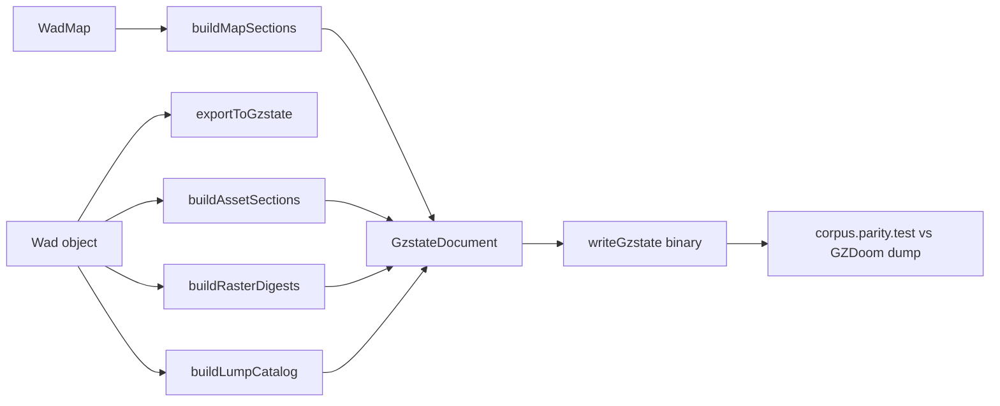

# 12 — GZSTATE Export Bridge

**GZSTATE v1** is the canonical binary interchange format between doom-wad-core's parsed WAD and GZDoom's C++ level dump. This chapter traces how a `WadMap` becomes a `GzstateDocument` via `buildMapSections.ts` and `exportToGzstate.ts`.

← [11 — Audio & Misc](./11-audio-and-misc-lumps.md) | [TOC](./README.md) | Next: [Appendix — Map Catalog](./appendix-map-catalog.md)

---

## Export pipeline



Primary source: `/Users/williamfarmer/IdeaProjects/doom/doom-wad-core/src/export/exportToGzstate.ts`

Lab re-export wrapper: `doom-wad-lab/src/wad/parity/export/exportWadLabToGzstate.ts`

Wire spec: [../../gzrender-v2/gzstate-v1.md](../../gzrender-v2/gzstate-v1.md)

---

## exportToGzstate entry point

```35:78:/Users/williamfarmer/IdeaProjects/doom/doom-wad-core/src/export/exportToGzstate.ts
export function exportToGzstate(wad: Wad, mapName: string, engineTag = 'DOOM-WAD-CORE'): GzstateDocument {
  const map = wad.maps[mapName.toUpperCase()];
  if (!map) {
    throw new Error(`Map not found in WAD: ${mapName}`);
  }

  const strings: string[] = [];

  return {
    header: {
      magic: GZSTATE_MAGIC,
      version: GZSTATE_VERSION,
      flags: 0,
      headerSize: 64,
      sectionCount: 0,
      sectionDirectoryOffset: 64,
      mapName: mapName.toUpperCase(),
      engineTag,
    },
    sections: [],
    strings,
    vertices: buildVertices(map),
    sectors: buildSectors(map, strings),
    sidedefs: buildSidedefs(map, strings),
    linedefs: buildLinedefs(map),
    segs: buildSegs(map),
    subsectors: buildSubsectors(map),
    nodes: buildNodes(map),
    things: buildThings(map),
    lumpCatalog: buildLumpCatalog(wad, strings),
    textureDefs: buildTextureDefs(wad, strings),
    flatNames: buildFlatNames(wad, strings),
    spriteNames: buildSpriteNames(wad, strings),
    musicNames: buildMusicNames(wad, strings),
    soundNames: buildSoundNames(wad, strings),
    pnames: buildPnames(wad, strings),
    patchRasters: buildPatchRasterDigests(wad, strings),
    flatRasters: buildFlatRasterDigests(wad, strings),
    spriteRasters: buildSpriteRasterDigests(wad, strings),
    textureRasters: buildTextureRasterDigests(wad, strings),
    mapReject: map.REJECT as ArrayBuffer | undefined,
    mapBlockmapRaw: map.BLOCKMAP_RAW as ArrayBuffer | undefined,
  };
}
```

Constants: `GZSTATE_MAGIC = 0x54535a47` ('GZST'), `GZSTATE_VERSION = 1`

---

## buildMapSections — field mapping

File: `/Users/williamfarmer/IdeaProjects/doom/doom-wad-core/src/export/buildMapSections.ts`

### Vertices

```typescript
{ x: v.x, y: v.y }  // int16 preserved
```

### Sectors

| WadMap field | GZSTATE field |
|--------------|---------------|
| floorheight | floorHeight |
| ceilingheight | ceilingHeight |
| lightlevel | lightLevel |
| type | special (uint16) |
| tag | tag |
| floorpic | floorTextureIndex (string pool) |
| ceilingpic | ceilingTextureIndex |

### Sidedefs

| WadMap | GZSTATE |
|--------|---------|
| xOffset | textureOffsetX |
| yOffset | textureOffsetY |
| topTexture | topTextureIndex |
| bottomTexture | bottomTextureIndex |
| midTexture | midTextureIndex |
| sector | sectorIndex |

### Linedefs

| WadMap | GZSTATE |
|--------|---------|
| v1, v2 | vertex1, vertex2 |
| rawFlags | flags |
| special | special |
| sidenum[0,1] | side0, side1 (−1 → 0xFFFF) |
| tag / args | tag, args[0..4] |

`GZSTATE_NO_SIDE = 0xffff` for missing sides on segs.

### Segs

Maps linedef −1 to `GZSTATE_NO_SIDE`. Preserves angle, side, offset.

### Subsectors

`numsegs` → `numSegs`, `firstseg` → `firstSeg`. Sector index filled by GZDoom at runtime — export uses 0 placeholder.

### Nodes

BBox flattened to Int16Array(8). Children via `nodeChildToGzstate()`:

```71:75:/Users/williamfarmer/IdeaProjects/doom/doom-wad-core/src/formats/encodeDoomFormats.ts
export function nodeChildToGzstate(rawChild: number): number {
  const child = rawChild & 0xffff;
  if (child & 0x8000) return ((child & 0x7fff) | 0x80000000) >>> 0;
  return child >>> 0;
}
```

### Things

Classic export sets `z: 0`, `tid: 0`. Flags via `encodeClassicThingFlags()`.

Extended thing height/tid not yet exported in classic corpus path.

---

## Raw lump passthrough

Critical for tier-3 parity:

| Field | Source |
|-------|--------|
| mapReject | REJECT lump bytes unchanged |
| mapBlockmapRaw | BLOCKMAP_RAW captured before parse |

Ensures bitwise identity even when parsed BLOCKMAP structure round-trips differently.

---

## Asset sections (buildAssetSections.ts)

| Builder | GZSTATE section ID |
|---------|---------------------|
| buildPnames | PNAMES (17) |
| buildTextureDefs | TEXTURE_DEFS (12) |
| buildFlatNames | FLAT_NAMES (13) |
| buildSpriteNames | SPRITE_NAMES (14) |
| buildMusicNames | MUSIC_NAMES (15) |
| buildSoundNames | SOUND_NAMES (16) |
| buildLumpCatalog | LUMP_CATALOG (11) |

String interning: `internString(strings, name)` — deduplicated UTF-8 pool.

---

## Raster digests (buildRasterDigests.ts)

Headless RGBA rasterization hashed for asset parity without storing full pixels in every test:

| Builder | Input |
|---------|-------|
| buildPatchRasterDigests | Each patch in PNAMES order |
| buildFlatRasterDigests | Each flat in F_ range |
| buildSpriteRasterDigests | Each sprite lump |
| buildTextureRasterDigests | Each composite texture |

Uses `rasterizePatch`, `rasterizeFlat`, `rasterizeTexture` from doom-wad-core.

---

## GZSTATE section IDs

From `doom-wad-core/src/gzstate/constants.ts`:

| ID | Name |
|----|------|
| 1 | STRING_TABLE |
| 2 | VERTICES |
| 3 | SECTORS |
| 4 | SIDEDEFS |
| 5 | LINEDEFS |
| 6 | SEGS |
| 7 | SUBSECTORS |
| 8 | NODES |
| 9 | THINGS |
| 10 | MAP_META |
| 11 | LUMP_CATALOG |
| 12 | TEXTURE_DEFS |
| 13 | FLAT_NAMES |
| 14 | SPRITE_NAMES |
| 15 | MUSIC_NAMES |
| 16 | SOUND_NAMES |
| 17 | PNAMES |
| 18–21 | Raster digests |
| 22 | MAP_REJECT |
| 23 | MAP_BLOCKMAP |

Corpus test compares **20 sections** per map against GZDoom C++ dump artifacts.

---

## Corpus parity test

File: `doom-wad-lab/src/wad/parity/corpus.parity.test.ts`

```
npm run test:corpus
# Requires: public/wads/DOOM.WAD, DOOM2.WAD
#           artifacts/gzrender-v2/corpus/*.gzst from GZDoom dump
```

All **68 maps** must match byte-for-byte on compared sections.

---

## Round-trip boundary

Design goal (stage 3 parity): `wad.maps[MAP]` ≡ `gzstateToWadMap(exportToGzstate(wad, MAP))` for map geometry sections.

Full WAD re-serialization to IWAD is **out of scope** — GZSTATE is not a WAD replacement.

---

## doom-wad-lab parity module

| File | Role |
|------|------|
| `src/wad/parity/export/exportWadLabToGzstate.ts` | Lab entry |
| `src/wad/parity/export/buildMapSections.ts` | Synced copy / shim |
| `src/wad/parity/corpus.parity.test.ts` | 68-map gate |

Canonical implementation lives in **doom-wad-core** — lab copies synced via `tools/sync-from-doom-wad-lab.mjs`.

---

## External references

| Resource | Path |
|----------|------|
| GZSTATE v1 spec | `doom-wad-lab/docs/gzrender-v2/gzstate-v1.md` |
| C++ dump | `gzdoom-project/src/gzstate_dump.cpp` |
| Parity tracker | `doom-wad-lab/docs/gzrender-v2/parity-gap-tracker.md` |

---

## Code index

| File | Role |
|------|------|
| `doom-wad-core/src/export/exportToGzstate.ts` | Main export |
| `doom-wad-core/src/export/buildMapSections.ts` | Map sections |
| `doom-wad-core/src/export/buildAssetSections.ts` | Asset names |
| `doom-wad-core/src/export/buildRasterDigests.ts` | RGBA hashes |
| `doom-wad-core/src/export/buildLumpCatalog.ts` | Lump inventory |
| `doom-wad-core/src/gzstate/constants.ts` | Magic, section IDs |

---

← [11 — Audio & Misc](./11-audio-and-misc-lumps.md) | [TOC](./README.md) | Next: [Appendix — Map Catalog](./appendix-map-catalog.md)
