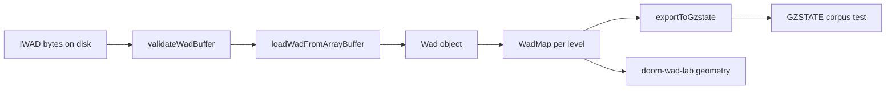

# WAD Bible — Table of Contents

Authoritative reference for **classic Doom IWAD/PWAD** container format, lump semantics, and the parse pipeline used by [`doom-wad-core`](../../../../doom-wad-core) and consumed by [`doom-wad-lab`](../../../). These chapters document **WAD truth** — the bytes on disk and the in-memory structures they become — not the lab's WebGL renderer (see [Rendering](../../rendering.md)) or the GZDoom GLES pipeline (see [GZDoom Bible](../gzdoom/README.md)).

## How to read this bible

1. Start with [00 — Introduction](./00-introduction.md) for scope, repository roles, and the **68-map gold corpus**.
2. Read [01–02](./01-container-format.md) for container layout and the `LoadMode` directory walk.
3. Use [03](./03-map-lumps.md) as the record-layout cheat sheet when debugging map parity.
4. Graphics chapters [04–07](./04-graphics-patches-textures.md) cover patches, textures, palettes, flats, and sprites.
5. Gameplay-facing chapters [08–10](./08-switches-textures-linedefs.md) cover switches, line specials, BSP, and collision lumps.
6. [12](./12-gzstate-export-bridge.md) bridges parsed WAD data to **GZSTATE v1** for GZDoom parity gates.
7. [Appendix — Map Catalog](./appendix-map-catalog.md) lists every stock level in the corpus with gold snapshot keys.

All paths into source code use the monorepo layout under `/Users/williamfarmer/IdeaProjects/doom/`.

---

## Chapters

| # | File | Summary |
|---|------|---------|
| 00 | [00-introduction.md](./00-introduction.md) | Scope of the WAD Bible; gold standard definition (68-map corpus @ 0% playfield diff); relationship among raw IWAD, `doom-wad-core` parser, `doom-wad-lab` host, and GZDoom WASM oracle. |
| 01 | [01-container-format.md](./01-container-format.md) | IWAD/PWAD 12-byte header; 16-byte directory entries; 8-character lump names; little-endian layout; `validateWadBuffer` pre-parse checks. |
| 02 | [02-loading-phases.md](./02-loading-phases.md) | `LoadMode` state machine (`normal` / `map` / `sprites` / `flat`); marker lumps; map header detection (`E#M#`, `MAP##`); `BEHAVIOR` → extended UDMF-style records. |
| 03 | [03-map-lumps.md](./03-map-lumps.md) | Complete map lump catalog with byte-accurate record layouts for classic vs extended formats: THINGS, LINEDEFS, SIDEDEFS, VERTEXES, SEGS, SSECTORS, NODES, SECTORS, REJECT, BLOCKMAP, BEHAVIOR. |
| 04 | [04-graphics-patches-textures.md](./04-graphics-patches-textures.md) | PNAMES index; Doom patch column/post format; TEXTURE1/2 composite definitions; patch origins; animated wall chains from `animatedTextureMap`. |
| 05 | [05-palette-and-colormap.md](./05-palette-and-colormap.md) | PLAYPAL (768 bytes); COLORMAP (34×256); palette index 0 transparency; lighting band selection; rasterization to RGBA. |
| 06 | [06-flats-and-sky.md](./06-flats-and-sky.md) | F_START/F_END marker ranges; 4096-byte 64×64 flats; F_SKY sentinel; sky texture names; animated flat chains from `animatedFlatMap`. |
| 07 | [07-sprites-and-animations.md](./07-sprites-and-animations.md) | S_START/S_END groups; 8-char sprite naming (`TROOA1`); frame letters A–H and rotation digits 1–8; `createSpriteIndex` object graph. |
| 08 | [08-switches-textures-linedefs.md](./08-switches-textures-linedefs.md) | SW1/SW2 and DB1/DB2 switch texture pairs; `flipSwitchLineTextures` in doom-wad-lab; linedef flags bit table (classic and extended). |
| 09 | [09-linedef-specials.md](./09-linedef-specials.md) | Stock Doom line special catalog; activation mnemonics (W1, S1, SR, …); handler dispatch; links to `lineSpecialRegistry.ts` and [line-specials.md](../../line-specials.md). |
| 10 | [10-sectors-things-bsp.md](./10-sectors-things-bsp.md) | Sector records; thing types and spawn flags; BSP nodes/segs/subsectors; REJECT matrix and BLOCKMAP grid purpose. |
| 11 | [11-audio-and-misc-lumps.md](./11-audio-and-misc-lumps.md) | GENMIDI, DMXGUS, MUS/D_* music lumps, sound lumps, DEMO1–3, ENDOOM, DMUSINFO, intermission text. |
| 12 | [12-gzstate-export-bridge.md](./12-gzstate-export-bridge.md) | `WadMap` → GZSTATE v1 via `buildMapSections.ts` and `exportToGzstate.ts`; 23 sections; REJECT/BLOCKMAP raw passthrough. |
| A | [appendix-map-catalog.md](./appendix-map-catalog.md) | All **68** gold corpus maps: DOOM E1–E4 (36) + DOOM II MAP01–32 (32); episode themes; official names; `bspGoldenSnapshots.json` keys. |
| — | [references.md](./references.md) | External specs (Doom Wiki, Unofficial Specs, id format docs) and repository file index. |

## Classic renderer cross-reference

Parsed WAD structures from this bible feed the **Classic WebGL2** renderer via `doom-wad-core`. For how each lump type maps to live draw layers (walls, flats, sky, sprites), see the [Classic Layer Bible](../classic-layers/README.md) — especially [Chapter 03](../classic-layers/03-node-geometry-pipeline.md).

---

## Related documentation

| Document | Role |
|----------|------|
| [../README.md](../README.md) | Parent bible index (WAD + GZDoom) |
| [../../wad-processing.md](../../wad-processing.md) | Lab worker pipeline (fetch → parse → geometry) |
| [../../line-specials.md](../../line-specials.md) | Runtime line-special simulation in doom-wad-lab |
| [../../gzrender-v2/gzstate-v1.md](../../gzrender-v2/gzstate-v1.md) | GZSTATE binary wire format |
| [../../../../doom-wad-core/README.md](../../../../doom-wad-core/README.md) | Parser package overview |

---

## End-to-end flow (WAD Bible scope)

The WAD Bible covers everything from **BYTES** through **GZS**. Pixel gates beyond GZSTATE are documented in the [GZDoom Bible](../gzdoom/README.md).
