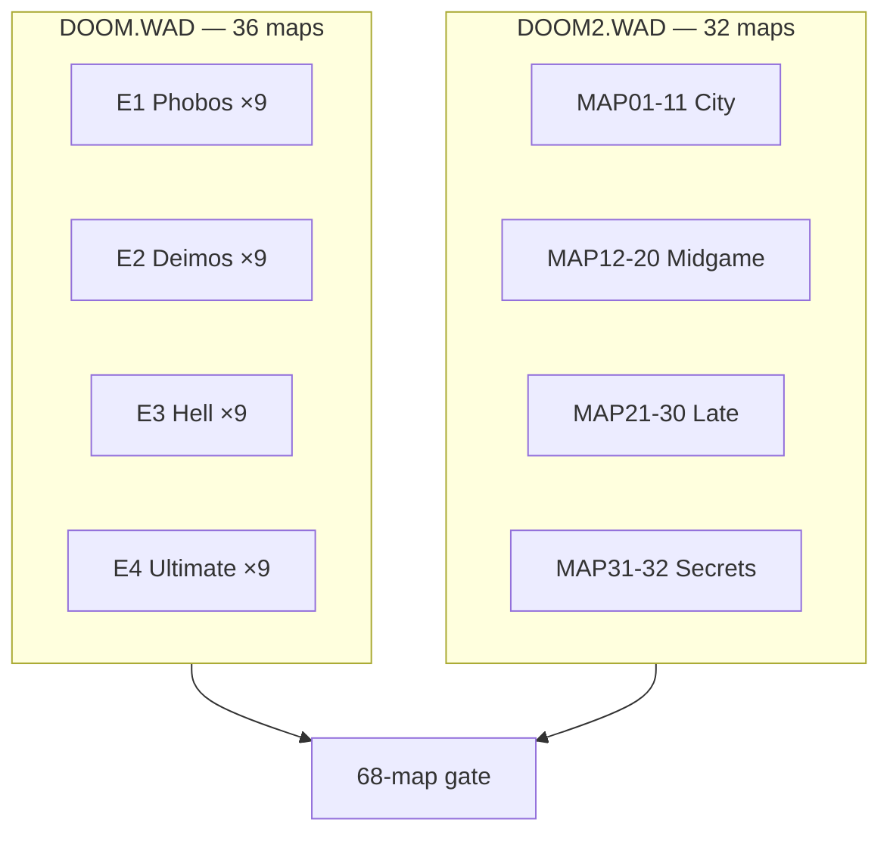

# Appendix — Map Catalog (68-Map Gold Corpus)

Complete listing of every stock level in the **68-map gold corpus**: Ultimate Doom (`DOOM.WAD`, 36 maps) and Doom II (`DOOM2.WAD`, 32 maps). Each row links to BSP golden snapshot keys in `bspGoldenSnapshots.json`.

← [12 — GZSTATE Bridge](./12-gzstate-export-bridge.md) | [TOC](./README.md) | [References](./references.md)

---

## Corpus definition

| IWAD | Maps | Naming | Count |
|------|------|--------|-------|
| DOOM.WAD | E1M1–E1M9, E2M1–E2M9, E3M1–E3M9, E4M1–E4M9 | Episode + mission | **36** |
| DOOM2.WAD | MAP01–MAP32 | Decimal map number | **32** |
| **Total** | | | **68** |

Episodes E2–E4 and all of Doom II require registered / commercial IWADs. The corpus gates assume both files are present under `public/wads/`.

Golden snapshot path (relative to repo root):

```
doom-wad-lab/src/wad/renderer/bsp/vanilla/bspGoldenSnapshots.json
```

Key format: `{IWAD_FILENAME}/{MAP_NAME}` — e.g. `DOOM.WAD/E1M1`, `DOOM2.WAD/MAP07`.

---

## Episode themes (Ultimate Doom)

| Episode | Title | Setting | Sky | Maps |
|---------|-------|---------|-----|------|
| E1 | Knee-Deep in the Dead | Phobos military bases | SKY1 | E1M1–E1M9 |
| E2 | The Shores of Hell | Deimos installations | SKY2 | E2M1–E2M9 |
| E3 | Inferno | Hell | SKY3 | E3M1–E3M9 |
| E4 | Thy Flesh Consumed | Earth / hybrid hell | SKY4 | E4M1–E4M9 |

Music lumps typically `D_E1M1` … `D_E4M9` pattern (see DMUSINFO overrides).

---

## DOOM.WAD — Episode 1: Knee-Deep in the Dead

| Map | Name (Doom Wiki) | Notes | Gold key | Snapshot hash |
|-----|------------------|-------|----------|---------------|
| E1M1 | Hangar | First level, tutorial layout | `DOOM.WAD/E1M1` | `2300d852a6f67b1b` |
| E1M2 | Nuclear Plant | | `DOOM.WAD/E1M2` | `011bc536441f0598` |
| E1M3 | Toxin Refinery | Outdoor areas | `DOOM.WAD/E1M3` | `e35df24db75b04af` |
| E1M4 | Command Control | | `DOOM.WAD/E1M4` | `e5428fabdcbd7117` |
| E1M5 | Phobos Lab | | `DOOM.WAD/E1M5` | `c78766be9d89880b` |
| E1M6 | Central Processing | | `DOOM.WAD/E1M6` | `729ea4d8015cb8b9` |
| E1M7 | Computer Station | | `DOOM.WAD/E1M7` | `2ab6f0de16944d61` |
| E1M8 | Phobos Anomaly | Boss: Barons of Hell | `DOOM.WAD/E1M8` | `3e9ddd8526489714` |
| E1M9 | Military Base | **Secret** level | `DOOM.WAD/E1M9` | `3fa2c8d3f9fe3f73` |

---

## DOOM.WAD — Episode 2: The Shores of Hell

| Map | Name | Notes | Gold key | Snapshot hash |
|-----|------|-------|----------|---------------|
| E2M1 | Deimos Anomaly | | `DOOM.WAD/E2M1` | `3233f8e12b7f7ab4` |
| E2M2 | Containment Area | | `DOOM.WAD/E2M2` | `c9cadc2d9043c0bf` |
| E2M3 | Refinery | | `DOOM.WAD/E2M3` | `6c2606113060e8f3` |
| E2M4 | Deimos Lab | | `DOOM.WAD/E2M4` | `3122608b66866e9b` |
| E2M5 | Command Center | | `DOOM.WAD/E2M5` | `3f37f2d6abc3cdc6` |
| E2M6 | Halls of the Damned | | `DOOM.WAD/E2M6` | `f4254dd70446d09c` |
| E2M7 | Spawning Vats | | `DOOM.WAD/E2M7` | `04e2e671b122b2c2` |
| E2M8 | Tower of Babel | Boss: Cyberdemon | `DOOM.WAD/E2M8` | `d6cf3f551fe0d744` |
| E2M9 | Fortress of Mystery | **Secret** | `DOOM.WAD/E2M9` | `9eac1c2ca12787fb` |

---

## DOOM.WAD — Episode 3: Inferno

| Map | Name | Notes | Gold key | Snapshot hash |
|-----|------|-------|----------|---------------|
| E3M1 | Hell Keep | | `DOOM.WAD/E3M1` | `146b403111ef9622` |
| E3M2 | Slough of Despair | | `DOOM.WAD/E3M2` | `e3a5791be5f018d4` |
| E3M3 | Pandemonium | | `DOOM.WAD/E3M3` | `e7fe5bb9760c4b76` |
| E3M4 | House of Pain | | `DOOM.WAD/E3M4` | `a9e9db52a9b34307` |
| E3M5 | Unholy Cathedral | | `DOOM.WAD/E3M5` | `6c6b66955ab72938` |
| E3M6 | Mt. Erebus | Open lava areas | `DOOM.WAD/E3M6` | `888f9e4240992f26` |
| E3M7 | Gate to Limbo | | `DOOM.WAD/E3M7` | `1dc6ade1cc9ca1c0` |
| E3M8 | Dis | Boss: Spider Mastermind | `DOOM.WAD/E3M8` | `602a761a05856c1d` |
| E3M9 | Warrens | **Secret** | `DOOM.WAD/E3M9` | `e3d97585bd3b8069` |

---

## DOOM.WAD — Episode 4: Thy Flesh Consumed

Added in Ultimate Doom (1995). Higher difficulty, Earth textures.

| Map | Name | Notes | Gold key | Snapshot hash |
|-----|------|-------|----------|---------------|
| E4M1 | Hell Gate | | `DOOM.WAD/E4M1` | `bad9025fdc0db86e` |
| E4M2 | Perversity | | `DOOM.WAD/E4M2` | `0941083c411ae0a0` |
| E4M3 | Pillars of Skulls | | `DOOM.WAD/E4M3` | `70d6224249a01819` |
| E4M4 | Unruly Evil | | `DOOM.WAD/E4M4` | `4a24158268bd0c1a` |
| E4M5 | They Will Repent | | `DOOM.WAD/E4M5` | `e157dfedb1653687` |
| E4M6 | Against Thee Wickedly | | `DOOM.WAD/E4M6` | `8686325d73ac9eca` |
| E4M7 | And Hell Followed | | `DOOM.WAD/E4M7` | `474382e146efd423` |
| E4M8 | Unto The Cruel | | `DOOM.WAD/E4M8` | `a38e064004bbb51c` |
| E4M9 | Fear | **Secret** | `DOOM.WAD/E4M9` | `8c3a8241bd7c78be` |

---

## DOOM2.WAD — Doom II: Hell on Earth

Single episode, 32 maps. Sky transitions: MAP01–11 SKY1, MAP12–20 SKY2, MAP21–32 SKY3.

| Map | Name | Notes | Gold key | Snapshot hash |
|-----|------|-------|----------|---------------|
| MAP01 | Entryway | | `DOOM2.WAD/MAP01` | `83fe34edc080af20` |
| MAP02 | Underhalls | | `DOOM2.WAD/MAP02` | `e55fc3ab1177fd24` |
| MAP03 | The Gantlet | | `DOOM2.WAD/MAP03` | `260d74899d742143` |
| MAP04 | The Focus | | `DOOM2.WAD/MAP04` | `2ce7da783ee5ad78` |
| MAP05 | The Waste Tunnels | | `DOOM2.WAD/MAP05` | `6ed95d298548b553` |
| MAP06 | The Crusher | | `DOOM2.WAD/MAP06` | `1108324a5e5a2471` |
| MAP07 | Dead Simple | Monster arena | `DOOM2.WAD/MAP07` | `2e4dd2f428591a2f` |
| MAP08 | Tricks and Traps | | `DOOM2.WAD/MAP08` | `4f55667657e54875` |
| MAP09 | The Pit | | `DOOM2.WAD/MAP09` | `8b314a689f57b600` |
| MAP10 | Refueling Base | | `DOOM2.WAD/MAP10` | `0dc6c1187aa94238` |
| MAP11 | Circle of Death | Also "O' of Destruction" | `DOOM2.WAD/MAP11` | `a59608687c9bcda2` |
| MAP12 | The Factory | | `DOOM2.WAD/MAP12` | `70912d7489660589` |
| MAP13 | Downtown | | `DOOM2.WAD/MAP13` | `6330c839e85c68c2` |
| MAP14 | The Inmost Dens | | `DOOM2.WAD/MAP14` | `d2810e66c00140b2` |
| MAP15 | Industrial Zone | | `DOOM2.WAD/MAP15` | `860daf84db392fab` |
| MAP16 | Suburbs | | `DOOM2.WAD/MAP16` | `7de93a7ca56b8eef` |
| MAP17 | Tenements | | `DOOM2.WAD/MAP17` | `608a5897832e9692` |
| MAP18 | The Courtyard | | `DOOM2.WAD/MAP18` | `c124782d555f2a9f` |
| MAP19 | The Citadel | | `DOOM2.WAD/MAP19` | `425d44c81d90c9b8` |
| MAP20 | Gotcha! | | `DOOM2.WAD/MAP20` | `ca023965d35fbb32` |
| MAP21 | Nirvana | | `DOOM2.WAD/MAP21` | `c9c9eb026f46dede` |
| MAP22 | The Catacombs | | `DOOM2.WAD/MAP22` | `233d8391baed35ad` |
| MAP23 | Barrels o' Fun | | `DOOM2.WAD/MAP23` | `437c942c9e1e6789` |
| MAP24 | The Chasm | | `DOOM2.WAD/MAP24` | `7fa6808c40fe725d` |
| MAP25 | Bloodfalls | | `DOOM2.WAD/MAP25` | `4f4e0145b0c24d77` |
| MAP26 | The Abandoned Mines | | `DOOM2.WAD/MAP26` | `6119dc52960b1ded` |
| MAP27 | Monster Condo | | `DOOM2.WAD/MAP27` | `606a5d77c3f5bcde` |
| MAP28 | The Spirit World | | `DOOM2.WAD/MAP28` | `f9af3f16a062bb3c` |
| MAP29 | The Living End | | `DOOM2.WAD/MAP29` | `955a4c3aac9723ca` |
| MAP30 | Icon of Sin | Final boss | `DOOM2.WAD/MAP30` | `484f6dca63a0c673` |
| MAP31 | Wolfenstein | **Secret** (No Rest for the Living precursor) | `DOOM2.WAD/MAP31` | `ee81a3084e2c1243` |
| MAP32 | Grosse | **Secret** | `DOOM2.WAD/MAP32` | `4ebf2960bf4dcc1f` |

---

## Using golden snapshot keys in tests

```typescript
import snapshots from '@/wad/renderer/bsp/vanilla/bspGoldenSnapshots.json';

const key = 'DOOM.WAD/E1M1';
const entry = snapshots.spawn[key];
// entry.hash — fingerprint of draw order
// entry.snapshot.cameraSectorIndex — spawn sector
// entry.snapshot.flatSubsectorOrder — BSP flat pass order
```

Test file: `src/wad/renderer/bsp/vanilla/bspGoldenSnapshots.test.ts`

Assertion: catalog covers all 68 IWAD maps at player start.

---

## GZSTATE corpus artifacts

Parallel to BSP snapshots, GZSTATE dumps live under:

```
doom-wad-lab/artifacts/gzrender-v2/corpus/
```

One `.gzst` (or equivalent) per map from GZDoom C++ `gzstate_dump.cpp`, compared by `corpus.parity.test.ts`.

---

## Maps explicitly **not** in corpus

| IWAD | Reason |
|------|--------|
| TNT.WAD / PLUTONIA.WAD | Final Doom — separate product |
| Master Levels | PWAD collection |
| No Rest for the Living | MAP33+ in some DOOM2 versions |
| Shareware doom1.wad | Only E1 — subset of DOOM.WAD E1 |

---

## Quick lookup diagram



---

## External map name references

| Resource | URL |
|----------|-----|
| Doom Wiki level list | https://doomwiki.org/wiki/Category:Doom_levels |
| Doom II maps | https://doomwiki.org/wiki/Category:Doom_II_levels |
| Ultimate Doom episode 4 | https://doomwiki.org/wiki/Thy_Flesh_Consumed |

---

← [12 — GZSTATE Bridge](./12-gzstate-export-bridge.md) | [TOC](./README.md) | [References](./references.md)
