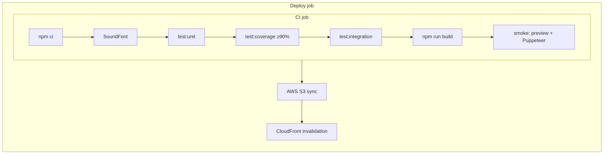

# CI/CD pipeline

GitHub Actions runs on every **pull request** and every **push to `main`**. Production deploy reuses the same test gates before uploading to S3/CloudFront.

## Workflow files

| File | Trigger | Purpose |
|------|---------|---------|
| [`.github/workflows/ci.yml`](../.github/workflows/ci.yml) | PR + `main` | Test, coverage, build, smoke |
| [`.github/workflows/deploy.yml`](../.github/workflows/deploy.yml) | `main` + manual | Same tests, then AWS deploy |



## Steps (in order)

1. **`npm ci`** — clean install from lockfile.
2. **TimGM6mb.sf2** — downloaded into `public/soundfonts/` for music code paths.
3. **`npm run test:unit`** — Vitest unit project (`src/**/*.test.ts`); **threads** pool, parallel across ~130 files ([`vitest.config.ts`](../vitest.config.ts), [TESTING.md](./TESTING.md)).
4. **`npm run test:coverage`** — same tests with **≥90%** line/statement coverage on scoped engine code ([`vitest.config.ts`](../vitest.config.ts)).
5. **`npm run test:integration`** — integration project; IWAD tests **skip** when no valid `DOOM.WAD` / `DOOM2.WAD` is present; synthetic line-special tests **always** run.
6. **`npm run build`** — Vite production bundle (workers + lazy voxel chunk).
7. **Smoke test** — `vite preview` on port 4173, console smoke + **diamond E2E** (GZDoom scenarios skip when no IWAD on runner).

## Common failures (and fixes)

| Symptom | Cause | Fix |
|---------|--------|-----|
| `tsx: not found` | `tsx` in `package.json` but missing from `package-lock.json` (so `npm ci` skips it) | Run `npm install`, commit `package-lock.json`; workflows use `npx --yes tsx` as a fallback |
| Coverage below 90% | New files under `coverageInclude` without tests | Add unit tests or exclude audit-only glue in `vitest.config.ts` |
| Integration “No valid WAD fixture” | No IWAD on runner | Expected locally without WADs; CI uses `describe.skipIf(!hasIntegrationIwad())` for stock maps |
| Smoke: console errors | WebGL/shader/runtime throw on load | Fix runtime errors; smoke ignores 404 on `/wads/DOOM*.WAD` |
| Deploy: missing AWS vars | `AWS_DEPLOY_ROLE_ARN`, etc. | Set GitHub **repository variables** per `scripts/bootstrap-aws.sh` |

## Local commands

```bash
npm run test:unit
npm run test:unit:fast    # all CPU cores
npm run test:coverage
npm run test:integration
npm run build
npm run preview -- --host 127.0.0.1 --port 4173
TEST_URL=http://127.0.0.1:4173 npm run test:console
```

### Parity suites (local; not in default CI)

Requires IWADs in `public/wads/` and generated corpus artifacts. See [TESTING.md](./TESTING.md).

```bash
npm run corpus:parity:all
npm run test:parity-gates          # corpus + modular + federated + frame (soft)
GZFRAME_PARITY_REQUIRED=1 npm run test:frame   # required for gzrender-v2 PR merge
```

## IWAD vs synthetic tests

| Suite | Needs DOOM.WAD / DOOM2.WAD? |
|-------|-----------------------------|
| Unit + coverage | No |
| `synthetic-line-specials.integration.test.ts` | No |
| `line-specials.integration.test.ts` (stock audit) | Yes |
| `wad-pipeline` / `music-pipeline` / `map-cache` (most tests) | Yes |

Place IWADs under `public/wads/` for full integration coverage locally; they are **gitignored** and not deployed.
