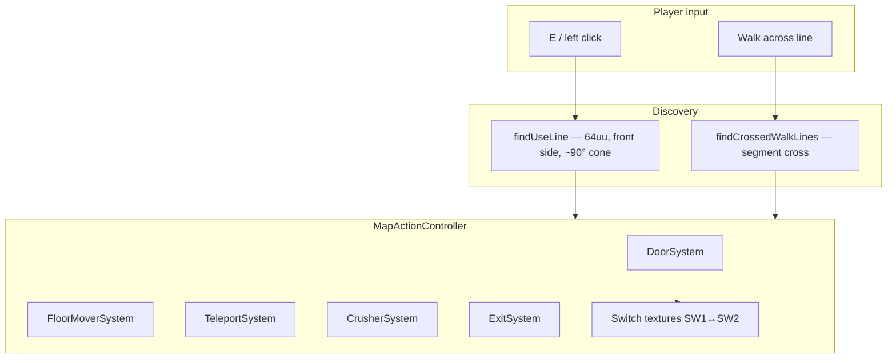
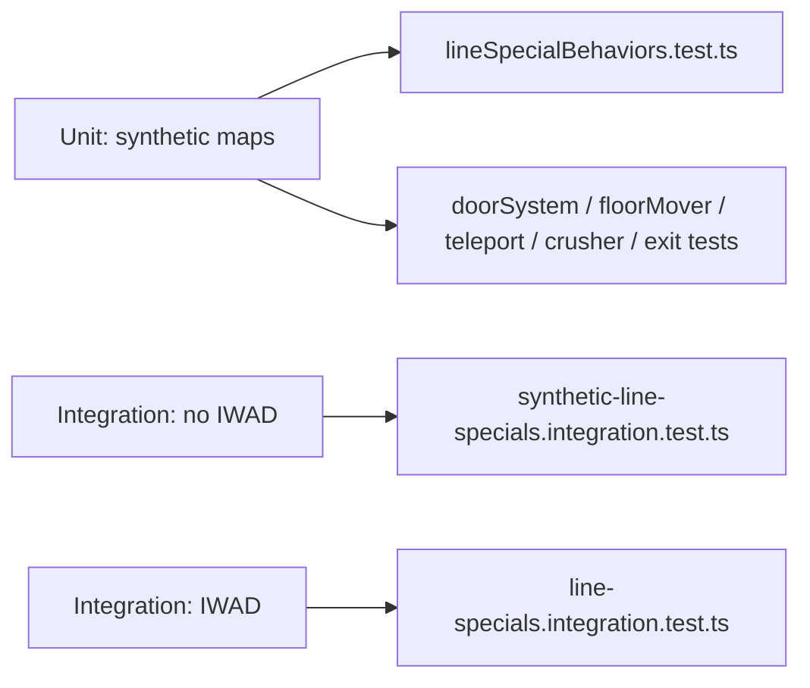

# Line specials — doors, switches, movers, teleports

Runtime line-special handling is modeled on **Doom `p_spec`** (see `src/wad/constants/LineDefSpecials.ts` for the full vanilla catalog).

## How the player activates lines

| Input | Function | Rules |
|-------|----------|--------|
| **E** / **click** | `findUseLine` | Range **64** (`USERANGE`), **front side** only, prefers lines within **90°** of view |
| **Walk** | `findCrossedWalkLines` | Segment intersection; no facing check |

`MapActionController` (`src/wad/game/mapActionController.ts`) dispatches by line `special` number.

## Implementation status (summary)

| Category | Count | Handler | Notes |
|----------|-------|---------|--------|
| Doors | 37 | `DoorSystem` | Manual + remote, med/turbo, O/C/O-W-C |
| Floors / lifts / ceilings | 20 | `FloorMoverSystem` | Plats, LIC, LEF, HEC, lower ceiling |
| Teleports | 4 | `TeleportSystem` | 39, 97 (player); 125, 126 (monsters) |
| Crushers | 7 | `CrusherSystem` | Start/stop, stair crush, floor-up-then-crush |
| Exits | 4 | `ExitSystem` | Sets `requestExit` |
| Stairs | 4 | `StairSystem` | Includes turbo + crush (100, 127) |
| Donut | 1 | `DonutSystem` | Special 9 |
| Lights | 10 | `LightSystem` | Zero, max, neighbor, flicker |
| Scroll | 1 | `ScrollSystem` | Special 48 (continuous `xOffset`) |
| Moving floors | 4 | `MovingFloorSystem` | 53/87 start, 54/89 stop |
| Keyed doors | 12 | `DoorSystem` + `doorKeys` | Enforced when `getKeys` is wired |

Authoritative per-special rows: **`src/wad/game/lineSpecialRegistry.ts`** (`LINE_SPECIAL_CATALOG`).

## Doors (`DoorSystem`)

Ceiling movers: the **door sector** ceiling rises to meet the **front sector** ceiling (manual) or **tagged** sectors (remote).

| Pattern | Activation examples | Behavior |
|---------|---------------------|----------|
| Manual O/C | 1, 26–28 | Back sector of switch line |
| Manual open | 31–34, 46, 118 | One-shot open |
| Remote walk | 2–4, 16, 75–76, 86, 106–111 | Tag on line → sectors |
| Remote switch | 29, 42, 50, 61, 63, 103, 112–116 | Same, switch-fired |
| Blaze | 105–118, 133–137 (catalog) | Turbo speed; keys not enforced yet |

**Live geometry:** dirty sectors refresh walls/flats when heights change (`refreshMapGeometry`).

## Floors & lifts (`FloorMoverSystem`)

| Kind | Specials (examples) | Motion |
|------|---------------------|--------|
| **Plat** | 10, 21, 62, 88, 120–123 | Down → wait → up (lift) |
| **Floor up** | 5, 91, 101, 64 | To lowest adjacent ceiling − 8 |
| **Floor down** | 38, 23, 82, 60 | To lowest adjacent floor |
| **Ceiling down** | 41, 43, 44 | To floor + 8 |
| **Ceiling up** | 40 | To highest adjacent ceiling |

## Crushers (`CrusherSystem`)

Floor rises and ceiling lowers until gap **8**, brief wait, then opens back.

| Special | Activation |
|---------|------------|
| 6 | Switch repeat |
| 25 | Walk once |
| 73 | Walk once |
| 77 | Walk repeat |
| 141 | Switch once (Doom II) |

## Teleports (`TeleportSystem`)

| Special | Who | Landing |
|---------|-----|---------|
| 39, 97 | Player | Thing type **14** in tagged sector |
| 125, 126 | Monsters | Player walk ignored |

Position updates immediately; fog/VFX not implemented.

## Exits (`ExitSystem`)

| Special | Activation |
|---------|------------|
| 11 | Switch |
| 51, 52, 124 | Walk |

Sets `MapActionController.isExitRequested()` / `result.requestExit` for the game loop to end the level.

## Switch visuals

On switch activation, sidedef textures flip **SW1↔SW2** (and **DB1↔DB2**); the line is tracked in `getSwitchedLineIndices()` for mesh refresh.

## Testing

| Command | What it runs |
|---------|----------------|
| `npm run test:unit -- src/wad/game` | All game logic + **61+** parameterized line behavior tests |
| `npm run test:integration` | Synthetic suite always; stock IWAD audit if `public/wads/DOOM2.WAD` exists |
| `npm run test:coverage` | ≥90% on scoped `src/wad/game/**` (see [ci.md](./ci.md)) |

**Synthetic maps** (`test/helpers/syntheticMaps.ts`) build minimal `WadMap` graphs without a binary PWAD.

**IWAD audit** (`lineSpecialAudit.ts`): scans commercial WADs, simulates each implemented special with &lt;12% tolerance for map layout edge cases.

## Not yet implemented

| Feature | Specials (examples) |
|---------|---------------------|
| **Stairs** | 7, 8, 100, 127 |
| **Donut** | 9 |
| **Stop crusher** | 57, 74 |
| **Lights (line)** | 12, 13, 17, 35 |
| **Scrollers** | 48 |
| **Keyed doors** | Keys not checked (26–28, 32–34, 99, 133–137) |
| **Gun lines** | 46 (door only; no ammo gate) |
| **Extra floors** | 18, 24, 49, 69, 72, 119, 128–132 |

Sector types **4, 12, 13, 17** (light strobes) are handled at draw time in `sectorDynamicLight.ts`, not as line specials.

## Related docs

- [CI/CD](./ci.md) — GitHub Actions gates and smoke test
- [Performance](./performance.md) — geometry refresh, workers
- [Rendering](./rendering.md) — draw path
