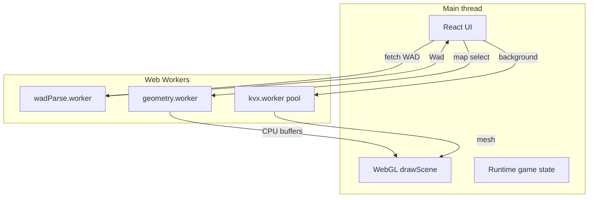

# Performance & optimizations


The app targets **smooth map loads** and **steady 60 FPS** in browser on large Doom II maps. Optimizations span **Node/build**, **Web Workers**, **GPU caching**, and **React lifecycle** design.

## Architecture overview



## Node.js & build toolchain


| Tool | Role |
|------|------|
| **Vite 6** | Dev server, ESM bundling, `?raw` imports for VOXELDEF/ZScript |
| **vite-plugin-string** | Inline GLSL as strings |
| **TypeScript 5.8** | Path aliases `@/`, strict types for WAD structures |
| **Vitest** | Unit tests under `src/` (350+ tests) + integration project |
| **tsx / Puppeteer** | Optional browser scripts in `scripts/` |

### Build outputs

- Workers emitted as separate chunks (`wadParse.worker`, `geometry.worker`, `kvx.worker`)
- **Level viewer** loads without Three.js; the voxel tab pulls lazy chunks `voxel-viewer` + `three` (`React.lazy` in `App.tsx`, `manualChunks` in `vite.config.ts`)

### CI

**File:** `.github/workflows/ci.yml`

`npm test` + `npm run build` on push/PR.

## Web Workers (never block the UI)

### 1. WAD parse worker

**Files:** `wadParse.worker.ts`, `parseWadInWorker.ts`

- Entire IWAD parse off main thread
- Transferable `ArrayBuffer` ownership

### 2. Geometry worker

**Files:** `geometry.worker.ts`, `geometryWorkerClient.ts`

- `mapToFlats` + `mapToWalls` + sector triangulation
- Main thread only uploads buffers to GPU (`uploadCpuGeometry`)

### 3. KVX worker pool

**Files:** `kvxWorkerPool.ts`, `kvx.worker.ts`

- 2–4 parallel workers
- Job queue with transferable KVX buffers
- Main-thread fallback if pool saturated

## Caching strategy

### WAD cache

**File:** `src/features/level-viewer/wadCache.ts`

```typescript
// In-memory: path → { wad, loadedAt }
```

Switching back to a previously loaded IWAD skips network + parse.

### Map geometry cache

**File:** `src/wad/renderer/renderGame/mapLoadCache.ts`

Key: `` `${wadPath ?? 'memory'}::${mapName}` ``

Cached once per map:

- WebGL textures (walls, flats, things, sky, height maps)
- GPU buffers (walls, flats, things)
- Sector triangle hash + visibility index
- Sprite frame maps

Per load (cheap):

- `structuredClone(map)` for mutable game state
- Relink sector refs, lighting, thing positions

**Revisit MAP17** after first visit: skips ~900ms geometry rebuild.

Failed promises evicted from cache.

### WAD assets cache

**File:** `src/wad/renderer/drawAssets/wadAssetsCache.ts`

Rasterized PLAYPAL patches for a map — avoids re-decoding lumps.

### Height URL miss cache

**File:** `heightTextures.ts` — `clearHeightUrlMissCache()`

Remembers missing `voxel_heights/*.png` URLs to avoid repeated 404 fetches.

### Music MIDI cache

**File:** `musicPreload.ts`

MUS→MIDI conversion cached by `wadPath + lumpName`. Synth preload deferred until Play (expensive).

## React patterns

### `useDoomLoader`

**File:** `src/features/level-viewer/useDoomLoader.ts`

- **Split concerns:** WAD fetch effect vs map load effect
- **Cache hit** short-circuit for WAD
- **Cancellation** flags on async map load
- **Non-blocking music:** soundfont warm-start in parallel; map load does not `await` music
- **`clearCache()`** cascades all subsystem caches

### `useLevelMusic`

- Preloads MIDI on map change
- `playing` flag separate from `enabled` (visualizer only when audio runs)
- Stops track on map/WAD change before starting new preload

### Level transition phases

**File:** `LevelViewer.tsx`

```text
loading → wiping → playing
```

- No 3D render during minimum loading screen (`MIN_LOADING_SCREEN_MS`)
- Single snapshot for melt wipe (no per-frame full-scene re-render)
- `game.setPresentationVisible(false)` during wipe overlay

### Memoization

- `useMemo` for map name lists
- `useCallback` for game loop handlers, automap, cheats
- Refs for cheat buffer, load timestamps (avoid stale closures)

## GPU / draw call optimizations

**File:** `drawScene.ts`

- **Sorted flats** — floors before ceilings (`geometryCache.buildSortedFlats`)
- **Opaque vs transparent wall lists** — pre-split at buffer build
- **Back-to-front** transparent pass only when needed
- **Sector + frustum + distance** cull before draw
- **Portal visibility** with cross-frame cache + precomputed `portalSectors` on walls
- **Point light grid** + uniform batching for walls/flats
- **WeakMap** geometry caches for KVX / height generation

## Runtime geometry refresh

**File:** `refreshMapGeometry.ts`

Doors/platforms update only affected sectors — not full map reload.

## Preload & lazy work

| What | When |
|------|------|
| MUS→MIDI | Map selected (background) |
| SoundFont | App start (best-effort) |
| KVX meshes | After map playable (`hydrateVoxelThingMeshes`) |
| Height PNGs | Map load (parallel with buffers) |

## Development scripts

| Script | Purpose |
|--------|---------|
| `scripts/audit-textures.ts` | Texture / height map coverage |
| `scripts/capture-console-errors.ts` | Headless console capture |
| `scripts/test-music-browser.ts` | Music smoke test |
| `scripts/test-door-browser.ts` | Door interaction test |

## Clear cache (user action)

**Clear Cache** button in UI calls:

```typescript
clearWadCache();
clearMapLoadCache();
clearWadAssetsCache();
clearHeightUrlMissCache();
clearMusicPreloadCache();
resetSoundfontEngine(); // if applicable
```

Use after asset updates or music parser fixes.

## Rendering optimizations (implemented)

| Technique | What it does |
|-----------|----------------|
| **Lazy Three.js** | `VoxelModelViewer` is `React.lazy`-loaded; map mode never downloads `three` until the user opens the voxel tab. |
| **BSP camera sector** | `findCameraSectorIndex` walks the map BSP (`findCameraSubsector` → `subsectorToSector`) before falling back to triangle hash lookup. Stable at sector boundaries; O(log n) per frame. |
| **Wall draw sorting** | `sortOpaqueWallsForDraw` groups walls by texture + sector at buffer build time. |
| **Uniform batching** | `drawScene` batches texture/sector/fog uniforms for walls and flats; point-light uniforms update only when the 128-unit spatial cell changes. |
| **Point light grid** | `PointLightGrid` (384-unit cells) replaces O(lights × surfaces) nearest-light scans each frame. Rebuilt once per map load. |
| **Visible sector cache** | `VisibleSectorCache` reuses portal BFS when the camera sector is unchanged and movement is under 96 map units. |
| **Sector light cache** | Flickering sector light levels bucketed at 20 Hz per sector index — avoids recomputing animated light every draw. |
| **Precomputed portal sectors** | Each `WallBuffer` stores `portalSectors` at build time so culling skips per-wall linedef lookups. |
| **Single-pass things** | Voxels and billboards share one visibility/frustum loop over `renderableThings`. |
| **Scratch matrices** | Sprites/voxels reuse module-level `mat4`/`vec4` scratch buffers — no per-sprite allocations. |
| **Pooled sort buffers** | Transparent walls and sprites reuse pooled arrays instead of allocating each frame. |
| **Door geometry throttle** | `refreshDoorGeometry` runs at most every ~48 ms unless a switch forces an immediate upload. |

Portal **flood-fill** (`buildPotentiallyVisibleSectors`) remains the runtime PVS: it handles sky courtyards, windows, and Doom-style portal rules that vanilla BSP PVS tables do not encode in this renderer.

## Deferred (why not yet)

| Idea | Status | Rationale |
|------|--------|-----------|
| **OffscreenCanvas worker GL upload** | Not started | Browsers differ on `OffscreenCanvas` + WebGL2 in workers; buffer upload on the main thread is already fast once geometry is built in `geometry.worker`. High integration cost for uncertain gain. |
| **Full BSP PVS replacing portal BFS** | Partial | BSP is used for **camera sector** and index build; replacing portal visibility with precomputed BSP leaves would need per-map PVS data and would regress outdoor/indoor portal cases we fixed with rule-based BFS. |
| **Instanced wall draws** | Not started | Walls differ in height span, UV scale, middle textures, and per-wall point lights. True instancing needs a merged wall VBO + instance attributes; current sort + uniform batching is the low-risk win. |

## Further ideas

- Merge walls that share texture + sector into multi-quad VBOs (fewer `drawElements`, still one shader)
- `requestIdleCallback` scheduling for non-critical KVX hydration (already background-loaded; tune priority)
- Profile with WebGL timer queries on heavy maps (MAP07, MAP24) after changes

See also: [WAD processing](./wad-processing.md), [Rendering](./rendering.md).
