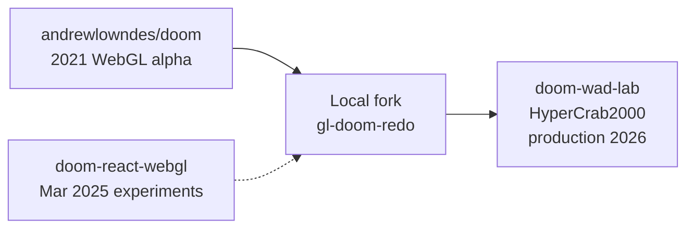

# Project history — how Doom WAD Lab grew

This page reconstructs the evolution of **Doom WAD Lab** from its upstream fork through local development in **gl-doom-redo** to the production deployment today. It combines three sources:

1. **Git history** — commits in this repo and its predecessors  
2. **IntelliJ local history** — shelved change descriptions stored in `.idea/workspace.xml` from the **gl-doom-redo** working copy (JetBrains “Local History” task summaries, `LOCAL-00009` … `LOCAL-00057`)  
3. **Upstream context** — [Andrew Lowndes’ original `doom` WebGL project](https://github.com/andrewlowndes/doom) (2021), which this line of work forked from

The `.idea` folder is not version-controlled, but its `workspace.xml` preserved a day-by-day diary of what was being changed *before* or *between* commits — often with more candid notes than commit messages. Those entries align closely with git timestamps from March–April 2025.

---

## Lineage



| Repository | Role | Active period |
|------------|------|----------------|
| [andrewlowndes/doom](https://github.com/andrewlowndes/doom) | Original browser Doom WebGL renderer (webpack-era) | 2021 → forked 2025 |
| **gl-doom-redo** | Local Vite + React refactor, parser cleanup, voxels | Mar–Apr 2025 |
| **doom-wad-lab** | Production app: AWS deploy, music, POM, tests, docs | May 2026 → present |

---

## Phase 1 — Fork & modernize (16–17 Mar 2025)

**Goal:** Take Andrew’s library and make it run cleanly on **Vite + React 19 + TypeScript**.

Git and IntelliJ local history both start here on **2025-03-16**:

| When | Event |
|------|--------|
| Mar 16 | `Works out of the box thankfully` — initial fork runs |
| Mar 16 | NPM audit fix, package updates, Vite compatibility |
| Mar 16 23:11 | Prettier pass, type definition fixes, folder organization |
| Mar 16 23:13 | Geometry folder moved into clearer structure |
| Mar 16 23:19 | **“Ready for the big refactor”** — aliases, paths, TS types cleaned; async progress monitoring explicitly deferred |

The local-history notes capture the mindset: get the build green first, refactor the alpha architecture second, worry about loader UX later.

---

## Phase 2 — Loader & architecture (17–18 Mar 2025)

**Goal:** Replace monolithic loading code with hooks, modules, and a `src/wad/` package layout.

This was an intense **~36-hour** restructuring session (Mar 17 15:51 → Mar 18 01:18 in local history):

| When | Milestone |
|------|-----------|
| Mar 17 | Shaders moved to parser folder; import fixes |
| Mar 17 16:10 | Main React component improved |
| Mar 17 16:15 | **`useDoomLoader` hook** — “Puts the wad loader in a hook finally. It was gross otherwise.” |
| Mar 17 16:25–23:58 | Loader/state utils cleaned; massive function extraction from `loadWad` |
| Mar 17 23:30–23:58 | **Module moves into `src/wad/`:** interfaces → constants → utils → ByteReader → draw assets → shaders |
| Mar 18 00:02 | Geometry and player controls moved under renderer |
| Mar 18 00:42 | Parser functions extracted; need for **loader status / logging** identified |
| Mar 18 01:18 | Parser cleanup continues; **testing strategy** called out explicitly in notes |

The `.idea` diary at this stage already names the next priorities that doom-wad-lab would later implement: status reporting, per-function parser tests, and async pipeline hardening.

---

## Phase 3 — Game world rendering (19–20 Mar 2025)

**Goal:** Things, weapons, and sky that feel like Doom—not just flat walls.

| When | Milestone |
|------|-----------|
| Mar 19 21:51 | Monsters added; weapon sprites fixed; first sky (**“literally a sky in a box”**) |
| Mar 19 23:02 | **Per-level skybox** — proper sky texture for each map |
| Mar 20 | Skybox iteration committed |

This phase marks the transition from “map geometry demo” to “recognizable Doom level.”

---

## Phase 4 — Voxel Doom (30 Mar – 21 Apr 2025)

**Goal:** Support **KVX** voxel models (Voxel Doom / Slab6 format) alongside the WebGL level renderer.

Local history shows a separate, longer arc with lots of iteration:

| When | Milestone |
|------|-----------|
| Mar 30 20:02 | First voxel test renderer (top/side/front views) — “kind of a mess” but saved so work isn’t lost |
| Apr 5 18:07 | **Pinky** mesh improved after reading Slab6 reference code |
| Apr 5 18:46 | “Pinky's LOOK LIKE PINKY now. Finally.” |
| Apr 6 00:29 | Cacodemon model work |
| Apr 6 | Bounding boxes, sphere grid helper, centering fixes |
| Apr 6 21:21–22:03 | Voxel test viewer **finally centered** (multiple LOCAL snapshots = long debugging session) |
| Apr 20–21 | **Split renderers:** “No sprites with the new renderer but voxels do work separately.” |

**gl-doom-redo**’s last commits (Apr 21, 2025) end here. The project paused with voxels working in isolation but sprite integration still open.

---

## Phase 5 — Production rebuild (25 May 2026)

After ~13 months, development resumed as **doom-wad-lab** with a production focus. All commits below are on `main`:

| Commit | Summary |
|--------|---------|
| `9088dc7` | **Rebuild + AWS pipeline** — GitHub Actions CI/deploy, Terraform (S3, CloudFront, WAF, OIDC), README overhaul |
| `f979a53` | AWS bootstrap script, Terraform lockfile |
| `c5a7771` | Exclude commercial IWADs from S3 deploys (legal/redistribution) |
| `fdc68cc` | Classic automap, surface relief (POM), gameplay polish |
| `d2b71dd` | Fix CloudFront WAD loading paths |
| `1685813` | Fix parallax relief GLSL compile error |
| `2b3f11b` | **Comprehensive docs** (`docs/`), map-load cache, music visualizer, sky visibility fixes, UI polish |
| `29fb06b` | Skybox WebGL2 shader fix (`gl_FragDepth`), console-error smoke test gates deploy |

Live endpoints after deploy:

- https://wadlab.computingandtooting.com  
- https://wadlab.tootingandcomputing.com  

---

## What changed between gl-doom-redo and doom-wad-lab

| Area | gl-doom-redo (Apr 2025) | doom-wad-lab (2026) |
|------|-------------------------|---------------------|
| **Deploy** | Local dev only | S3 + CloudFront + GitHub OIDC |
| **Music** | Not present | MUS → MIDI → SoundFont, visualizer |
| **Visuals** | Basic skybox | POM relief, sector lighting, slime glow, melt transitions |
| **Performance** | Synchronous map load | Worker parse, `mapLoadCache`, background preload |
| **Voxels** | Separate test viewer | KVX catalog, in-level meshes, dedicated Three.js viewer |
| **Testing** | Ad-hoc parser tests | 267+ unit tests, integration suite, 93% coverage on core logic |
| **Docs** | README only | Multi-page `docs/` guides |

---

## IntelliJ local history — how to read it

JetBrains IDEs store **Local History** outside git. In this project, many shelved changes were also recorded as `LOCAL-*` tasks in:

```text
gl-doom-redo/.idea/workspace.xml   (copied alongside doom-wad-lab/.idea/)
```

Each entry has:

- **`created` / `updated`** — Unix epoch ms (converted to dates in the tables above)  
- **`summary`** — developer note, often more detailed than the git message  
- **`LOCAL-000NN`** — sequential shelf ID; gaps before 00009 mean earlier history was rotated or never shelved

To browse interactively in IntelliJ: **Right-click a file → Local History → Show History**.

---

## Related repos on this machine

These sibling folders help explain experiments that fed into gl-doom-redo:

| Folder | Notes |
|--------|-------|
| `~/IdeaProjects/doom` | Andrew’s upstream; initial commit May 2021 |
| `~/IdeaProjects/doom-react-webgl` | Mar 2025 — heavy WAD parser testing, sprite/texture JSON fixtures |
| `~/IdeaProjects/gl-doom-redo` | Mar–Apr 2025 — Vite migration + voxels (source of `.idea` history) |

---

## Full commit timeline (this repo)

<details>
<summary>Click to expand — 62 commits from fork to present</summary>

```
2025-03-16  Works out of the box thankfully
2025-03-16  NPM Audit Fix / package updates / Vite / aliases
2025-03-16  Prettier, types, geometry folder move
2025-03-17  Shaders, imports, Main component, useDoomLoader hook
2025-03-17  Loader refactor, src/wad/ module migration
2025-03-18  Parser extraction, geometry + controls move
2025-03-19  Monsters, weapons, sky-in-a-box → real skybox
2025-03-30  Voxel test renderer (first KVX work)
2025-04-05  Pinky voxel mesh
2025-04-06  Cacodemon, bounding box, centered voxel viewer
2025-04-20  Voxels work separately from sprite renderer
2026-05-25  Production rebuild, AWS infra, automap, POM, docs, CI smoke tests
```

</details>

---

## See also

- [WAD processing](./wad-processing.md) — technical detail on the parser pipeline started in Phase 2  
- [Voxels](./voxels.md) — KVX work begun in Phase 4  
- [Performance](./performance.md) — caching and preload added in Phase 5  
- [Root README](../README.md) — run, deploy, assets
