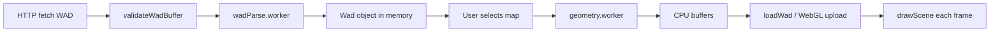

# WAD processing


This project reads classic **IWAD/PWAD** archives (Doom, Doom II, Ultimate Doom) in the browser and turns a selected map into GPU-ready geometry and textures.

## End-to-end pipeline



## 1. Fetch and validate

**Files:** `src/wad/loader/fetchWad.ts`, `src/wad/loader/validateWadBuffer.ts`

1. `fetch(path)` downloads the binary from `public/wads/` (or CDN in production).
2. Rejects responses that look like HTML error pages (common when a WAD is missing on S3).
3. `validateWadBuffer` checks:
   - Magic `IWAD` or `PWAD`
   - Lump count and directory offset are in range
   - Directory entries do not read past the file end

## 2. Parse in a Web Worker

**Files:** `src/wad/parser/parseWadInWorker.ts`, `src/wad/parser/wadParse.worker.ts`, `src/wad/parser/loadWadFromArrayBuffer.ts`

Parsing runs off the main thread so large IWADs do not freeze the UI.

- A singleton worker handles requests with monotonic IDs and a `pending` promise map.
- The `ArrayBuffer` is **transferred** to the worker (zero-copy handoff).
- If `Worker` is unavailable, parsing falls back to the main thread.

### Lump directory walk

`loadWadFromArrayBuffer` walks the WAD directory once with a small state machine (`LoadMode`):

| Mode | What gets collected |
|------|---------------------|
| `normal` | Palettes, texture definitions, sprites, flats, GENMIDI |
| `map` | After a map header (`E1M1`, `MAP01`, …) |
| `sprites` / `flat` | Sprite and flat lump groups |

### Map lumps

When inside a map, named lumps are parsed into a `WadMap`:

- `THINGS` — actors (player start, monsters, items)
- `LINEDEFS` / `SIDEDEFS` / `VERTEXES` — level geometry
- `SEGS` / `SSECTORS` / `NODES` — BSP (used for sector lookup and visibility)
- `SECTORS` — floor/ceiling heights, light level, textures
- `REJECT` / `BLOCKMAP` — present in file; gameplay collision uses simplified line tests

The result is a single in-memory `Wad` object: `maps`, `textures`, `flats`, `sprites`, `playpal`, animation chains, etc.

## 3. Map geometry (CPU)

**Files:** `src/wad/renderer/workers/geometryWorkerClient.ts`, `src/wad/renderer/workers/geometry.worker.ts`, `src/wad/renderer/geometry/buildMapGeometryCpu.ts`

For the active map:

1. **Sector polygons** — `sectorLinesToTriangles` fans each sector’s boundary into triangles (`earcut` is available in the stack; sector triangulation uses the project’s line-walk utilities).
2. **Flats** — `mapToFlats` builds floor/ceiling meshes; **F_SKY** flats are skipped (sky is drawn separately).
3. **Walls** — `mapToWalls` extrudes one-sided and two-sided linedefs into quads (lower, upper, middle textures).

Wall segments carry:

- Texture name, UVs, normals, center, `boundsRadius`
- Flags: transparent mid-texture, two-sided middle, sector index
- **Facing normal** for back-face culling at distance

## 4. GPU upload and runtime load

**Files:** `src/wad/renderer/geometry/createBuffers.ts`, `src/wad/renderer/renderGame/loadWad.ts`, `src/wad/renderer/renderGame/mapLoadCache.ts`

`loadWad(gl, wad, map, mapName, wadPath)`:

1. **`buildSharedMapGeometry`** (cached per `wadPath::mapName`):
   - Rasterize needed flats/walls/sprites from PLAYPAL
   - Build height textures for parallax (see [Visual enhancements](./visual-enhancements.md))
   - Upload WebGL textures and buffer objects
   - Build sector triangle hash + visibility index

2. **`hydrateLoadedMap`** (per visit):
   - Relink sector pointers on a fresh `structuredClone` of the map (game state mutates sectors)
   - Apply floor/wall ambient lighting heuristics
   - Compute player spawn, thing sectors, point lights, renderable things

### Caches

| Cache | Key | Stores |
|-------|-----|--------|
| `wadCache` | WAD URL | Parsed `Wad` + timestamp |
| `mapLoadCache` | `wadPath::mapName` | `Promise<CachedMapGeometry>` |
| `wadAssetsCache` | map + path | Rasterized patch/flat canvases |

Failed map load promises are removed from `mapLoadCache` so retries can succeed.

## 5. Live geometry updates

**Files:** `src/wad/renderer/geometry/refreshMapGeometry.ts`, `src/wad/game/doorSystem.ts`, `src/wad/game/useLines.ts`

Doors, crushers, and platforms mutate `Sector` heights at runtime. `refreshMapGeometry` rebuilds affected wall/flat CPU buffers and re-uploads GPU data without reloading the entire WAD.

## Data structures worth remembering

```typescript
// Simplified mental model
interface Wad {
  maps: Record<string, WadMap>;
  textures: Record<string, TextureDef>;
  flats: Record<string, FlatLump>;
  sprites: Record<string, SpriteLump>;
  playpal: PlayPal;
  animatedTextures: Record<string, string[]>;
  animatedFlats: Record<string, string[]>;
}

interface WadMap {
  THINGS: Thing[];
  LINEDEFS: LineDef[];
  SIDEDEFS: SideDef[];
  VERTEXES: Vertex[];
  SECTORS: Sector[];
  NODES: Node[];
  // ...
}
```

## Tests

- `src/wad/loader/validateWadBuffer.test.ts`
- `src/wad/renderer/geometry/mapToWalls.test.ts`, `mapToFlats.test.ts`, `refreshMapGeometry.test.ts`
- Door/crusher cases in `mapToWalls.crusherDoors.test.ts`, `useLines.test.ts`
